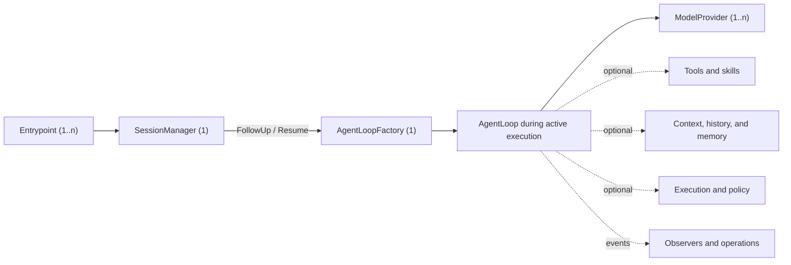

# AgentSlot Standard Component Map

[English](COMPONENT_MAP.md) | [简体中文](COMPONENT_MAP.zh-CN.md)

This document is the authoritative map of the customization seams in a
composable LLM agent. It is a primary AgentSlot asset, not a list of whatever
interfaces happen to exist in one implementation.

The map answers four questions for component authors and application authors:

1. Which agent responsibilities can be implemented or replaced independently?
2. What is the stable Slot ID and cardinality of each responsibility?
3. Which components are required for a runnable standard agent?
4. How much evidence exists that each proposed standard is portable?

The composition core is already implemented. The domain contracts in this map
are being admitted incrementally. A mapped row must not be described as an
implemented Go interface until it reaches **Contracted** maturity.

Current repository reality:

| Inventory | Count |
| --- | ---: |
| Mapped standard component ecosystems | 40 |
| Standardized domain vocabularies | 2 |
| Contracted AgentSlot-owned domain interfaces | 0 |
| Conformant component ecosystems | 0 |
| Proven component ecosystems | 0 |
| Assembled standard component ecosystems | 0 |

The separate composition protocol currently exports five Go interfaces:
`Module`, `SlotRequirer`, `Registrar`, `Contribution`, and `Lifecycle`. They are
framework mechanics, not substitutes for the 40 mapped agent component
contracts.

## Runnable standard profile

An AgentSlot application conforms to the runnable standard agent profile only
when its assembled plan contains all four of these component ecosystems:

| Slot ID | Standard contract | Kind | Required cardinality | Responsibility |
| --- | --- | --- | --- | --- |
| `agent.loop` | `AgentLoopFactory` | `One` | exactly 1 | Provides a factory that creates at most one isolated AgentLoop on demand for each Session with active execution; the Loop owns model/tool iteration and loop-control decisions during that execution. |
| `session.manager` | `SessionManager` | `One` | exactly 1 | Creates or resolves a stable Session and exposes its durable state and command handle. |
| `model.provider` | `ModelProvider` | `Many` | at least 1 | Executes model requests behind provider-neutral agent semantics. |
| `interaction.entrypoint` | `Entrypoint` | `Many` | at least 1 | Accepts user or caller input and exposes agent output through TUI, Web, desktop, HTTP, ACP, or another protocol. |

These are assembly requirements, not permission for a hidden runtime
coordinator. `agent.loop` installs one `AgentLoopFactory`; the factory creates
one isolated `AgentLoop` only when a Session has claimed active execution.
Opening or browsing a Session does not create a Loop. The Session durably owns
state and command entry points; the active Loop remains the sole owner of loop
semantics. Entrypoints invoke Session commands rather than retaining Loop
objects, and do not reimplement tool/model control flow.

`ModelProvider` is mandatory because a plan that can start but cannot produce a
model response is not a runnable LLM agent. The standard contract must remain
provider-neutral. AgentSlot will provide an official OpenAI Chat Compatible
adapter as the ubiquitous baseline implementation; OpenAI Responses,
Anthropic Messages, and other protocols remain independent implementations of
the same Slot contract.

When exactly one model provider is installed, an application may select it
automatically. When more than one is installed, the plan must have an explicit,
deterministic default model/provider selection or a `ModelSelector`. Selection
must never depend on module installation order, concrete Go type, or a hidden
fallback.

Tools are deliberately not part of the minimum cardinality. A conversational
agent can run with zero tools. A coding or operational profile can require a
specific tool set without making that requirement universal.

## Maturity scorecard

The component map and the implementation scorecard are deliberately separate.
Mapping a responsibility is an architectural decision; proving its portable
method-level contract is an engineering result.

| Level | Meaning |
| --- | --- |
| **Mapped** | Responsibility, boundary, Slot ID, and cardinality are defined here. No public Go interface is implied. |
| **Contracted** | A public AgentSlot-owned domain interface and typed Slot declaration exist. |
| **Conformant** | A reusable conformance suite verifies required behavior, cancellation, failures, and lifecycle ownership. |
| **Proven** | At least two semantically independent implementations pass the conformance suite. Wrappers over the same implementation count once. |
| **Assembled** | A reference application exchanges proven implementations through the Slot without concrete-type branches. |

Every domain row below is currently **Mapped** unless a later scorecard update
explicitly records a higher level with links to its contract, conformance
suite, implementations, and reference assembly.

The score is measured by proven component ecosystems, not by the number of
modules, packages, or interface methods. One module may contribute to several
Slots, and several modules may contribute to one `Many` or `Chain` Slot.

## Component ecosystems

### 1. Runtime and interaction

| Slot ID | Contract | Kind | Profile rule | Responsibility | Maturity |
| --- | --- | --- | --- | --- | --- |
| `agent.loop` | `AgentLoopFactory` | `One` | globally required | Creates at most one isolated AgentLoop on demand per actively executing Session; that Loop runs requests and owns loop-control decisions during execution. | Mapped |
| `session.manager` | `SessionManager` | `One` | globally required | Resolves stable Session identity, lifecycle, state, and command handles without absorbing the replaceable persistence implementation. | Mapped |
| `interaction.entrypoint` | `Entrypoint` | `Many` | globally requires at least 1 | Connects a caller-facing protocol or UI to Session commands, snapshots, and agent events. | Mapped |
| `runtime.observer` | `RuntimeObserver` | `Chain` | optional | Observes typed agent, turn, message, tool, retry, and lifecycle events without controlling the loop. | Mapped |

The `AgentLoopFactory` method-level contract is a design baseline, not a
contracted or proven public interface. `AgentLoop` implementations can differ radically: general assistants, coding
agents, research loops, deterministic workflow agents, or remote-agent
bridges. If an implementation hides its own external model service and cannot
use `model.provider`, it is not conformant to the standard LLM agent profile;
it can still use the lower-level composition core under a different explicit
profile.

### 2. Model access

| Slot ID | Contract | Kind | Profile rule | Responsibility | Maturity |
| --- | --- | --- | --- | --- | --- |
| `model.provider` | `ModelProvider` | `Many` | globally requires at least 1 | Streams model output, tool calls, stop reasons, usage, and capability reporting behind provider-neutral semantics; non-streaming responses are Gateway aggregation. | Mapped |
| `model.selector` | `ModelSelector` | `One` | optional; conditional for dynamic routing | Selects a provider/model using explicit request and policy inputs. | Mapped |
| `model.catalog` | `ModelCatalog` | `Many` | optional | Describes available models and their declared capabilities without exposing credentials. | Mapped |
| `model.middleware` | `ModelMiddleware` | `Chain` | optional | Applies observable request/response concerns without changing provider identity. | Mapped |

AgentSlot fixes the finite model vocabulary in the
[`model` package](model):

- input and output modalities are exactly `text`, `image`, and `audio`;
- every selected model declares input and output modality sets separately;
- tool calling is a separate capability because it is an action, not a media
  modality.

Provider wire blocks, model IDs, context limits, rate limits, media transport,
and vendor-specific features remain implementation declarations. Adding a new
standard modality is an explicit future standard revision, not a free-form
string accepted by current adapters.

OpenAI Chat Compatible is a required official adapter, not the standard
contract itself. The provider-neutral contract must not force Anthropic,
OpenAI Responses, local inference, or future protocols into OpenAI-specific
wire objects.

### 3. Tools and skills

| Slot ID | Contract | Kind | Profile rule | Responsibility | Maturity |
| --- | --- | --- | --- | --- | --- |
| `tool` | `Tool` | `Many` | optional globally; profiles may require keys | Declares and invokes a named capability available to the loop. | Mapped |
| `skill` | `Skill` | `Many` | optional | Supplies discoverable instructions, resources, or component bundles without pretending natural-language keyword matching is semantic routing. | Mapped |
| `tool.middleware` | `ToolMiddleware` | `Chain` | optional | Wraps invocation for policy, telemetry, normalization, or recovery. | Mapped |
| `tool.output-store` | `ToolOutputStore` | `One` | optional | Stores oversized or binary tool results and returns stable references. | Mapped |

The [`tool` package](tool) fixes the portable tool-call vocabulary:

- every model-facing tool definition has a self-contained JSON Schema Draft
  2020-12 input schema;
- the schema root is a closed object (`type: object` and
  `additionalProperties: false`), while internal references remain available;
- tool-call arguments are JSON instance values and must validate against that
  schema before invocation;
- call ID, tool name, and argument values are distinct from the schema.

This subset can be used as an OpenAPI 3.1 Schema Object, but a tool is not
required to be an HTTP API. Provider adapters may declare smaller supported
keyword and size limits; they may not reinterpret the standard schema.

Common file read/write/edit and controlled shell execution belong in an
official optional component pack. They must remain disableable, and their risk
decisions must use policy/approval components rather than concrete UI checks.

### 4. Context, history, and memory

| Slot ID | Contract | Kind | Profile rule | Responsibility | Maturity |
| --- | --- | --- | --- | --- | --- |
| `history.store` | `HistoryStore` | `One` | optional | Persists the unique ordered ledger of committed conversation, model, tool, and run facts as an append-only sequence; Queue, Context, and RunJournal remain distinct responsibilities. | Mapped |
| `context.source` | `ContextSource` | `Chain` | optional | Contributes ordered context for a model turn. | Mapped |
| `context.compactor` | `ContextCompactor` | `One` | optional | Replaces the current full Context with a smaller conversation-message projection without rewriting History; the Loop reattaches fixed prompts/tools and validates protocol and hard token limits. | Mapped |
| `memory.store` | `MemoryStore` | `Many` | optional | Reads and writes durable recall outside the authoritative conversation history. | Mapped |
| `checkpoint.store` | `CheckpointStore` | `One` | optional | Saves resumable execution state without pretending it is user-visible history. | Mapped |

Terminology is strict:

- A **session** is stable identity and lifecycle.
- **History** is the unique append-only fact ledger in actual committed order; it is not required to be a directly sendable provider message sequence at every instant.
- **Context** is the versioned, model-protocol-valid projection assembled for the next model call; an unpaired tool call is not projected.
- **Queue** is the durable set of normal, steer, and held messages not yet in Context.
- **RunJournal** records in-flight execution and tool recovery evidence, not model context or a second conversation ledger.
- **Memory** is durable recall selected for possible future use.
- A **checkpoint** is resumable runtime state.

If `HistoryStore` is installed, committed facts are strictly append-only. An
implementation may not edit, delete, reorder, or insert facts before the
committed tail. Compaction creates derived context; it never rewrites history.
The standard Compactor contract is replaceable: any “summary plus last three
inbound messages” algorithm is a default implementation, not a framework
invariant.

### 5. Workspace, execution, and artifacts

| Slot ID | Contract | Kind | Profile rule | Responsibility | Maturity |
| --- | --- | --- | --- | --- | --- |
| `workspace.manager` | `WorkspaceManager` | `One` | optional | Defines the files, roots, isolation, and lifetime visible to an agent session or run. | Mapped |
| `execution.environment` | `ExecutionEnvironment` | `Many` | optional | Executes commands or code in a named local, container, sandbox, or remote environment. | Mapped |
| `artifact.store` | `ArtifactStore` | `One` | optional | Persists generated files and exposes stable metadata/references. | Mapped |
| `credential.resolver` | `CredentialResolver` | `One` | optional | Resolves scoped credentials without placing secret values in plans or component descriptions. | Mapped |

### 6. Policy, authorization, and human approval

| Slot ID | Contract | Kind | Profile rule | Responsibility | Maturity |
| --- | --- | --- | --- | --- | --- |
| `policy.guard` | `PolicyGuard` | `Chain` | optional | Evaluates proposed model, tool, data, or execution actions in deterministic order. | Mapped |
| `approval.service` | `ApprovalService` | `One` | optional; risk profiles may require it | Requests and resolves human approval independently of a particular TUI or gateway. | Mapped |
| `authorization.provider` | `AuthorizationProvider` | `One` | optional | Decides whether an authenticated principal may perform an agent operation. | Mapped |

### 7. Multi-agent and workflow

| Slot ID | Contract | Kind | Profile rule | Responsibility | Maturity |
| --- | --- | --- | --- | --- | --- |
| `agent.provider` | `AgentProvider` | `Many` | optional | Exposes named child-agent or remote-agent capabilities. | Mapped |
| `workflow.scheduler` | `WorkflowScheduler` | `One` | optional | Schedules multi-step or multi-agent work without replacing an individual agent loop. | Mapped |
| `job.store` | `JobStore` | `One` | optional | Persists queued/running/completed workflow job state. | Mapped |
| `mailbox` | `Mailbox` | `One` | optional | Carries addressed asynchronous messages between agents or jobs. | Mapped |

### 8. Gateway and delivery

| Slot ID | Contract | Kind | Profile rule | Responsibility | Maturity |
| --- | --- | --- | --- | --- | --- |
| `gateway.transport` | `GatewayTransport` | `Many` | optional | Connects named external channels such as HTTP, WebSocket, ACP, chat platforms, or message queues. | Mapped |
| `gateway.identity` | `IdentityResolver` | `One` | optional | Maps transport identities to stable application principals. | Mapped |
| `gateway.route` | `RouteResolver` | `One` | optional | Selects the target agent/session from authenticated inbound requests. | Mapped |
| `gateway.delivery` | `DeliveryAdapter` | `Many` | optional | Delivers asynchronous output back through a named external channel. | Mapped |

A direct TUI, Web UI, desktop application, HTTP server, or ACP server can be an
`Entrypoint`. A gateway that multiplexes several external channels is normally
one `Entrypoint` assembled from the optional gateway Slots above. This avoids
making every small UI implement gateway routing machinery.

AgentSlot standardizes neither transient-chunk cursors nor client ACK cursors.
Reconnect uses a client revision and Session Snapshot. A concrete gateway or
external messaging system may keep private reliable-delivery state, but that
state is not a standard Slot or Session fact and cannot change run completion.

### 9. Usage and billing

| Slot ID | Contract | Kind | Profile rule | Responsibility | Maturity |
| --- | --- | --- | --- | --- | --- |
| `usage.recorder` | `UsageRecorder` | `Chain` | optional | Records normalized model, tool, storage, or execution usage events. | Mapped |
| `price.resolver` | `PriceResolver` | `One` | optional | Resolves versioned prices for normalized usage. | Mapped |
| `quota.guard` | `QuotaGuard` | `One` | optional | Accepts or rejects work against declared budgets and quotas. | Mapped |
| `billing.ledger` | `BillingLedger` | `One` | optional | Persists auditable charges, credits, and reservation outcomes. | Mapped |

### 10. Operations and audit

| Slot ID | Contract | Kind | Profile rule | Responsibility | Maturity |
| --- | --- | --- | --- | --- | --- |
| `audit.sink` | `AuditSink` | `Chain` | optional | Receives security- and governance-relevant records. | Mapped |
| `trace.sink` | `TraceSink` | `Chain` | optional | Receives correlated runtime spans and events. | Mapped |
| `metric.sink` | `MetricSink` | `Chain` | optional | Receives normalized counters, gauges, and distributions. | Mapped |
| `health.contributor` | `HealthContributor` | `Chain` | optional | Reports component readiness and health without exposing configuration values. | Mapped |

## Standard contract admission

Moving a row beyond **Mapped** requires method-level design based on real
semantics rather than the API shape of one legacy SDK:

1. Compare at least two independent implementations or protocols.
2. Write conformance tests before freezing the public contract.
3. Prove one consumer can replace implementations through the Slot without a
   concrete-type branch.
4. Preserve cancellation, streaming, errors, lifecycle ownership, and other
   semantics required by either implementation.
5. Keep provider-, product-, and transport-specific configuration outside the
   AgentSlot composition core.

Previous-generation SDKs are evidence and migration sources. They may add
AgentSlot adapters without changing their existing assembly paths, so current
products can continue iterating. They do not permanently own an industry-level
contract merely because they implemented the responsibility first.

## Required conformance evidence

The standard profile and every admitted component contract must be covered by
automated tests for the rules that apply to it:

- missing required component;
- duplicate contribution to a unique Slot;
- duplicate key in a `Many` Slot;
- declared dependency cycle;
- startup failure rollback in reverse order;
- replacement without concrete implementation branches;
- cancellation and error propagation;
- strict append-only history when history is installed;
- deterministic provider selection;
- `Plan.Describe()` visibility of Slot IDs, cardinality, dependencies, source,
  and lifecycle order without component values, configuration, or secrets.

The reference standard agent must additionally prove a no-key automated path
with a deterministic test provider and retain a real OpenAI Chat Compatible
configuration path. A fake provider is test infrastructure, never a substitute
for the real adapter proof.

## Change policy

Changing a Slot ID, responsibility boundary, kind, or required cardinality is
an architectural change. Every such change must update this map, explain its
compatibility impact, and update the scorecard evidence. Adding another row is
not automatically progress: the new boundary must reduce coupling and make an
independently implementable responsibility clearer.
