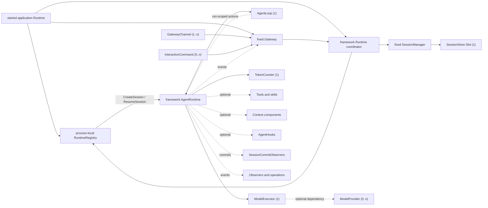

# AgentSlot Standard Component Map

[English](COMPONENT_MAP.md) | [简体中文](COMPONENT_MAP.zh-CN.md)

This document is the generated public map of the customization seams in a
composable LLM agent. The versioned `ComponentCatalog` in the
[`componentcatalog`](componentcatalog) package is its structured source. The
catalog and this view are primary AgentSlot assets, not a list of whatever
interfaces happen to exist in one implementation. The catalog is documentation
data and never participates in Runtime assembly. It also records publicly
constructible implementation identities, non-secret generation settings,
dependencies, conflicts, Tool keys, and the two deterministic `agentslot init`
presets. This scaffold metadata selects explicit source code; it is not a
Runtime service locator or hidden default.

The map answers four questions for component authors and application authors:

1. Which agent responsibilities can be implemented or replaced independently?
2. What is the stable Slot ID and cardinality of each responsibility?
3. Which components are required for a runnable standard agent?
4. How much evidence exists that each proposed standard is portable?

The composition core is already implemented. The domain contracts in this map
are being admitted incrementally. A mapped row must not be described as an
implemented Go interface until it reaches **Contracted** maturity.

Current repository reality:

| Inventory | Count |
| --- | ---: |
| Mapped standard component ecosystems | 41 |
| Standardized domain vocabularies | 9 |
| Contracted AgentSlot-owned domain interfaces | 32 |
| Conformant component ecosystems | 2 |
| Proven component ecosystems | 0 |
| Assembled standard component ecosystems | 0 |

The generic composition protocol exports five Go interfaces: `Module`,
`SlotRequirer`, `Registrar`, `Contribution`, and `Lifecycle`. Thirty-two domain
contracts are now defined across the standard leaf packages; one is
Conformant, the other thirty-one remain Contracted, and none is Proven.
The other nine ecosystems remain Mapped.

The nine counted vocabulary families are Agent Loop outcomes, model capability,
tool calls, policy/approval, observation, Goal, Memory, Workflow, and Billing. This count
tracks finite interoperable words and facts, not arbitrary constants.

## Runnable standard profile

A standard Agent explicitly enters through `standardagent.NewApplication`. It
returns the same `*agentslot.Application` as the generic core and automatically
mounts the fixed AgentRuntime/Gateway layer and an inspectable standard AgentLoop
default. The generic
`agentslot.NewApplication` never infers a standard Agent profile from installed
Slots.

The Go profile requires the five implemented ecosystems below. Token counting
is independently replaceable from model execution; a missing or failed counter
prevents provider dispatch rather than silently using an indefensible estimate.

`Assembly` is the immutable build result exposed by the current Go implementation.
Its description uses `AssemblyDescription` and the `agentslot.assembly/v0` schema.

| Slot ID | Standard contract | Kind | Required cardinality | Responsibility |
| --- | --- | --- | --- | --- |
| `agent.loop` | `AgentLoop` | `One` | exactly 1 | Owns replaceable Agent execution strategy through ordered, Run-scoped Runtime actions while the framework retains Session truth, budgets, cancellation, recovery, and terminal commits. |
| `session.store` | `SessionStore` | `One` | exactly 1 | Persists the whole Session aggregate and atomic revision/CAS transactions; preserves tool arguments by JSON value semantics across encoding and reopen; lists resumable Sessions through bounded, deterministic, lifecycle-scoped cursor pages within an Agent/Workspace scope; History remains the unique append-only fact view. |
| `model.executor` | `ModelExecutor` | `One` | exactly 1 | Validates selected-model capabilities, executes one logical model call with a checked temporary/reset/terminal stream, contains retries and continuation, reports post-call usage, and durably records each physical attempt plus an optional bounded adapter-sanitized displayable failure message through the restricted AttemptRecorder. |
| `model.token-counter` | `TokenCounter` | `One` | exactly 1 | Counts the complete provider-visible request for pre-call planning, using an exact tokenizer or a validated conservative bound and failing closed when neither is defensible. |
| `gateway.channel` | `GatewayChannel` | `Many` | at least 1 | Binds one caller-facing protocol, function API, or UI to the fixed Gateway and receives only `GatewayAccess`; gRPC, WebSocket, SSH, and inbound ACP are alternative implementations of this Slot. |

`AgentRuntime` and the in-process Gateway remain framework control-plane
behavior, not Slots. The selected `AgentLoop` controls execution strategy through
constrained, run-scoped actions without owning Session truth, Gateway routing,
or transaction invariants. Creating or explicitly resuming a Session
initializes one Runtime bound to that Session; listing or viewing Sessions does
not. One started application Runtime and all AgentRuntimes registered beneath it
live in one process. The same Session has one Runtime in that registry, that
Runtime stays resident while idle, and it is released only by explicit Close or
application shutdown.
Gateway channels invoke only the fixed Gateway's carrier-neutral API; they never
receive Runtime access or AgentRuntime pointers. `Application.Start` creates a
started application Runtime that owns one process-local Session-to-Runtime
registry and one Gateway. A
framework-internal Runtime coordinator operates that registry and is mounted
with the standard Agent Application; none is a public Slot. Every Runtime in
one registry lives in the same process, while persisted Sessions that have not
been opened occupy no Runtime. This is the standard architecture boundary, not
a first-version compromise.

An immutable AgentRuntimeConfig snapshot supplies SystemPrompt, ToolKeys,
MaxInlineToolResultBytes, and Context settings for one Runtime lifetime. An Agent-level default initializes
new Sessions, while each Session durably owns its current provider, model,
reasoning, and model parameters as SessionModelConfig. That model configuration
may be changed explicitly while the Runtime is idle and is snapshotted for each
Run. SystemPrompt and tool schemas are assembled into model requests; they are
not repeatedly stored as History facts merely because the model can see them.

The portable reasoning vocabulary is finite: `default`, `low`, `medium`,
`high`, `xhigh`, and `max`. `default` means that an adapter omits an explicit
effort when its protocol supports omission. A model descriptor declares the
subset it actually accepts; applications must not present or send the whole
portable vocabulary as if every model supported it. The standard model command
returns those per-model subsets in its query data and deliberately does not
publish one static reasoning dropdown in the command descriptor.

`ModelExecutor`, rather than `ModelProvider`, is globally mandatory because it
is the Runtime's logical model-call boundary. `model.provider` is an optional
`Many` Slot: an Executor that uses installed providers declares that dependency
explicitly, while another Executor may use a remote service or an embedded
backend without manufacturing a fake provider registry.

When an Executor declares a `model.provider` dependency and exactly one provider
is installed, it may select that provider automatically. With more than one,
selection must be explicit and deterministic, either in SessionModelConfig,
Executor configuration, or through `ModelSelector`; it must never depend on
module order, concrete Go type, or a hidden fallback.

Tools are deliberately not part of the minimum cardinality. A conversational
agent can run with zero tools. A coding or operational profile can require a
specific tool set without making that requirement universal.

## Maturity scorecard

The component map and the implementation scorecard are deliberately separate.
Mapping a responsibility is an architectural decision; proving its portable
method-level contract is an engineering result.

| Level | Meaning |
| --- | --- |
| **Mapped** | Responsibility, boundary, Slot ID, and cardinality are defined here. No public Go interface is implied. |
| **Contracted** | A public AgentSlot-owned domain interface and typed Slot declaration exist. |
| **Conformant** | A reusable black-box suite has passed against an exact AgentSlot commit, verifying required behavior, cancellation, failures, and lifecycle ownership. |
| **Proven** | At least two semantically independent implementations pass the same suite version. Wrappers over the same implementation count once. |
| **Assembled** | LAS or another approved real consumer exchanges proven implementations through the Slot without concrete-type branches. |

Thirty-two domain rows are now at least **Contracted**: each has a public
domain interface, typed Slot, and contract tests. The repository now contains
in-memory and crash-safe file Session stores, deterministic Fake and
OpenAI Chat Compatible executors, Bash/file/HTTP tools, in-process and CLI
Gateway channels, deterministic tool policy/approval components, and a JSON Lines
observation module. The fixed Runtime and selected AgentLoop consume these components without
concrete-type branches.

`session.store` is **Conformant**: the reusable `session.store/v1` black-box
suite passed all required public behavior and durable-reopen scenarios against
the exact AgentSlot `v0.0.10` commit
`c6b42a767d5422464ebc2978bf408b7d15eb5125`, with no failures or skips.
MemoryStore remains a process-lifetime reference check, and MemoryStore/FileStore
share one implementation codebase, so this is one implementation result rather
than Proven evidence. The other thirty-one domain rows remain **Contracted**;
every other row remains **Mapped**.

The current score is 1 Conformant, 0 Proven, and 0 Assembled.

The score is measured by proven component ecosystems, not by the number of
modules, packages, or interface methods. One module may contribute to several
Slots, and several modules may contribute to one `Many` or `Chain` Slot.

## Component ecosystems

### 1. Runtime and interaction

| Slot ID | Contract | Kind | Profile rule | Responsibility | Maturity |
| --- | --- | --- | --- | --- | --- |
| `agent.loop` | `AgentLoop` | `One` | globally requires exactly 1 | Owns replaceable Agent execution strategy through ordered, Run-scoped Runtime actions while the framework retains Session truth, budgets, cancellation, recovery, and terminal commits. | Contracted |
| `gateway.channel` | `GatewayChannel` | `Many` | globally requires at least 1 | Binds one caller-facing protocol, function API, or UI to the fixed Gateway and receives only `GatewayAccess`; gRPC, WebSocket, SSH, and inbound ACP are alternative implementations of this Slot. | Contracted |
| `interaction.command` | `InteractionCommand` | `Many` | optional | Registers a keyed UI-neutral command with the fixed Gateway; Channels render the shared descriptor as slash commands, menus, buttons, forms, or command palettes. | Contracted |
| `agent.hook` | `AgentHook` | `Chain` | optional | Proposes controlled follow-on input before run completion; it cannot mutate Session state or become a second Runtime controller. | Contracted |
| `goal.store` | `goal.Store` | `One` | optional; installed with `goal.evaluator` | Owns one CAS-protected objective lifecycle per Session, separate from append-only conversation History. | Contracted |
| `goal.evaluator` | `goal.Evaluator` | `One` | optional; installed with `goal.store` | Makes a structured continue/blocked/done decision before an otherwise finished Run closes. | Contracted |
| `session.commit.observer` | `SessionCommitObserver` | `Chain` | optional | Asynchronously observes applied Session revisions and their appended History sequence ranges; failures and panics cannot roll back a commit. | Contracted |

The fixed AgentRuntime and Gateway are deliberately absent from this table: the
map records customization seams, not every framework object. AgentLoop is a
standard seam, but it cannot replace the Runtime's Session ownership, CAS,
Gateway routing, cancellation, or history invariants.

Goal is deliberately attached to the fixed completion boundary rather than
implemented as CRUD alone. An active Goal is evaluated after the assistant
would otherwise stop. `continue` supplies one identity-free follow-on input;
`blocked` pauses the Goal; `done` completes it. The finite reason vocabulary is
validated, model-backed evaluators receive the same restricted AttemptRecorder,
and evaluator failure pauses rather than guessing. User steer arriving during
evaluation takes precedence. Goal state remains outside conversation History.

### 2. Model access

| Slot ID | Contract | Kind | Profile rule | Responsibility | Maturity |
| --- | --- | --- | --- | --- | --- |
| `model.executor` | `ModelExecutor` | `One` | globally required | Validates selected-model capabilities, executes one logical model call with a checked temporary/reset/terminal stream, contains retries and continuation, reports post-call usage, and durably records each physical attempt plus an optional bounded adapter-sanitized displayable failure message through the restricted AttemptRecorder. | Conformant |
| `model.token-counter` | `TokenCounter` | `One` | globally requires exactly 1 | Counts the complete provider-visible request for pre-call planning, using an exact tokenizer or a validated conservative bound and failing closed when neither is defensible. | Contracted |
| `model.attempt.observer` | `AttemptObserver` | `Chain` | optional | Synchronously records or rejects one physical provider attempt before dispatch and after completion; unlike passive telemetry it may fail closed. | Contracted |
| `model.provider` | `ModelProvider` | `Many` | optional; required only by an Executor that declares it | Implements named provider access for Executors that compose local adapters. | Mapped |
| `model.selector` | `ModelSelector` | `One` | optional; conditional for dynamic routing | Selects a provider/model using explicit request and policy inputs. | Mapped |
| `model.catalog` | `ModelCatalog` | `Many` | optional | Describes available models and their declared capabilities without exposing credentials. | Contracted |
| `model.middleware` | `ModelMiddleware` | `Chain` | optional | Applies observable request/response concerns without changing provider identity. | Mapped |

An explicit SessionModelConfig is authoritative. A ModelSelector may validate
it, resolve aliases, apply authorization, or reject it, but must not silently
route the Session to a different model. An interactive `model` command may use
ModelCatalog contributions to present candidates; that presentation is not part
of the fixed Runtime backend contract.

AgentSlot fixes the finite model vocabulary in the
[`model` package](model):

- input and output modalities are exactly `text`, `image`, and `audio`;
- every selected model declares input and output modality sets separately;
- tool calling is a separate capability because it is an action, not a media
  modality.

Provider wire blocks, model IDs, context limits, rate limits, media transport,
and vendor-specific features remain implementation declarations. Adding a new
standard modality is an explicit future standard revision, not a free-form
string accepted by current adapters.

OpenAI Chat Compatible is a required official adapter, not the standard
contract itself. The provider-neutral contract must not force Anthropic,
OpenAI Responses, local inference, or future protocols into OpenAI-specific
wire objects.

### 3. Tools and skills

| Slot ID | Contract | Kind | Profile rule | Responsibility | Maturity |
| --- | --- | --- | --- | --- | --- |
| `tool` | `Tool` | `Many` | optional globally; profiles may require keys | Declares and invokes a named capability available to AgentRuntime. | Contracted |
| `skill` | `Skill` | `Many` | optional | Supplies discoverable instructions, resources, or component bundles without pretending natural-language keyword matching is semantic routing. | Mapped |
| `tool.middleware` | `ToolMiddleware` | `Chain` | optional | Wraps invocation for policy, telemetry, normalization, or recovery. | Mapped |

The [`tool` package](tool) fixes the portable tool-call vocabulary:

- every model-facing tool definition has a self-contained JSON Schema Draft
  2020-12 input schema;
- the schema root is a closed object (`type: object` and
  `additionalProperties: false`), while internal references remain available;
- tool-call arguments are JSON instance values and must validate against that
  schema before invocation;
- call ID, tool name, and argument values are distinct from the schema.

This subset can be used as an OpenAPI 3.1 Schema Object, but a tool is not
required to be an HTTP API. Provider adapters may declare smaller supported
keyword and size limits; they may not reinterpret the standard schema.

Common file read/write/edit and controlled shell execution belong in an
official optional component pack. They must remain disableable, and their risk
decisions must use policy/approval components rather than concrete UI checks.

ToolInvocation carries an explicit inline-output budget and ToolResult carries
a standard list of `artifact.store` metadata references. Tools handle the
budget normally; fixed Runtime validates it before History persistence and
never silently truncates or automatically retries a violating, possibly
effectful call. Capture,
preview, truncation, search, and paged reading remain Tool/package behavior and
do not form a second `tool.output-store` ecosystem.

### 4. Context, history, and memory

| Slot ID | Contract | Kind | Profile rule | Responsibility | Maturity |
| --- | --- | --- | --- | --- | --- |
| `session.store` | `SessionStore` | `One` | globally required | Persists the whole Session aggregate and atomic revision/CAS transactions; preserves tool arguments by JSON value semantics across encoding and reopen; lists resumable Sessions through bounded, deterministic, lifecycle-scoped cursor pages within an Agent/Workspace scope; History remains the unique append-only fact view. | Conformant |
| `context.source` | `ContextSource` | `Chain` | optional | Contributes ordered context for a model turn. | Contracted |
| `context.compactor` | `ContextCompactor` | `One` | optional | Replaces the current full Context with a smaller conversation-message projection without rewriting History; AgentRuntime reattaches fixed prompts/tools and validates protocol and hard token limits. | Contracted |
| `memory.store` | `MemoryStore` | `Many` | optional | Recalls, remembers, and forgets governed long-term memory outside authoritative conversation History. | Contracted |
| `checkpoint.store` | `CheckpointStore` | `One` | optional | Saves resumable execution state without pretending it is user-visible history. | Mapped |

Terminology is strict:

- A **session** is stable identity and lifecycle.
- **History** is the unique append-only fact ledger in actual committed order; it is not required to be a directly sendable provider message sequence at every instant.
- **Context** is the versioned, model-protocol-valid projection assembled for the next model call; an unpaired tool call is not projected.
- **Queue** is the durable set of normal, steer, and held messages not yet in Context.
- **RunJournal** records in-flight execution and tool recovery evidence, not model context or a second conversation ledger.
- **Memory** is durable recall selected for possible future use.
- A **checkpoint** is resumable runtime state.

Every `SessionStore` must keep committed History facts strictly append-only. An
implementation may not edit, delete, reorder, or insert facts before the
committed tail. The Store must also atomically coordinate History, Context,
Queue, RunJournal, and revision/CAS boundaries. Compaction creates derived
context; it never rewrites History. Tool arguments retain identity by exact
JSON value semantics across Store encoding and reopen, while duplicate object
members are rejected before admission. Runtime recovery may expose idle only
after the durable Run has a unique terminal fact; any running or inconsistent
snapshot fails closed for explicit resume.
Session listing is deliberately weakly consistent: one traversal excludes new
Sessions created after its first page and never repeats a returned position,
while concurrent deletion may remove a pending Session and an update may move
one before the cursor until a fresh traversal. Cursors are opaque and valid
only for the issuing Store lifecycle and exact Agent/Workspace scope. Listing
must not create, load, recover, or start a Session Runtime.
The standard Compactor contract is replaceable: any “summary plus last three
inbound messages” algorithm is a default implementation, not a framework
invariant.
`session_history` is a keyed standard Tool rather than a new Slot. It returns a
model-safe, revision/sequence-traceable projection through a narrow read-only
History boundary, preserves complete logical Steps under the ToolResult budget,
and never opens Artifact content automatically. Its configurable ceiling is
current Session, same Workspace, or explicitly authorized full access; same
Workspace is the default, and its public Authorizer hook can only narrow it.
The `memory` package fixes portable scope and memory-kind vocabularies and
provides optional recall/remember/forget tools plus a pre-recall ContextSource.
Its Store contract preserves four typed candidate payloads, source and
confidence facts, execution provenance, explicit visibility/writeback
governance, recall intent, and evidence selection. The host injects execution
identity and governance; model tool arguments cannot choose them. Implementers
remain free to select storage, indexing, ranking, retention, and consolidation
strategies. An adapter may map the portable facts into a richer memory SDK, but
it may not turn memory into a second Session history, infer write scope from
prompt text, invent missing facts, or silently discard a supplied fact.

### 5. Workspace, execution, and artifacts

| Slot ID | Contract | Kind | Profile rule | Responsibility | Maturity |
| --- | --- | --- | --- | --- | --- |
| `workspace.manager` | `workspace.Manager` | `One` | optional | Resolves and isolates the trusted resource boundary visible to a Session or Run; a Workspace may be a local directory, container, remote resource, cloud notes, or object storage, while concrete operations remain separate components. | Contracted |
| `execution.environment` | `ExecutionEnvironment` | `Many` | optional | Executes commands or code in a named local, container, sandbox, or remote environment. | Mapped |
| `artifact.store` | `ArtifactStore` | `One` | optional; required by components that consume attachments | Persists immutable inbound or generated content—including tool content deliberately retained long-term—and resolves stable metadata/references without placing binary data, local paths, or credentials in History. | Contracted |
| `credential.resolver` | `Resolver` | `One` | optional; required by configured outbound adapters | Late-resolves a product-supplied non-secret Ref inside one physical outbound-operation callback; supports distinct credential shapes while exposing only an opaque non-reversible identity outside that callback. | Contracted |

### 6. Policy, authorization, and human approval

| Slot ID | Contract | Kind | Profile rule | Responsibility | Maturity |
| --- | --- | --- | --- | --- | --- |
| `policy.guard` | `PolicyGuard` | `Chain` | optional | Evaluates a detached proposed tool action in deterministic order without gaining execution authority. | Contracted |
| `approval.service` | `ApprovalService` | `One` | optional; risk profiles may require it | Resolves an approval request after policy requires confirmation, independently of a particular UI. | Contracted |
| `authorization.provider` | `AuthorizationProvider` | `One` | optional | Decides whether an authenticated principal may perform an agent operation. | Mapped |

The initial portable policy vocabulary is intentionally narrow: one detached
tool-action proposal and exactly three effects—`allow`, `deny`, and
`require_approval`. Guards cannot replace arguments or execute an action. The
fixed dispatcher evaluates every Guard, resolves approval when required, and
remains the sole owner of the original invocation. New policy action kinds
require separate evidence rather than widening this contract with an opaque
map.

### 7. Multi-agent and workflow

| Slot ID | Contract | Kind | Profile rule | Responsibility | Maturity |
| --- | --- | --- | --- | --- | --- |
| `agent.provider` | `AgentProvider` | `Many` | optional | Executes a task through a named child-agent or remote-agent implementation. | Contracted |
| `workflow.scheduler` | `Scheduler` | `One` | optional | Schedules asynchronous multi-agent work without replacing the fixed per-Session AgentRuntime. | Contracted |
| `job.store` | `JobStore` | `One` | optional | Persists CAS-versioned queued/running/terminal workflow job state and wait notifications. | Contracted |
| `mailbox` | `Mailbox` | `One` | optional | Carries append-only, addressed asynchronous messages between Sessions and jobs. | Contracted |

The reference Scheduler depends only on these Slots and the optional standard
`agent.*` tool pack consumes only `workflow.scheduler` and `mailbox`. Its
in-memory stores prove the lifecycle and replacement boundary; they do not
claim cross-process recovery or production durability. A durable implementation
must preserve the same terminal-state and addressed-message facts.

### 8. Gateway and delivery

The fixed Gateway is an in-process, carrier-neutral interaction backend, not a
network forwarding service and not a Slot. Every direct TUI, Web UI, desktop
application, function API, HTTP server, or ACP server installs a
`GatewayChannel`, and every Channel calls the same Gateway API. In-process
Channels call it directly; out-of-process Channels map their wire protocol onto
it. A Channel owns its communication protocol, remote authentication and
authorization, routing, output encoding, and rate limiting. These are not
separate standard Slots because splitting them would create alternate paths
around the fixed Gateway. The Channel passes a durable `ActorIdentity` with
every write; Gateway records it but never uses it to re-authenticate or stores
credentials.

Only the Gateway consumes `interaction.command` contributions. It exposes one
UI-neutral command directory and structured invocation contract. A Channel
may render the stable key `model` as `/model`, a menu, a button, or a form, but
does not execute a separate command implementation. InteractionCommand cannot
access SessionStore, Runtime access, or the model/tool loop directly.
The framework currently provides an explicitly installed built-in `model`
command, a function-style `interaction/inprocess` Channel, and a line-oriented
`interaction/cli` Channel as reference implementations. Importing any package
installs nothing; the absence of a shared conformance suite keeps these
ecosystems at Contracted maturity.

AgentSlot standardizes neither transient-chunk cursors nor client ACK cursors.
Every external write carries `ExpectedRevision`. A stale write returns a typed
revision conflict with the current revision and is never retried implicitly.
Reconnect reads the authoritative `SessionView`: it contains current state,
Queue, model configuration, and at most the latest 100 complete logical Steps.
Older History is read backwards with an exclusive `BeforeHistorySequence`
cursor and a maximum of 100 complete Steps per page. After persistence Gateway
emits only `SessionID + Revision`; clients then refresh the View. Transient
chunk/reset events carry the Runtime-reserved assistant `MessageID` that an
eventual durable Message will reuse, but that correlation does not make the
temporary text durable. Transient events may be dropped, and disconnect never cancels the Run. A
subscriber whose buffer cannot accept a durable revision notification is
closed explicitly and reconnects through View rather than consuming unbounded
memory. A concrete Channel or external messaging system may keep private
reliable-delivery state, but that state is not a standard Slot or Session fact
and cannot change Run completion.

### 9. Usage and billing

| Slot ID | Contract | Kind | Profile rule | Responsibility | Maturity |
| --- | --- | --- | --- | --- | --- |
| `usage.recorder` | `UsageRecorder` | `Chain` | optional | Receives Provider-reported token usage for one identified physical model attempt. | Contracted |
| `price.resolver` | `PriceResolver` | `One` | optional | Resolves an integer-micro, currency- and version-labelled price for normalized usage. | Contracted |
| `quota.guard` | `QuotaGuard` | `One` | optional | Checks, reserves, commits, or releases explicitly attributed quota before provider work. | Contracted |
| `billing.ledger` | `BillingLedger` | `One` | optional | Persists immutable physical-attempt intent and outcome facts for audit and later settlement. | Contracted |

`usage.recorder` remains passive and best-effort; it cannot enforce quota or
serve as the durable billing handoff. The `billing` attempt module instead
contributes a synchronous `model.attempt.observer`: quota reservation and
durable intent finish before request bytes may be sent, and terminal ledger and
quota settlement finish before retry or logical completion. Account, tenant,
plan, price-table, and credential-fingerprint policy remain explicit adapter or
product configuration.

### 10. Operations and audit

| Slot ID | Contract | Kind | Profile rule | Responsibility | Maturity |
| --- | --- | --- | --- | --- | --- |
| `audit.sink` | `AuditSink` | `Chain` | optional | Receives model-config and tool-policy decision facts without message content or tool arguments. | Contracted |
| `trace.sink` | `TraceSink` | `Chain` | optional | Receives correlated Runtime, Run, model-attempt, and tool lifecycle facts. | Contracted |
| `metric.sink` | `MetricSink` | `Chain` | optional | Receives normalized counters and duration measurements with detached attributes. | Contracted |
| `health.contributor` | `HealthContributor` | `Chain` | optional | Reports component readiness and health without exposing configuration values. | Mapped |

The `observe` package fixes another finite vocabulary family: correlated
Runtime/Run/model-attempt/tool trace facts, counter or duration metrics,
model-config/tool-decision audits, and Provider-reported model token usage.
These chains are passive and best-effort. They receive no message content,
tool arguments, credentials, component values, or mutation capability; they
are not a second Session ledger. A product that must reject an action uses
Policy/Approval before execution instead of treating sink availability as an
authorization decision. `observe/jsonlines` is an explicitly installed,
thread-safe reference implementation.

## Standard contract admission

Moving a row beyond **Mapped** requires method-level design based on real
semantics rather than the API shape of one legacy SDK:

1. Compare at least two independent implementations or protocols.
2. Write conformance tests before freezing the public contract.
3. Prove one consumer can replace implementations through the Slot without a
   concrete-type branch.
4. Preserve cancellation, streaming, errors, lifecycle ownership, and other
   semantics required by either implementation.
5. Keep provider-, product-, and transport-specific configuration outside the
   AgentSlot composition core.

Previous-generation SDKs are evidence and migration sources. They may add
AgentSlot adapters without changing their existing assembly paths, so current
products can continue iterating. They do not permanently own an industry-level
contract merely because they implemented the responsibility first.

## Required conformance evidence

The standard profile and every admitted component contract must be covered by
automated tests for the rules that apply to it:

- missing required component;
- duplicate contribution to a unique Slot;
- duplicate key in a `Many` Slot;
- declared dependency cycle;
- startup failure rollback in reverse order;
- replacement without concrete implementation branches;
- cancellation and error propagation;
- strict append-only history when history is installed;
- deterministic provider selection;
- target `Assembly.Describe()` visibility of Slot IDs, cardinality, dependencies, source,
  and lifecycle order without component values, configuration, or secrets.

The reference standard agent must additionally prove a no-key automated path
with a deterministic test provider and retain a real OpenAI Chat Compatible
configuration path. A fake provider is test infrastructure, never a substitute
for the real adapter proof.

## Change policy

Changing a Slot ID, responsibility boundary, kind, or required cardinality is
an architectural change. Every such change must update this map, explain its
compatibility impact, and update the scorecard evidence. Adding another row is
not automatically progress: the new boundary must reduce coupling and make an
independently implementable responsibility clearer.
