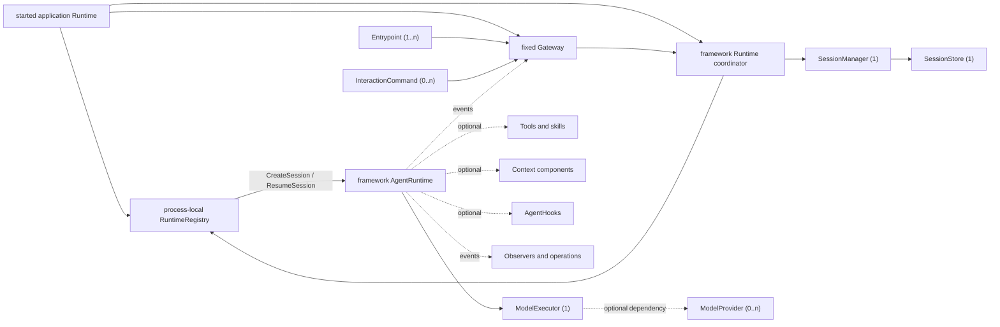

# AgentSlot Standard Component Map

[English](COMPONENT_MAP.md) | [简体中文](COMPONENT_MAP.zh-CN.md)

For complete object ownership, the Gateway spine, and package dependency
direction, read the [Agent framework panorama](docs/agent-framework-architecture.zh-CN.md).

This document is the authoritative map of the customization seams in a
composable LLM agent. It is a primary AgentSlot asset, not a list of whatever
interfaces happen to exist in one implementation.

The map answers four questions for component authors and application authors:

1. Which agent responsibilities can be implemented or replaced independently?
2. What is the stable Slot ID and cardinality of each responsibility?
3. Which components are required for a runnable standard agent?
4. How much evidence exists that each proposed standard is portable?

The composition core is already implemented. The domain contracts in this map
are being admitted incrementally. A mapped row must not be described as an
implemented Go interface until it reaches **Contracted** maturity.

Current repository reality:

| Inventory | Count |
| --- | ---: |
| Mapped standard component ecosystems | 42 |
| Standardized domain vocabularies | 2 |
| Contracted AgentSlot-owned domain interfaces | 9 |
| Conformant component ecosystems | 0 |
| Proven component ecosystems | 0 |
| Assembled standard component ecosystems | 0 |

The generic composition protocol exports five Go interfaces: `Module`,
`SlotRequirer`, `Registrar`, `Contribution`, and `Lifecycle`. The first nine
domain contracts are now defined in the `session`, `model`, `tool`, `context`,
`hook`, and `interaction` packages; they are Contracted but not yet Conformant
or Proven.

## Runnable standard profile

A standard Agent explicitly enters through `standardagent.NewApplication`. It
returns the same `*agentslot.Application` as the generic core and automatically
mounts the fixed AgentRuntime/Gateway layer. The generic
`agentslot.NewApplication` never infers a standard Agent profile from installed
Slots.

An AgentSlot application conforms to the runnable standard agent profile only
when its Assembly contains all four of these component ecosystems:

`Assembly` is the immutable build result exposed by the current Go implementation.
Its description uses `AssemblyDescription` and the `agentslot.assembly/v0` schema.

| Slot ID | Standard contract | Kind | Required cardinality | Responsibility |
| --- | --- | --- | --- | --- |
| `session.manager` | `SessionManager` | `One` | exactly 1 | Creates, resumes, forks, or summary-starts a stable Session without absorbing its replaceable persistence implementation. |
| `session.store` | `SessionStore` | `One` | exactly 1 | Persists the Session aggregate—History, Context, Queue, RunJournal, SessionModelConfig, revisions, and atomic CAS transactions. |
| `model.executor` | `ModelExecutor` | `One` | exactly 1 | Executes one logical model call while containing provider-specific physical attempts, streaming recovery, and final failure semantics. |
| `interaction.entrypoint` | `Entrypoint` | `Many` | at least 1 | Adapts TUI, Web, desktop, function, HTTP, ACP, or another caller-facing surface to the fixed Gateway. |

`AgentRuntime`, the in-process Gateway, and their control path are framework
behavior, not Slots or replaceable component ecosystems. Creating or explicitly resuming a Session
initializes one Runtime bound to that Session; listing or viewing Sessions does
not. One started application Runtime and all AgentRuntimes registered beneath it
live in one process. The same Session has one Runtime in that registry, that
Runtime stays resident while idle, and it is released only by explicit Close or
application shutdown.
Entrypoints invoke only the fixed Gateway's carrier-neutral API; they never
receive Runtime access or AgentRuntime pointers. `Application.Start` creates a
started application Runtime that owns one process-local Session-to-Runtime
registry and one Gateway. A
framework-internal Runtime coordinator operates that registry and is mounted
with the standard Agent Application; none is a public Slot. Every Runtime in
one registry lives in the same process, while persisted Sessions that have not
been opened occupy no Runtime. This is the standard architecture boundary, not
a first-version compromise.

An immutable AgentRuntimeConfig snapshot supplies SystemPrompt, ToolKeys, and
Context settings for one Runtime lifetime. An Agent-level default initializes
new Sessions, while each Session durably owns its current provider, model,
reasoning, and model parameters as SessionModelConfig. That model configuration
may be changed explicitly while the Runtime is idle and is snapshotted for each
Run. SystemPrompt and tool schemas are assembled into model requests; they are
not repeatedly stored as History facts merely because the model can see them.

`ModelExecutor`, rather than `ModelProvider`, is globally mandatory because it
is the Runtime's logical model-call boundary. `model.provider` is an optional
`Many` Slot: an Executor that uses installed providers declares that dependency
explicitly, while another Executor may use a remote service or an embedded
backend without manufacturing a fake provider registry.

When an Executor declares a `model.provider` dependency and exactly one provider
is installed, it may select that provider automatically. With more than one,
selection must be explicit and deterministic, either in SessionModelConfig,
Executor configuration, or through `ModelSelector`; it must never depend on
module order, concrete Go type, or a hidden fallback.

Tools are deliberately not part of the minimum cardinality. A conversational
agent can run with zero tools. A coding or operational profile can require a
specific tool set without making that requirement universal.

## Maturity scorecard

The component map and the implementation scorecard are deliberately separate.
Mapping a responsibility is an architectural decision; proving its portable
method-level contract is an engineering result.

| Level | Meaning |
| --- | --- |
| **Mapped** | Responsibility, boundary, Slot ID, and cardinality are defined here. No public Go interface is implied. |
| **Contracted** | A public AgentSlot-owned domain interface and typed Slot declaration exist. |
| **Conformant** | A reusable conformance suite verifies required behavior, cancellation, failures, and lifecycle ownership. |
| **Proven** | At least two semantically independent implementations pass the conformance suite. Wrappers over the same implementation count once. |
| **Assembled** | A reference application exchanges proven implementations through the Slot without concrete-type branches. |

Nine foundational domain rows are now **Contracted**: each has a public domain
interface, typed Slot, and contract tests. `session.manager` and `session.store`
also have one reference in-memory implementation with focused behavior tests,
and `model.executor` has one deterministic Fake implementation consumed by the
fixed Runtime. None has a reusable conformance suite or independent second
implementation; they therefore remain Contracted rather than Conformant or
Proven. Every other domain row remains **Mapped**.

The score is measured by proven component ecosystems, not by the number of
modules, packages, or interface methods. One module may contribute to several
Slots, and several modules may contribute to one `Many` or `Chain` Slot.

## Component ecosystems

### 1. Runtime and interaction

| Slot ID | Contract | Kind | Profile rule | Responsibility | Maturity |
| --- | --- | --- | --- | --- | --- |
| `session.manager` | `SessionManager` | `One` | globally required | Creates, resumes, fully forks, or summary-starts stable Sessions while depending on replaceable SessionStore persistence. | Contracted |
| `interaction.entrypoint` | `Entrypoint` | `Many` | globally requires at least 1 | Adapts a caller-facing protocol, function API, or UI to the fixed Gateway without receiving Runtime access. | Contracted |
| `interaction.command` | `InteractionCommand` | `Many` | optional | Registers a keyed UI-neutral command with the fixed Gateway; Entrypoints render the shared descriptor as slash commands, menus, buttons, forms, or command palettes. | Contracted |
| `agent.hook` | `AgentHook` | `Chain` | optional | Runs ordered, controlled hooks: proposes follow-on input before run completion or observes committed facts, without mutating Session or Runtime state directly. | Contracted |
| `runtime.observer` | `RuntimeObserver` | `Chain` | optional | Passively observes typed agent, run, message, tool, retry, and lifecycle events without controlling the Runtime. | Mapped |

The fixed AgentRuntime and Gateway are deliberately absent from this table: the
map records customization seams, not every framework object. A product that
needs a wholly different loop or interaction backend may define a local Slot
and explicit non-standard profile on the generic composition core, but it is
not a conforming standard LLM Agent application.

### 2. Model access

| Slot ID | Contract | Kind | Profile rule | Responsibility | Maturity |
| --- | --- | --- | --- | --- | --- |
| `model.executor` | `ModelExecutor` | `One` | globally required | Executes one logical model request and emits provider-neutral temporary output, reset, complete result, or final failure while owning physical attempts and recovery. | Contracted |
| `model.provider` | `ModelProvider` | `Many` | optional; required only by an Executor that declares it | Implements named provider access for Executors that compose local adapters. | Mapped |
| `model.selector` | `ModelSelector` | `One` | optional; conditional for dynamic routing | Selects a provider/model using explicit request and policy inputs. | Mapped |
| `model.catalog` | `ModelCatalog` | `Many` | optional | Describes available models and their declared capabilities without exposing credentials. | Mapped |
| `model.middleware` | `ModelMiddleware` | `Chain` | optional | Applies observable request/response concerns without changing provider identity. | Mapped |

An explicit SessionModelConfig is authoritative. A ModelSelector may validate
it, resolve aliases, apply authorization, or reject it, but must not silently
route the Session to a different model. An interactive `model` command may use
ModelCatalog contributions to present candidates; that presentation is not part
of the fixed Runtime backend contract.

AgentSlot fixes the finite model vocabulary in the
[`model` package](model):

- input and output modalities are exactly `text`, `image`, and `audio`;
- every selected model declares input and output modality sets separately;
- tool calling is a separate capability because it is an action, not a media
  modality.

Provider wire blocks, model IDs, context limits, rate limits, media transport,
and vendor-specific features remain implementation declarations. Adding a new
standard modality is an explicit future standard revision, not a free-form
string accepted by current adapters.

OpenAI Chat Compatible is a required official adapter, not the standard
contract itself. The provider-neutral contract must not force Anthropic,
OpenAI Responses, local inference, or future protocols into OpenAI-specific
wire objects.

### 3. Tools and skills

| Slot ID | Contract | Kind | Profile rule | Responsibility | Maturity |
| --- | --- | --- | --- | --- | --- |
| `tool` | `Tool` | `Many` | optional globally; profiles may require keys | Declares and invokes a named capability available to AgentRuntime. | Contracted |
| `skill` | `Skill` | `Many` | optional | Supplies discoverable instructions, resources, or component bundles without pretending natural-language keyword matching is semantic routing. | Mapped |
| `tool.middleware` | `ToolMiddleware` | `Chain` | optional | Wraps invocation for policy, telemetry, normalization, or recovery. | Mapped |
| `tool.output-store` | `ToolOutputStore` | `One` | optional | Stores oversized or binary tool results and returns stable references. | Mapped |

The [`tool` package](tool) fixes the portable tool-call vocabulary:

- every model-facing tool definition has a self-contained JSON Schema Draft
  2020-12 input schema;
- the schema root is a closed object (`type: object` and
  `additionalProperties: false`), while internal references remain available;
- tool-call arguments are JSON instance values and must validate against that
  schema before invocation;
- call ID, tool name, and argument values are distinct from the schema.

This subset can be used as an OpenAPI 3.1 Schema Object, but a tool is not
required to be an HTTP API. Provider adapters may declare smaller supported
keyword and size limits; they may not reinterpret the standard schema.

Common file read/write/edit and controlled shell execution belong in an
official optional component pack. They must remain disableable, and their risk
decisions must use policy/approval components rather than concrete UI checks.

### 4. Context, history, and memory

| Slot ID | Contract | Kind | Profile rule | Responsibility | Maturity |
| --- | --- | --- | --- | --- | --- |
| `session.store` | `SessionStore` | `One` | globally required | Persists the whole Session aggregate, including SessionModelConfig, and its atomic revision/CAS transactions; History remains the unique append-only fact view inside that aggregate. | Contracted |
| `context.source` | `ContextSource` | `Chain` | optional | Contributes ordered context for a model turn. | Contracted |
| `context.compactor` | `ContextCompactor` | `One` | optional | Replaces the current full Context with a smaller conversation-message projection without rewriting History; AgentRuntime reattaches fixed prompts/tools and validates protocol and hard token limits. | Contracted |
| `memory.store` | `MemoryStore` | `Many` | optional | Reads and writes durable recall outside the authoritative conversation history. | Mapped |
| `checkpoint.store` | `CheckpointStore` | `One` | optional | Saves resumable execution state without pretending it is user-visible history. | Mapped |

Terminology is strict:

- A **session** is stable identity and lifecycle.
- **History** is the unique append-only fact ledger in actual committed order; it is not required to be a directly sendable provider message sequence at every instant.
- **Context** is the versioned, model-protocol-valid projection assembled for the next model call; an unpaired tool call is not projected.
- **Queue** is the durable set of normal, steer, and held messages not yet in Context.
- **RunJournal** records in-flight execution and tool recovery evidence, not model context or a second conversation ledger.
- **Memory** is durable recall selected for possible future use.
- A **checkpoint** is resumable runtime state.

Every `SessionStore` must keep committed History facts strictly append-only. An
implementation may not edit, delete, reorder, or insert facts before the
committed tail. The Store must also atomically coordinate History, Context,
Queue, RunJournal, and revision/CAS boundaries. Compaction creates derived
context; it never rewrites History.
The standard Compactor contract is replaceable: any “summary plus last three
inbound messages” algorithm is a default implementation, not a framework
invariant.

### 5. Workspace, execution, and artifacts

| Slot ID | Contract | Kind | Profile rule | Responsibility | Maturity |
| --- | --- | --- | --- | --- | --- |
| `workspace.manager` | `WorkspaceManager` | `One` | optional | Defines the files, roots, isolation, and lifetime visible to an agent session or run. | Mapped |
| `execution.environment` | `ExecutionEnvironment` | `Many` | optional | Executes commands or code in a named local, container, sandbox, or remote environment. | Mapped |
| `artifact.store` | `ArtifactStore` | `One` | optional | Persists generated files and exposes stable metadata/references. | Mapped |
| `credential.resolver` | `CredentialResolver` | `One` | optional | Resolves scoped credentials without placing secret values in Assemblies or component descriptions. | Mapped |

### 6. Policy, authorization, and human approval

| Slot ID | Contract | Kind | Profile rule | Responsibility | Maturity |
| --- | --- | --- | --- | --- | --- |
| `policy.guard` | `PolicyGuard` | `Chain` | optional | Evaluates proposed model, tool, data, or execution actions in deterministic order. | Mapped |
| `approval.service` | `ApprovalService` | `One` | optional; risk profiles may require it | Requests and resolves human approval independently of a particular TUI or gateway. | Mapped |
| `authorization.provider` | `AuthorizationProvider` | `One` | optional | Decides whether an authenticated principal may perform an agent operation. | Mapped |

### 7. Multi-agent and workflow

| Slot ID | Contract | Kind | Profile rule | Responsibility | Maturity |
| --- | --- | --- | --- | --- | --- |
| `agent.provider` | `AgentProvider` | `Many` | optional | Exposes named child-agent or remote-agent capabilities. | Mapped |
| `workflow.scheduler` | `WorkflowScheduler` | `One` | optional | Schedules multi-step or multi-agent work without replacing the fixed per-Session AgentRuntime. | Mapped |
| `job.store` | `JobStore` | `One` | optional | Persists queued/running/completed workflow job state. | Mapped |
| `mailbox` | `Mailbox` | `One` | optional | Carries addressed asynchronous messages between agents or jobs. | Mapped |

### 8. Gateway and delivery

| Slot ID | Contract | Kind | Profile rule | Responsibility | Maturity |
| --- | --- | --- | --- | --- | --- |
| `gateway.transport` | `GatewayTransport` | `Many` | optional | Connects named external channels such as HTTP, WebSocket, ACP, chat platforms, or message queues. | Mapped |
| `gateway.identity` | `IdentityResolver` | `One` | optional | Maps transport identities to stable application principals. | Mapped |
| `gateway.route` | `RouteResolver` | `One` | optional | Selects the target agent/session from authenticated inbound requests. | Mapped |
| `gateway.delivery` | `DeliveryAdapter` | `Many` | optional | Delivers asynchronous output back through a named external channel. | Mapped |

The fixed Gateway is an in-process, carrier-neutral interaction backend, not a
network forwarding service and not a Slot. Every direct TUI, Web UI, desktop
application, function API, HTTP server, or ACP server is an `Entrypoint` or uses
one, and every Entrypoint calls the same Gateway API. In-process adapters call it
directly; out-of-process adapters map their wire protocol onto it. The optional
gateway Slots above customize transport, identity, routing policy, and delivery
without replacing the Gateway core.

Only the Gateway consumes `interaction.command` contributions. It exposes one
UI-neutral command directory and structured invocation contract. An Entrypoint
may render the stable key `model` as `/model`, a menu, a button, or a form, but
does not execute a separate command implementation. InteractionCommand cannot
access SessionStore, Runtime access, or the model/tool loop directly.

AgentSlot standardizes neither transient-chunk cursors nor client ACK cursors.
Reconnect uses a client revision and Session Snapshot. A concrete transport
adapter or external messaging system may keep private reliable-delivery state, but that
state is not a standard Slot or Session fact and cannot change run completion.

### 9. Usage and billing

| Slot ID | Contract | Kind | Profile rule | Responsibility | Maturity |
| --- | --- | --- | --- | --- | --- |
| `usage.recorder` | `UsageRecorder` | `Chain` | optional | Records normalized model, tool, storage, or execution usage events. | Mapped |
| `price.resolver` | `PriceResolver` | `One` | optional | Resolves versioned prices for normalized usage. | Mapped |
| `quota.guard` | `QuotaGuard` | `One` | optional | Accepts or rejects work against declared budgets and quotas. | Mapped |
| `billing.ledger` | `BillingLedger` | `One` | optional | Persists auditable charges, credits, and reservation outcomes. | Mapped |

### 10. Operations and audit

| Slot ID | Contract | Kind | Profile rule | Responsibility | Maturity |
| --- | --- | --- | --- | --- | --- |
| `audit.sink` | `AuditSink` | `Chain` | optional | Receives security- and governance-relevant records. | Mapped |
| `trace.sink` | `TraceSink` | `Chain` | optional | Receives correlated runtime spans and events. | Mapped |
| `metric.sink` | `MetricSink` | `Chain` | optional | Receives normalized counters, gauges, and distributions. | Mapped |
| `health.contributor` | `HealthContributor` | `Chain` | optional | Reports component readiness and health without exposing configuration values. | Mapped |

## Standard contract admission

Moving a row beyond **Mapped** requires method-level design based on real
semantics rather than the API shape of one legacy SDK:

1. Compare at least two independent implementations or protocols.
2. Write conformance tests before freezing the public contract.
3. Prove one consumer can replace implementations through the Slot without a
   concrete-type branch.
4. Preserve cancellation, streaming, errors, lifecycle ownership, and other
   semantics required by either implementation.
5. Keep provider-, product-, and transport-specific configuration outside the
   AgentSlot composition core.

Previous-generation SDKs are evidence and migration sources. They may add
AgentSlot adapters without changing their existing assembly paths, so current
products can continue iterating. They do not permanently own an industry-level
contract merely because they implemented the responsibility first.

## Required conformance evidence

The standard profile and every admitted component contract must be covered by
automated tests for the rules that apply to it:

- missing required component;
- duplicate contribution to a unique Slot;
- duplicate key in a `Many` Slot;
- declared dependency cycle;
- startup failure rollback in reverse order;
- replacement without concrete implementation branches;
- cancellation and error propagation;
- strict append-only history when history is installed;
- deterministic provider selection;
- target `Assembly.Describe()` visibility of Slot IDs, cardinality, dependencies, source,
  and lifecycle order without component values, configuration, or secrets.

The reference standard agent must additionally prove a no-key automated path
with a deterministic test provider and retain a real OpenAI Chat Compatible
configuration path. A fake provider is test infrastructure, never a substitute
for the real adapter proof.

## Change policy

Changing a Slot ID, responsibility boundary, kind, or required cardinality is
an architectural change. Every such change must update this map, explain its
compatibility impact, and update the scorecard evidence. Adding another row is
not automatically progress: the new boundary must reduce coupling and make an
independently implementable responsibility clearer.
