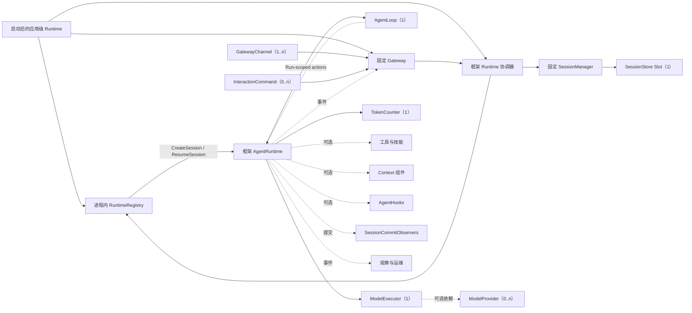

# AgentSlot 标准组件地图

[English](COMPONENT_MAP.md) | [简体中文](COMPONENT_MAP.zh-CN.md)

本文档是可组合 LLM Agent 定制边界的公开生成地图。版本化 `ComponentCatalog`
位于 [`componentcatalog`](componentcatalog) 包，是这张地图的结构化底稿。Catalog
与本视图都是 AgentSlot 的核心资产，不是对某一个实现中已有接口的简单罗列；Catalog
只保存标准文档数据，不参与 Runtime 装配。

这张地图回答组件开发者和应用开发者的四个问题：

1. Agent 的哪些职责可以独立实现或替换？
2. 每项职责对应的稳定 Slot ID 和基数是什么？
3. 一个可运行的标准 Agent 必须具备哪些组件？
4. 每项候选标准目前积累了多少可移植性证据？

组装核心已经实现，地图中的领域契约将分阶段准入。一个生态位只有达到
**已定义契约（Contracted）**成熟度后，才能被描述为已经实现的 Go 接口；
仅仅出现在地图上并不代表接口已经存在。

仓库当前真实状态：

| 资产 | 数量 |
| --- | ---: |
| 已映射的标准组件生态位 | 41 |
| 已标准化的领域词汇 | 9 |
| 已定义契约的 AgentSlot 自有领域接口 | 32 |
| 通过一致性验证的组件生态位 | 1 |
| 已由独立实现证明的组件生态位 | 0 |
| 已进入标准装配的组件生态位 | 0 |

独立的组装协议目前导出了五个 Go 接口：`Module`、`SlotRequirer`、
`Registrar`、`Contribution` 和 `Lifecycle`。它们是框架机制，不能代替
地图中 41 个 Agent 领域组件生态位；其中 32 个已经具备公开合同，1 个已通过一致性验证，
其余 31 个保持已定义契约，另外 9 个保持已映射，尚无生态位达到 Proven。

表中 9 组有限领域词汇分别是：Agent Loop 结果、模型能力、工具调用、策略/审批、观察、
Goal、Memory、Workflow 和 Billing。这个数字只统计为了互操作而固定的有限词汇和事实，不统计普通常量。

## 可运行标准 Profile

标准 Agent 必须通过 `standardagent.NewApplication` 显式启用标准 Profile。它返回通用
`*agentslot.Application`，自动挂载固定 AgentRuntime/Gateway 层和可检查的标准
AgentLoop 默认实现；通用
`agentslot.NewApplication` 不会根据已安装 Slot 隐式推断标准 Agent。

Go Profile 要求下表五个已经实现的生态位。Token 计数与模型执行可独立替换；计数器缺失
或失败时，Runtime 会阻止 Provider 请求，而不是悄悄使用无法自证的估算。

`Assembly` 是当前 Go 实现导出的不可变 Build 结果。其描述对象为
`AssemblyDescription`，格式标识为 `agentslot.assembly/v0`。

| Slot ID | 标准契约 | 类型 | 必需数量 | 职责 |
| --- | --- | --- | --- | --- |
| `agent.loop` | `AgentLoop` | `One` | 恰好 1 个 | 通过有序、Run-scoped 的受限 Runtime actions 承载可替换执行策略；框架继续独占 Session 真相、预算、取消、恢复和终态提交。 |
| `session.store` | `SessionStore` | `One` | 恰好 1 个 | 持久化包含 SessionModelConfig 的完整 Session 聚合及其 revision/CAS 原子事务；按 Agent/Workspace 提供有界、确定性排序且绑定 Store 生命周期的游标分页；History 是聚合内唯一、append-only 的事实视图。 |
| `model.executor` | `ModelExecutor` | `One` | 恰好 1 个 | 校验所选模型能力、执行一次逻辑模型调用、封装重试和续传、报告调用后 Usage，并通过受限 AttemptRecorder 持久记录每次真实请求。 |
| `model.token-counter` | `TokenCounter` | `One` | 恰好 1 个 | 为调用前规划计量完整 Provider 可见请求；使用精确 tokenizer 或经过验证的保守上界，两者都不可信时 fail closed。 |
| `gateway.channel` | `GatewayChannel` | `Many` | 至少 1 个 | 把调用方协议、函数 API 或 UI 绑定到固定 Gateway，并且只能取得 `GatewayAccess`；gRPC、WebSocket、SSH 和入站 ACP 都是该 Slot 的不同实现。 |

`AgentRuntime` 与进程内 Gateway 仍是框架固定的控制面，不是 Slot。选中的
`AgentLoop` 通过受限的 Run-scoped actions 负责执行策略，但不拥有 Session 真相、Gateway 路由或事务不变量。创建或显式恢复 Session 时初始化一个绑定该 Session 的 Runtime；仅列出或
浏览 Session 不创建。一个启动后的应用级 Runtime 及其登记的全部 AgentRuntime 位于
同一进程；同一 Session 在该注册表中只有一个 Runtime，idle 时继续驻留，只在显式
Close 或应用停止时释放。GatewayChannel 只能调用固定 Gateway 的与传输协议无关接口，
不能取得 RuntimeAccess、AgentRuntime 指针或重新实现模型与工具控制流程。
`Application.Start` 创建启动后的应用级 Runtime，并由它持有唯一的进程内
Session-to-Runtime 注册表和固定 Gateway。框架内部 Runtime 协调器只操作该注册表，
并随标准 Agent Application 自动挂载；三者都不是公共 Slot。
同一注册表中的全部 Runtime 位于同一进程；仅持久化但尚未打开的 Session 不占用
Runtime。这是标准架构边界，不是第一版的妥协。

一个不可变 AgentRuntimeConfig 快照为 Runtime 生命周期提供 SystemPrompt、ToolKeys、
MaxInlineToolResultBytes 和 Context 配置。Agent 级默认模型只初始化新 Session；每个 Session 通过
SessionModelConfig 持久保存当前 Provider、Model、Reasoning 和模型参数。该配置可以
在 Runtime idle 时显式修改，并在每个 Run 开始时冻结快照。SystemPrompt 和工具
Schema 在模型请求中装配，不能仅因为模型可见就反复写成 History 事实。

通用 Reasoning 词汇固定为 `default`、`low`、`medium`、`high`、`xhigh` 和 `max`。
`default` 表示协议允许时不显式发送 effort。每个模型通过 Descriptor 声明自己实际支持的子集；
应用不能假设所有模型支持整套词汇，也不能把不支持的档位展示或发送给该模型。
标准模型命令在查询结果中返回每个模型各自的子集，因此不会在命令描述中发布一份虚假的全局
Reasoning 下拉列表。

全局必需的是 `ModelExecutor`，而不是 `ModelProvider`，因为前者才是 Runtime 的
逻辑模型调用边界。`model.provider` 是可选 `Many` Slot：使用本地 Provider 集合的
Executor 必须显式声明依赖；使用远程模型服务或内嵌后端的 Executor 不必伪造
Provider 注册表。

当 Executor 声明依赖 `model.provider` 且只安装一个 Provider 时，可以自动选中它。
安装多个 Provider 时，必须通过 SessionModelConfig、Executor 配置或
`ModelSelector` 做出明确、确定的选择，绝不能依赖 Module 安装顺序、具体 Go 类型
或隐藏兜底。

Tools 有意不进入全局最低基数。纯对话 Agent 可以在没有工具时运行；编程或
运维 Profile 可以要求特定工具集合，但不能把这种要求强加给所有 Agent。

## 成熟度成绩单

组件地图和实现成绩单必须分开。划分一项职责是架构决策；证明其方法级契约
能够跨实现复用，才是工程成果。

| 等级 | 含义 |
| --- | --- |
| **已映射（Mapped）** | 已确定职责、边界、Slot ID 和基数；不代表存在公开 Go 接口。 |
| **已定义契约（Contracted）** | 已存在 AgentSlot 自有的公开领域接口和强类型 Slot 声明。 |
| **已通过一致性验证（Conformant）** | 可复用黑盒套件已针对明确 AgentSlot commit 通过，验证必要行为、取消、失败和生命周期所有权。 |
| **已证明（Proven）** | 至少两个语义上独立的实现通过同版一致性套件；同一实现的不同包装只能算一个。 |
| **已装配（Assembled）** | LAS 或后续获准的真实消费者能够通过 Slot 替换已证明的实现，不包含具体类型分支。 |

当前已有 32 个领域生态位至少进入**已定义契约（Contracted）**：它们拥有公开
领域接口、typed Slot 和合同测试。仓库已经包含内存/崩溃安全文件
SessionStore、确定性 Fake/OpenAI Chat Compatible Executor、Bash/文件/HTTP 工具、
进程内/CLI GatewayChannel、确定性的工具策略与审批组件，以及 JSON Lines 观察模块；固定
Runtime 与选中的 AgentLoop 不按具体类型分支即可消费它们。

`session.store` 已达到**已通过一致性验证（Conformant）**：可复用的 `session.store/v1`
黑盒套件针对 AgentSlot `v0.0.10` 的精确提交
`c6b42a767d5422464ebc2978bf408b7d15eb5125`，完整通过公共行为和持久重开场景，0 失败、
0 跳过。MemoryStore 只作进程生命周期内参考自检；MemoryStore/FileStore 又共享同一实现
代码库，因此这里只算一个实现结果，不能作为 Proven 证据。其余 31 个领域生态位保持
**已定义契约**，其他生态位仍处于**已映射**阶段。

当前成绩为 1 个 Conformant、0 个 Proven、0 个 Assembled。

成绩以已经证明的组件生态位计算，不按 Module、包或接口方法的数量计算。
一个 Module 可以向多个 Slot 提供组件，多个 Module 也可以共同向一个
`Many` 或 `Chain` Slot 提供组件。

## 组件生态位

### 1. 运行时与交互

| Slot ID | 契约 | 类型 | Profile 规则 | 职责 | 成熟度 |
| --- | --- | --- | --- | --- | --- |
| `agent.loop` | `AgentLoop` | `One` | 全局恰好 1 个 | 通过有序、Run-scoped 的受限 Runtime actions 承载可替换执行策略；框架继续独占 Session 真相、预算、取消、恢复和终态提交。 | 已定义契约 |
| `gateway.channel` | `GatewayChannel` | `Many` | 全局至少 1 个 | 把调用方协议、函数 API 或 UI 绑定到固定 Gateway，并且只能取得 `GatewayAccess`；gRPC、WebSocket、SSH 和入站 ACP 都是该 Slot 的不同实现。 | 已定义契约 |
| `interaction.command` | `InteractionCommand` | `Many` | 可选 | 向固定 Gateway 注册具名、UI-neutral 的结构化命令；Channel 把共享描述渲染为 Slash、菜单、按钮、表单或命令面板。 | 已定义契约 |
| `agent.hook` | `AgentHook` | `Chain` | 可选 | 在 Run 完成前提出受控的后续输入；不能修改 Session 状态，也不能成为第二个 Runtime 控制者。 | 已定义契约 |
| `goal.store` | `goal.Store` | `One` | 可选；与 `goal.evaluator` 同时安装 | 为每个 Session 保存一份受 CAS 保护的目标生命周期，与仅追加的会话 History 分离。 | 已定义契约 |
| `goal.evaluator` | `goal.Evaluator` | `One` | 可选；与 `goal.store` 同时安装 | 在本来准备结束的 Run 关闭前，给出结构化的继续、阻塞或完成判断。 | 已定义契约 |
| `session.commit.observer` | `SessionCommitObserver` | `Chain` | 可选 | 异步观察已经生效的 Session revision 及其新增 History sequence 范围；错误和 panic 不能回滚提交。 | 已定义契约 |

固定 AgentRuntime 和 Gateway 有意不出现在表中：组件地图只记录定制边界，不罗列
全部框架对象。AgentLoop 是标准定制边界，但不能替代 Runtime 对 Session、CAS、
Gateway 路由、取消和 History 不变量的所有权。

Goal 贴在固定完成边界上，而不是只做增删改查。存在 active Goal 时，assistant
本来要停止之际必须评估：`continue` 产生一条无身份的后续输入，`blocked` 暂停目标，
`done` 完成目标。原因码是有限词汇；模型型 Evaluator 复用同一受限
AttemptRecorder；评估失败时暂停，不能猜测；评估期间到达的用户 steer 优先。
Goal 状态不写进会话 History。

### 2. 模型访问

| Slot ID | 契约 | 类型 | Profile 规则 | 职责 | 成熟度 |
| --- | --- | --- | --- | --- | --- |
| `model.executor` | `ModelExecutor` | `One` | 全局必需 | 校验所选模型能力、执行一次逻辑模型调用、封装重试和续传、报告调用后 Usage，并通过受限 AttemptRecorder 持久记录每次真实请求。 | 已定义契约 |
| `model.token-counter` | `TokenCounter` | `One` | 全局恰好 1 个 | 为调用前规划计量完整 Provider 可见请求；使用精确 tokenizer 或经过验证的保守上界，两者都不可信时 fail closed。 | 已定义契约 |
| `model.attempt.observer` | `AttemptObserver` | `Chain` | 可选 | 在每次真实 Provider 请求发送前和结束后同步记录或拒绝；与被动遥测不同，它可以 fail closed。 | 已定义契约 |
| `model.provider` | `ModelProvider` | `Many` | 可选；仅由声明依赖的 Executor 要求 | 为组合本地适配器的 Executor 提供具名 Provider 访问。 | 已映射 |
| `model.selector` | `ModelSelector` | `One` | 可选；动态路由时按条件要求 | 根据明确的请求和策略输入选择 Provider/模型。 | 已映射 |
| `model.catalog` | `ModelCatalog` | `Many` | 可选 | 描述可用模型及其声明能力，但不暴露凭证。 | 已定义契约 |
| `model.middleware` | `ModelMiddleware` | `Chain` | 可选 | 在不改变 Provider 身份的前提下处理可观察的请求/响应横切逻辑。 | 已映射 |

显式 SessionModelConfig 具有权威性。ModelSelector 可以校验、解析别名、执行授权或
拒绝选择，但不能静默把 Session 路由到另一个模型。交互式 `model` 命令可以通过
ModelCatalog 展示候选项；这种展示不属于固定 Runtime 后端合同。

AgentSlot 已在 [`model` 包](model)中固定以下有限领域词汇：

- 输入和输出模态严格限定为 `text`、`image`、`audio`；
- 每个选中的模型必须分别声明输入模态集合和输出模态集合；
- 工具调用是独立能力，因为它是操作，不是媒体模态。

Provider 网络数据块、模型 ID、上下文限制、频率限制、媒体传输方式和供应商专属
能力，继续由具体实现声明。未来如果增加新的标准模态，必须明确升级标准；当前
适配器不能通过接受任意字符串偷偷扩展模态。

OpenAI Chat Compatible 是必须提供的官方适配器，不是标准契约本身。供应商
无关契约不能强迫 Anthropic、OpenAI Responses、本地推理或未来协议使用
OpenAI 专属的网络数据结构。

### 3. 工具与技能

| Slot ID | 契约 | 类型 | Profile 规则 | 职责 | 成熟度 |
| --- | --- | --- | --- | --- | --- |
| `tool` | `Tool` | `Many` | 全局可选；Profile 可要求指定键 | 声明并调用一个可供 AgentRuntime 使用的具名能力。 | 已定义契约 |
| `skill` | `Skill` | `Many` | 可选 | 提供可发现的指令、资源或组件包，不能用自然语言关键字匹配冒充语义路由。 | 已映射 |
| `tool.middleware` | `ToolMiddleware` | `Chain` | 可选 | 为调用过程增加策略、遥测、标准化或恢复处理。 | 已映射 |

[`tool` 包](tool)已经固定可移植的工具调用词汇：

- 每个面向模型的工具定义都必须提供自包含的 JSON Schema Draft 2020-12
  输入 Schema；
- Schema 顶层必须是封闭对象（`type: object` 且
  `additionalProperties: false`），允许使用内部引用；
- 工具调用参数是 JSON 实例值，执行前必须通过对应 Schema 校验；
- Call ID、工具名、参数值与 Schema 是四项不同的数据。

该子集可以直接作为 OpenAPI 3.1 Schema Object 使用，但不能因此要求工具必须
是 HTTP API。Provider 适配器可以声明自己支持的更小关键字子集和大小限制，
但不能重新解释标准 Schema。

通用文件读取、写入、编辑以及受控 Shell 执行，应放在官方可选组件包中。
这些能力必须可以关闭；风险决策必须通过策略/审批组件完成，不能检查具体 UI
类型来决定。

ToolInvocation 携带明确的内联输出预算，ToolResult 携带标准 `artifact.store` 元数据引用列表。
Tool 正常处理预算，固定 Runtime 在写入 History 前再次校验；不得静默截断，也不得自动重试
可能已经产生副作用的违规调用。Capture、预览、截断、
搜索和分页读取继续属于 Tool/工具包，不形成第二个 `tool.output-store` 生态位。

### 4. 上下文、历史与记忆

| Slot ID | 契约 | 类型 | Profile 规则 | 职责 | 成熟度 |
| --- | --- | --- | --- | --- | --- |
| `session.store` | `SessionStore` | `One` | 全局必需 | 持久化包含 SessionModelConfig 的完整 Session 聚合及其 revision/CAS 原子事务；按 Agent/Workspace 提供有界、确定性排序且绑定 Store 生命周期的游标分页；History 是聚合内唯一、append-only 的事实视图。 | 已通过一致性验证 |
| `context.source` | `ContextSource` | `Chain` | 可选 | 为一次模型调用按顺序提供上下文。 | 已定义契约 |
| `context.compactor` | `ContextCompactor` | `One` | 可选 | 把当前完整 Context 转为更小的会话消息投影且不改写 History；AgentRuntime 重新装配固定 Prompt/Tool，并校验协议和硬 Token 上限。 | 已定义契约 |
| `memory.store` | `MemoryStore` | `Many` | 可选 | 在权威会话 History 之外召回、记住和遗忘受治理的长期记忆。 | 已定义契约 |
| `checkpoint.store` | `CheckpointStore` | `One` | 可选 | 保存可恢复的执行状态，但不把它冒充为用户可见的历史。 | 已映射 |

术语必须严格区分：

- **Session** 是稳定身份和生命周期。
- **History** 是按真实提交顺序排列的唯一、append-only 事实账本；它不要求任意时刻都能直接作为 Provider 消息序列发送。
- **Context** 是为下一次模型调用组装出的版本化、满足模型协议的投影；未配对 tool call 不进入投影。
- **Queue** 是尚未进入 Context 的持久化 normal、steer 和 held 消息集合。
- **RunJournal** 记录进行中的执行和工具恢复证据，不进入模型 Context，也不是第二份对话账本。
- **Memory** 是可能在未来被选中使用的持久化召回信息。
- **Checkpoint** 是可以恢复的运行时状态。

每个 `SessionStore` 都必须保证已提交 History 事实严格仅追加。实现不得修改、
删除、换位，也不得向已经提交的尾部之前插入事实；还必须原子协调 History、
Context、Queue、RunJournal 和 revision/CAS 边界。上下文压缩只能产生派生
Context，绝不能改写 History。
Session 列表刻意采用弱一致性：一次遍历会排除首页之后新建的 Session，且不会重复
已返回的位置；并发删除可以让尚未返回的 Session 消失，并发更新可以让它移到游标
之前，调用方需要发起一次全新遍历来刷新结果。游标是不透明值，只能用于签发它的
Store 生命周期及完全相同的 Agent/Workspace 作用域。列出 Session 不得创建、加载、
恢复或启动 Session Runtime。
标准 Compactor 契约允许整体替换；“摘要 + 最近三条 inbound”只是默认实现，
不是框架不变量。
获准的 `session_history` 目标是标准具名 Tool，不新增 Slot。它通过窄只读 History 边界返回
可追溯 revision 的模型安全视图；读取上限可配置为当前 Session、同 Workspace 或显式 full
access，默认同 Workspace，AuthorizationProvider 只能进一步收紧。该 Tool 和配置尚未发布。
`memory` 包固定可移植的 scope 与 memory kind 词汇，并提供可选的
recall/remember/forget 工具和预召回 ContextSource。Store 契约完整保留四种 typed
candidate payload、来源与可信度、执行 provenance、显式 visibility/writeback 治理、
召回意图和 Evidence 选择；执行身份与治理值由宿主注入，模型工具参数不能自行指定。
开发者仍可自由选择存储、索引、排序、保留和归并实现。适配器可以把这些可移植事实
映射到更丰富的 Memory SDK，但不能制造第二份 Session History，不能从 prompt 文本
猜写入作用域，也不能发明缺失事实或静默丢弃已经提供的事实。

### 5. 工作区、执行与产物

| Slot ID | 契约 | 类型 | Profile 规则 | 职责 | 成熟度 |
| --- | --- | --- | --- | --- | --- |
| `workspace.manager` | `workspace.Manager` | `One` | 可选 | 解析并隔离 Session 或 Run 可见的可信资源边界；Workspace 可以是本地目录、容器、远程资源、云笔记或对象存储，具体操作继续属于独立组件。 | 已定义契约 |
| `execution.environment` | `ExecutionEnvironment` | `Many` | 可选 | 在具名的本地、容器、沙箱或远程环境中执行命令或代码。 | 已映射 |
| `artifact.store` | `ArtifactStore` | `One` | 可选；消费附件的组件必须依赖 | 持久化不可变的输入附件、生成内容及明确长期保留的工具内容，通过稳定元数据和引用读取；History 不保存二进制、本地路径或凭据。 | 已定义契约 |
| `credential.resolver` | `Resolver` | `One` | 可选；配置了凭据引用的外部适配器必须依赖 | 在一次真实外部操作的回调内晚绑定产品提供的非秘密 Ref；支持不同凭据形态，回调外只暴露不透明且不可逆的安全 identity。 | 已定义契约 |

### 6. 策略、授权与人工审批

| Slot ID | 契约 | 类型 | Profile 规则 | 职责 | 成熟度 |
| --- | --- | --- | --- | --- | --- |
| `policy.guard` | `PolicyGuard` | `Chain` | 可选 | 按确定顺序评估隔离副本形式的拟议工具动作，但不取得工具执行权。 | 已定义契约 |
| `approval.service` | `ApprovalService` | `One` | 可选；高风险 Profile 可要求 | 在策略要求确认后解析审批请求，不依赖某个具体 UI。 | 已定义契约 |
| `authorization.provider` | `AuthorizationProvider` | `One` | 可选 | 判断已认证主体是否有权执行某项 Agent 操作。 | 已映射 |

首批可移植策略词汇刻意保持精炼：一种隔离副本形式的工具动作，以及严格三个效果——
`allow`、`deny`、`require_approval`。Guard 不能替换参数或执行动作；固定 Dispatcher
按序评估全部 Guard，在需要时解析审批，并始终独占原始调用的执行权。增加新的策略动作
类型必须另行积累证据，不能用无约束 map 偷偷扩大合同。

### 7. 多 Agent 与工作流

| Slot ID | 契约 | 类型 | Profile 规则 | 职责 | 成熟度 |
| --- | --- | --- | --- | --- | --- |
| `agent.provider` | `AgentProvider` | `Many` | 可选 | 通过具名的子 Agent 或远程 Agent 实现执行任务。 | 已定义契约 |
| `workflow.scheduler` | `Scheduler` | `One` | 可选 | 异步调度多 Agent 工作，但不替代框架固定的每 Session AgentRuntime。 | 已定义契约 |
| `job.store` | `JobStore` | `One` | 可选 | 持久化带 CAS version 的排队、运行和终态 Job，并提供等待通知。 | 已定义契约 |
| `mailbox` | `Mailbox` | `One` | 可选 | 在 Session 与 Job 之间传递仅追加、有明确收件人的异步消息。 | 已定义契约 |

参考 Scheduler 只依赖这些 Slot；可选的标准 `agent.*` 工具包只消费
`workflow.scheduler` 和 `mailbox`。内存 Store 证明生命周期与替换边界，不宣称具备
跨进程恢复或生产持久性；耐久实现必须保留同样的终态事实和定向消息语义。

### 8. Gateway 与消息投递

固定 Gateway 是进程内、与承载协议无关的交互后端，不是网络转发服务，也不是 Slot。
直接 TUI、Web UI、桌面应用、函数 API、HTTP Server 或 ACP Server 都安装
`GatewayChannel`，并且全部调用同一个 Gateway API。进程内 Channel 直接调用；跨进程
Channel 把自己的 wire protocol 映射到 Gateway。Channel 自己负责通信协议、远程认证
授权、路由、输出编码和限流。这些职责不再拆成独立标准 Slot，否则会形成绕开固定
Gateway 的替代访问路径。Channel 为每个写命令提供持久化 `ActorIdentity`；Gateway
只负责记录，不用它重新认证，也不保存凭据。

只有 Gateway 消费 `interaction.command` 组件，并统一公开 UI-neutral 命令目录与结构化
调用合同。Channel 可以把 `model` 渲染为 `/model`、菜单、按钮或表单，但不能执行
另一套命令实现。InteractionCommand 不能直接访问 SessionStore、RuntimeAccess 或
模型/工具循环。
框架当前提供显式安装的内置 `model` 命令、函数式 `interaction/inprocess` Channel
和行式 `interaction/cli` Channel；import 不会自动安装组件，尚无共享一致性测试
套件，因此这些生态位保持“已定义契约”成熟度。

所有外部写命令都必须携带 `ExpectedRevision`；旧 revision 返回带当前 revision 的
类型化冲突，并且绝不隐式重试。重连重新读取权威 `SessionView`：它包含当前状态、
Queue、模型配置和最近最多 100 个完整逻辑 Step。更早 History 使用排他的
`BeforeHistorySequence` 游标向前翻页，每页最多 100 个完整 Step。事实持久化后，
Gateway 只发送 `SessionID + Revision`，客户端再刷新 View。临时 chunk/reset 可以
丢失，断线不会取消 Run；如果订阅缓存无法接收持久 revision 通知，则明确关闭订阅，
客户端通过 View 恢复，不能无界占用内存。具体 Channel 或外部消息系统可以私有保存
可靠投递状态，但它不是标准 Slot 或 Session 事实，也不能改变 Run 完成状态。

### 9. 用量与计费

| Slot ID | 契约 | 类型 | Profile 规则 | 职责 | 成熟度 |
| --- | --- | --- | --- | --- | --- |
| `usage.recorder` | `UsageRecorder` | `Chain` | 可选 | 接收由 Provider 报告、属于某次具名物理模型 Attempt 的 Token 用量。 | 已定义契约 |
| `price.resolver` | `PriceResolver` | `One` | 可选 | 为标准化用量解析带币种、版本和整数微单位的价格。 | 已定义契约 |
| `quota.guard` | `QuotaGuard` | `One` | 可选 | 在 Provider 工作发生前，对明确归属的额度执行检查、预留、提交或释放。 | 已定义契约 |
| `billing.ledger` | `BillingLedger` | `One` | 可选 | 持久化每次真实模型 Attempt 的不可变 intent 与 outcome，供审计和后续结算。 | 已定义契约 |

`usage.recorder` 仍然是被动、尽力投递的观察面，不能执行额度守门，也不能充当耐久
账务交接。`billing` attempt module 会贡献同步 `model.attempt.observer`：网络字节发送前
完成额度预留和 durable intent，重试或逻辑完成前写完终态账务并结算额度。账户、租户、
套餐、价目表和凭据指纹策略继续由显式适配器或产品配置负责。

### 10. 运维与审计

| Slot ID | 契约 | 类型 | Profile 规则 | 职责 | 成熟度 |
| --- | --- | --- | --- | --- | --- |
| `audit.sink` | `AuditSink` | `Chain` | 可选 | 接收模型配置变更和工具策略决策事实，不包含消息内容或工具参数。 | 已定义契约 |
| `trace.sink` | `TraceSink` | `Chain` | 可选 | 接收相互关联的 Runtime、Run、模型 Attempt 和工具生命周期事实。 | 已定义契约 |
| `metric.sink` | `MetricSink` | `Chain` | 可选 | 接收带隔离属性副本的标准化计数与耗时度量。 | 已定义契约 |
| `health.contributor` | `HealthContributor` | `Chain` | 可选 | 报告组件就绪状态与健康状况，但不暴露配置值。 | 已映射 |

`observe` 包固定另一组有限词汇：相互关联的 Runtime/Run/模型 Attempt/工具 Trace 事实、
计数或耗时 Metric、模型配置/工具决策 Audit，以及由 Provider 报告的模型 Token Usage。
这些 Chain 是被动、尽力投递的观察面，不接收消息内容、工具参数、凭据、组件值或修改
能力，也不是第二份 Session 账本。必须拒绝动作的产品应在执行前使用 Policy/Approval，
不能把观察 Sink 是否可用当成授权结论。`observe/jsonlines` 是显式安装、线程安全的参考
实现。

## 标准契约准入规则

一个生态位要从**已映射（Mapped）**继续升级，必须根据真实语义设计方法级
契约，而不是照抄某个旧 SDK 的 API 形状：

1. 比较至少两个独立实现或协议。
2. 在冻结公开契约之前先编写一致性测试。
3. 证明同一个消费者能通过 Slot 替换实现，不增加具体类型分支。
4. 保留任一实现需要的取消、流式处理、错误、生命周期所有权等语义。
5. 供应商、产品和传输协议专属配置不得进入 AgentSlot 组装核心。

上一代 SDK 是证据来源和迁移来源。它们可以增加 AgentSlot 适配器，同时保留
原有装配路径，从而不影响现有产品继续迭代。一个 SDK 不能仅凭自己较早实现了
某项职责，就永久占有行业级标准契约。

## 必需的一致性证据

标准 Profile 和每个获准进入标准的组件契约，都必须针对适用规则提供自动化
测试：

- 缺失必需组件；
- 唯一 Slot 出现重复组件；
- `Many` Slot 出现重复键；
- 声明的依赖形成环；
- 启动失败时按相反顺序回滚；
- 替换实现时不增加具体类型分支；
- 取消和错误正确传播；
- 安装 History 后严格仅追加；
- Provider 选择确定且可解释；
- 目标 `Assembly.Describe()` 能看到 Slot ID、基数、依赖、来源和生命周期顺序，但不包含
  组件值、配置或密钥。

标准 Agent 参考实现还必须使用确定性的测试 Provider，证明一条无需密钥的
自动化运行路径，并保留真实的 OpenAI Chat Compatible 配置入口。假 Provider
只是测试基础设施，绝不能代替真实适配器的可行性证明。

## 变更规则

修改 Slot ID、职责边界、类型或必需基数，都属于架构变更。每次变更都必须
同步更新本地图，说明兼容性影响，并更新成绩单证据。增加一行并不自动等于取得
进展；新边界必须真正降低耦合，让一项可独立实现的职责变得更加清楚。
