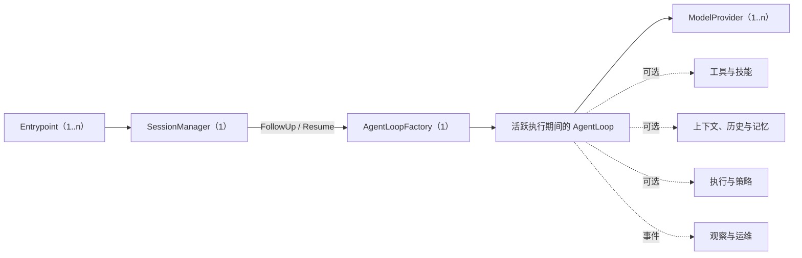

# AgentSlot 标准组件地图

[English](COMPONENT_MAP.md) | [简体中文](COMPONENT_MAP.zh-CN.md)

本文档是可组合 LLM Agent 定制边界的权威地图。它是 AgentSlot 的核心资产，
不是对某一个实现中已有接口的简单罗列。

这张地图回答组件开发者和应用开发者的四个问题：

1. Agent 的哪些职责可以独立实现或替换？
2. 每项职责对应的稳定 Slot ID 和基数是什么？
3. 一个可运行的标准 Agent 必须具备哪些组件？
4. 每项候选标准目前积累了多少可移植性证据？

组装核心已经实现，地图中的领域契约将分阶段准入。一个生态位只有达到
**已定义契约（Contracted）**成熟度后，才能被描述为已经实现的 Go 接口；
仅仅出现在地图上并不代表接口已经存在。

仓库当前真实状态：

| 资产 | 数量 |
| --- | ---: |
| 已映射的标准组件生态位 | 40 |
| 已标准化的领域词汇 | 2 |
| 已定义契约的 AgentSlot 自有领域接口 | 0 |
| 通过一致性验证的组件生态位 | 0 |
| 已由独立实现证明的组件生态位 | 0 |
| 已进入标准装配的组件生态位 | 0 |

独立的组装协议目前导出了五个 Go 接口：`Module`、`SlotRequirer`、
`Registrar`、`Contribution` 和 `Lifecycle`。它们是框架机制，不能代替
地图中 40 个待落地的 Agent 领域组件契约。

## 可运行标准 Profile

只有最终装配计划同时包含以下四类组件时，一个 AgentSlot 应用才符合
“可运行标准 Agent Profile”：

| Slot ID | 标准契约 | 类型 | 必需基数 | 职责 |
| --- | --- | --- | --- | --- |
| `agent.loop` | `AgentLoopFactory` | `One` | 恰好 1 个 | 提供 Factory，为每个需要活跃执行的 Session 按需创建至多一个独立 AgentLoop；Loop 在执行期间负责模型/工具迭代和循环控制决策。 |
| `session.manager` | `SessionManager` | `One` | 恰好 1 个 | 创建或解析稳定 Session，并提供其持久状态与命令句柄。 |
| `model.provider` | `ModelProvider` | `Many` | 至少 1 个 | 以供应商无关的 Agent 语义执行模型请求。 |
| `interaction.entrypoint` | `Entrypoint` | `Many` | 至少 1 个 | 通过 TUI、Web、桌面端、HTTP、ACP 或其他协议接收输入并呈现 Agent 输出。 |

这些是装配要求，不是引入隐藏运行时协调器的借口。`agent.loop` 安装一个
`AgentLoopFactory`，只在 Session 已经取得活跃执行权时创建独立 `AgentLoop`。
打开或浏览 Session 不创建 Loop。Session 长期拥有状态和命令入口；活跃 Loop
始终是循环语义的唯一所有者。Entrypoint 调用 Session 命令而不持有 Loop 对象，
也不能重新实现模型和工具的控制流程。

`ModelProvider` 必须存在，因为一个虽然能启动、却不能生成模型响应的计划，
不能算可运行的 LLM Agent。标准契约必须保持供应商无关。AgentSlot 将提供
官方 OpenAI Chat Compatible 适配器，作为最普及的基线实现；OpenAI
Responses、Anthropic Messages 和其他协议则是同一个 Slot 契约的独立实现。

当只安装一个模型 Provider 时，应用可以自动选中它。安装多个 Provider 时，
计划必须配置一个明确且确定的默认模型/Provider，或者提供
`ModelSelector`。选择结果绝不能依赖 Module 安装顺序、具体 Go 类型或隐藏的
兜底逻辑。

Tools 有意不进入全局最低基数。纯对话 Agent 可以在没有工具时运行；编程或
运维 Profile 可以要求特定工具集合，但不能把这种要求强加给所有 Agent。

## 成熟度成绩单

组件地图和实现成绩单必须分开。划分一项职责是架构决策；证明其方法级契约
能够跨实现复用，才是工程成果。

| 等级 | 含义 |
| --- | --- |
| **已映射（Mapped）** | 已确定职责、边界、Slot ID 和基数；不代表存在公开 Go 接口。 |
| **已定义契约（Contracted）** | 已存在 AgentSlot 自有的公开领域接口和强类型 Slot 声明。 |
| **已通过一致性验证（Conformant）** | 已有可复用的一致性测试套件，验证必要行为、取消、失败和生命周期所有权。 |
| **已证明（Proven）** | 至少两个语义上独立的实现通过一致性测试；同一实现的不同包装只能算一个。 |
| **已装配（Assembled）** | 参考应用能够通过 Slot 替换已证明的实现，不包含具体类型分支。 |

除非后续成绩单明确链接到接口、测试套件、独立实现和参考装配，否则下表所有
领域生态位当前都只处于**已映射（Mapped）**阶段。

成绩以已经证明的组件生态位计算，不按 Module、包或接口方法的数量计算。
一个 Module 可以向多个 Slot 提供组件，多个 Module 也可以共同向一个
`Many` 或 `Chain` Slot 提供组件。

## 组件生态位

### 1. 运行时与交互

| Slot ID | 契约 | 类型 | Profile 规则 | 职责 | 成熟度 |
| --- | --- | --- | --- | --- | --- |
| `agent.loop` | `AgentLoopFactory` | `One` | 全局必需 | 为每个正在活跃执行的 Session 按需创建至多一个独立 AgentLoop；Loop 在执行期间执行请求并负责循环控制决策。 | 已映射 |
| `session.manager` | `SessionManager` | `One` | 全局必需 | 解析稳定 Session 的身份、生命周期、状态和命令句柄，但不吞并可替换的持久化实现。 | 已映射 |
| `interaction.entrypoint` | `Entrypoint` | `Many` | 全局至少 1 个 | 把面向调用方的协议或 UI 与 Session 命令、Snapshot 和 Agent 事件连接起来。 | 已映射 |
| `runtime.observer` | `RuntimeObserver` | `Chain` | 可选 | 观察 Agent、轮次、消息、工具、重试和生命周期事件，但不控制 Loop。 | 已映射 |

`AgentLoopFactory` 的方法级契约目前只是设计基线，还不是已定义契约或已证明的
公开接口。`AgentLoop` 的实现可以截然不同，例如通用助手、编程 Agent、研究 Agent、
确定性工作流 Agent 或远程 Agent 桥接器。如果某个实现隐藏了自己的外部模型
服务，无法使用 `model.provider`，它就不符合标准 LLM Agent Profile；但仍可在
另一个明确的 Profile 下使用底层组装核心。

### 2. 模型访问

| Slot ID | 契约 | 类型 | Profile 规则 | 职责 | 成熟度 |
| --- | --- | --- | --- | --- | --- |
| `model.provider` | `ModelProvider` | `Many` | 全局至少 1 个 | 以供应商无关语义流式输出模型内容、工具调用、停止原因、用量和能力；非流式响应由 Gateway 聚合。 | 已映射 |
| `model.selector` | `ModelSelector` | `One` | 可选；动态路由时按条件要求 | 根据明确的请求和策略输入选择 Provider/模型。 | 已映射 |
| `model.catalog` | `ModelCatalog` | `Many` | 可选 | 描述可用模型及其声明能力，但不暴露凭证。 | 已映射 |
| `model.middleware` | `ModelMiddleware` | `Chain` | 可选 | 在不改变 Provider 身份的前提下处理可观察的请求/响应横切逻辑。 | 已映射 |

AgentSlot 已在 [`model` 包](model)中固定以下有限领域词汇：

- 输入和输出模态严格限定为 `text`、`image`、`audio`；
- 每个选中的模型必须分别声明输入模态集合和输出模态集合；
- 工具调用是独立能力，因为它是操作，不是媒体模态。

Provider 网络数据块、模型 ID、上下文限制、频率限制、媒体传输方式和供应商专属
能力，继续由具体实现声明。未来如果增加新的标准模态，必须明确升级标准；当前
适配器不能通过接受任意字符串偷偷扩展模态。

OpenAI Chat Compatible 是必须提供的官方适配器，不是标准契约本身。供应商
无关契约不能强迫 Anthropic、OpenAI Responses、本地推理或未来协议使用
OpenAI 专属的网络数据结构。

### 3. 工具与技能

| Slot ID | 契约 | 类型 | Profile 规则 | 职责 | 成熟度 |
| --- | --- | --- | --- | --- | --- |
| `tool` | `Tool` | `Many` | 全局可选；Profile 可要求指定键 | 声明并调用一个可供 Loop 使用的具名能力。 | 已映射 |
| `skill` | `Skill` | `Many` | 可选 | 提供可发现的指令、资源或组件包，不能用自然语言关键字匹配冒充语义路由。 | 已映射 |
| `tool.middleware` | `ToolMiddleware` | `Chain` | 可选 | 为调用过程增加策略、遥测、标准化或恢复处理。 | 已映射 |
| `tool.output-store` | `ToolOutputStore` | `One` | 可选 | 存储超大或二进制工具结果，并返回稳定引用。 | 已映射 |

[`tool` 包](tool)已经固定可移植的工具调用词汇：

- 每个面向模型的工具定义都必须提供自包含的 JSON Schema Draft 2020-12
  输入 Schema；
- Schema 顶层必须是封闭对象（`type: object` 且
  `additionalProperties: false`），允许使用内部引用；
- 工具调用参数是 JSON 实例值，执行前必须通过对应 Schema 校验；
- Call ID、工具名、参数值与 Schema 是四项不同的数据。

该子集可以直接作为 OpenAPI 3.1 Schema Object 使用，但不能因此要求工具必须
是 HTTP API。Provider 适配器可以声明自己支持的更小关键字子集和大小限制，
但不能重新解释标准 Schema。

通用文件读取、写入、编辑以及受控 Shell 执行，应放在官方可选组件包中。
这些能力必须可以关闭；风险决策必须通过策略/审批组件完成，不能检查具体 UI
类型来决定。

### 4. 上下文、历史与记忆

| Slot ID | 契约 | 类型 | Profile 规则 | 职责 | 成熟度 |
| --- | --- | --- | --- | --- | --- |
| `history.store` | `HistoryStore` | `One` | 可选 | 以仅追加序列持久化唯一、有序的已提交对话、模型、工具和运行事实；Queue、Context 与 RunJournal 保持不同职责。 | 已映射 |
| `context.source` | `ContextSource` | `Chain` | 可选 | 为一次模型调用按顺序提供上下文。 | 已映射 |
| `context.compactor` | `ContextCompactor` | `One` | 可选 | 把当前完整 Context 转为更小的会话消息投影且不改写 History；Loop 重新装配固定 Prompt/Tool，并校验协议和硬 Token 上限。 | 已映射 |
| `memory.store` | `MemoryStore` | `Many` | 可选 | 读写权威对话历史之外的持久化召回信息。 | 已映射 |
| `checkpoint.store` | `CheckpointStore` | `One` | 可选 | 保存可恢复的执行状态，但不把它冒充为用户可见的历史。 | 已映射 |

术语必须严格区分：

- **Session** 是稳定身份和生命周期。
- **History** 是按真实提交顺序排列的唯一、append-only 事实账本；它不要求任意时刻都能直接作为 Provider 消息序列发送。
- **Context** 是为下一次模型调用组装出的版本化、满足模型协议的投影；未配对 tool call 不进入投影。
- **Queue** 是尚未进入 Context 的持久化 normal、steer 和 held 消息集合。
- **RunJournal** 记录进行中的执行和工具恢复证据，不进入模型 Context，也不是第二份对话账本。
- **Memory** 是可能在未来被选中使用的持久化召回信息。
- **Checkpoint** 是可以恢复的运行时状态。

如果安装了 `HistoryStore`，所有已提交事实必须严格仅追加。实现不得修改、
删除、换位，也不得向已经提交的尾部之前插入事实。上下文压缩只能产生派生
Context，绝不能改写 History。
标准 Compactor 契约允许整体替换；“摘要 + 最近三条 inbound”只是默认实现，
不是框架不变量。

### 5. 工作区、执行与产物

| Slot ID | 契约 | 类型 | Profile 规则 | 职责 | 成熟度 |
| --- | --- | --- | --- | --- | --- |
| `workspace.manager` | `WorkspaceManager` | `One` | 可选 | 定义 Agent Session 或 Run 可见的文件、根目录、隔离和生命周期。 | 已映射 |
| `execution.environment` | `ExecutionEnvironment` | `Many` | 可选 | 在具名的本地、容器、沙箱或远程环境中执行命令或代码。 | 已映射 |
| `artifact.store` | `ArtifactStore` | `One` | 可选 | 持久化生成文件，并提供稳定的元数据和引用。 | 已映射 |
| `credential.resolver` | `CredentialResolver` | `One` | 可选 | 解析有作用域的凭证，不在 Plan 或组件描述中放入密钥值。 | 已映射 |

### 6. 策略、授权与人工审批

| Slot ID | 契约 | 类型 | Profile 规则 | 职责 | 成熟度 |
| --- | --- | --- | --- | --- | --- |
| `policy.guard` | `PolicyGuard` | `Chain` | 可选 | 以确定顺序评估模型、工具、数据或执行操作。 | 已映射 |
| `approval.service` | `ApprovalService` | `One` | 可选；高风险 Profile 可要求 | 请求并处理人工审批，不依赖某个具体 TUI 或 Gateway。 | 已映射 |
| `authorization.provider` | `AuthorizationProvider` | `One` | 可选 | 判断已认证主体是否有权执行某项 Agent 操作。 | 已映射 |

### 7. 多 Agent 与工作流

| Slot ID | 契约 | 类型 | Profile 规则 | 职责 | 成熟度 |
| --- | --- | --- | --- | --- | --- |
| `agent.provider` | `AgentProvider` | `Many` | 可选 | 暴露具名的子 Agent 或远程 Agent 能力。 | 已映射 |
| `workflow.scheduler` | `WorkflowScheduler` | `One` | 可选 | 调度多步骤或多 Agent 工作，但不替代单个 AgentLoop。 | 已映射 |
| `job.store` | `JobStore` | `One` | 可选 | 持久化排队中、运行中和已完成的工作流任务状态。 | 已映射 |
| `mailbox` | `Mailbox` | `One` | 可选 | 在 Agent 或任务之间传递有明确收件人的异步消息。 | 已映射 |

### 8. Gateway 与消息投递

| Slot ID | 契约 | 类型 | Profile 规则 | 职责 | 成熟度 |
| --- | --- | --- | --- | --- | --- |
| `gateway.transport` | `GatewayTransport` | `Many` | 可选 | 连接 HTTP、WebSocket、ACP、聊天平台或消息队列等具名外部通道。 | 已映射 |
| `gateway.identity` | `IdentityResolver` | `One` | 可选 | 将通道身份映射为稳定的应用主体。 | 已映射 |
| `gateway.route` | `RouteResolver` | `One` | 可选 | 从已认证的入站请求中选择目标 Agent/Session。 | 已映射 |
| `gateway.delivery` | `DeliveryAdapter` | `Many` | 可选 | 通过具名外部通道投递异步输出。 | 已映射 |

直接的 TUI、Web UI、桌面应用、HTTP Server 或 ACP Server 都可以实现
`Entrypoint`。需要复用多个外部通道的 Gateway，通常是一个由上述可选 Gateway
Slot 装配出来的 `Entrypoint`。这样无需强迫每个简单 UI 都实现一整套 Gateway
路由机制。

AgentSlot 不标准化临时 chunk 游标或客户端 ACK 游标。重连使用客户端 revision
与 Session Snapshot。具体 Gateway 或外部消息系统可以私有保存可靠投递状态，
但它不是标准 Slot 或 Session 事实，也不能改变 Run 完成状态。

### 9. 用量与计费

| Slot ID | 契约 | 类型 | Profile 规则 | 职责 | 成熟度 |
| --- | --- | --- | --- | --- | --- |
| `usage.recorder` | `UsageRecorder` | `Chain` | 可选 | 记录标准化的模型、工具、存储或执行用量事件。 | 已映射 |
| `price.resolver` | `PriceResolver` | `One` | 可选 | 为标准化用量解析带版本的价格。 | 已映射 |
| `quota.guard` | `QuotaGuard` | `One` | 可选 | 根据明确的预算和配额接受或拒绝工作。 | 已映射 |
| `billing.ledger` | `BillingLedger` | `One` | 可选 | 持久化可审计的费用、抵扣和额度预留结果。 | 已映射 |

### 10. 运维与审计

| Slot ID | 契约 | 类型 | Profile 规则 | 职责 | 成熟度 |
| --- | --- | --- | --- | --- | --- |
| `audit.sink` | `AuditSink` | `Chain` | 可选 | 接收安全和治理相关记录。 | 已映射 |
| `trace.sink` | `TraceSink` | `Chain` | 可选 | 接收相互关联的运行时 Span 和事件。 | 已映射 |
| `metric.sink` | `MetricSink` | `Chain` | 可选 | 接收标准化的计数器、仪表和分布指标。 | 已映射 |
| `health.contributor` | `HealthContributor` | `Chain` | 可选 | 报告组件就绪状态与健康状况，但不暴露配置值。 | 已映射 |

## 标准契约准入规则

一个生态位要从**已映射（Mapped）**继续升级，必须根据真实语义设计方法级
契约，而不是照抄某个旧 SDK 的 API 形状：

1. 比较至少两个独立实现或协议。
2. 在冻结公开契约之前先编写一致性测试。
3. 证明同一个消费者能通过 Slot 替换实现，不增加具体类型分支。
4. 保留任一实现需要的取消、流式处理、错误、生命周期所有权等语义。
5. 供应商、产品和传输协议专属配置不得进入 AgentSlot 组装核心。

上一代 SDK 是证据来源和迁移来源。它们可以增加 AgentSlot 适配器，同时保留
原有装配路径，从而不影响现有产品继续迭代。一个 SDK 不能仅凭自己较早实现了
某项职责，就永久占有行业级标准契约。

## 必需的一致性证据

标准 Profile 和每个获准进入标准的组件契约，都必须针对适用规则提供自动化
测试：

- 缺失必需组件；
- 唯一 Slot 出现重复组件；
- `Many` Slot 出现重复键；
- 声明的依赖形成环；
- 启动失败时按相反顺序回滚；
- 替换实现时不增加具体类型分支；
- 取消和错误正确传播；
- 安装 History 后严格仅追加；
- Provider 选择确定且可解释；
- `Plan.Describe()` 能看到 Slot ID、基数、依赖、来源和生命周期顺序，但不包含
  组件值、配置或密钥。

标准 Agent 参考实现还必须使用确定性的测试 Provider，证明一条无需密钥的
自动化运行路径，并保留真实的 OpenAI Chat Compatible 配置入口。假 Provider
只是测试基础设施，绝不能代替真实适配器的可行性证明。

## 变更规则

修改 Slot ID、职责边界、类型或必需基数，都属于架构变更。每次变更都必须
同步更新本地图，说明兼容性影响，并更新成绩单证据。增加一行并不自动等于取得
进展；新边界必须真正降低耦合，让一项可独立实现的职责变得更加清楚。
