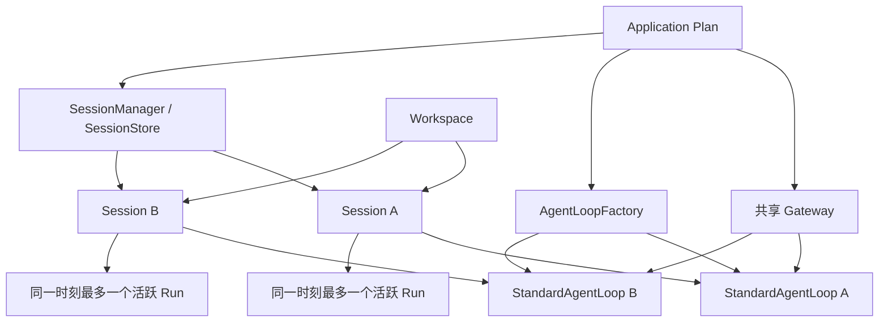

# Agent 设计的架构讨论

## 1. 文档定位

本文是 AgentSlot 中 Session 运行模型和 `StandardAgentLoop` 的架构决策账本，
不是聊天记录，也不是已经完成的代码说明。确定的结论直接约束后续接口和实现；
标记为“待商榷”的事项必须在编码触及对应边界前再次评审。

本文不改变组件地图中的成熟度。`agent.loop` 仍是 `Mapped`，因为目前只有拟议的
标准实现，还没有两个独立实现、真实无分支消费者和兼容测试。

相关实施步骤见
[StandardAgentLoop 实施计划](standard-agent-loop-implementation-plan.zh-CN.md)。

## 2. 总体对象关系

基本包含关系如下：一个 Application Plan 可以服务多个 Workspace；一个 Workspace
可以有多个 Session；一个 Session 可以先后产生多个 Run，但同一时刻最多有一个
活跃 Run；一个 Run 由若干 Step 组成；完整 Message 属于 Session，并记录其来源
Run/Step。sub-agent 是独立执行参与者，必须拥有独立 Session，并通过父子关系与
发起方关联。

## 3. 装配、身份与生命周期

### A-001 一个 Application Plan 服务多个 Workspace 和 Session

- **问题 / 背景：** Plan 是应用装配结果，不应与一次会话的短生命周期绑定。
- **最终决定：** 一个已构建并启动的 Application Plan 可以同时服务多个 Workspace 和 Session。
- **必须满足的不变量：** Plan 内组件选择和启动顺序固定；不同 Session 的运行状态相互隔离。
- **否决的方案及原因：** 每个 Session 创建独立 Plan，会重复启动应用级组件，并把会话隔离错误地变成重复装配。
- **对接口、存储、Gateway 和实现的影响：** Plan 持有共享 Factory、Gateway、Provider 适配器和存储入口；Session 是 Plan 之下的运行时作用域。
- **状态：** 已确定。

### A-002 `agent.loop` Slot 安装 Factory

- **问题 / 背景：** 一个 `AgentLoop` 实例无法安全承载多个隔离 Session 的可变状态。
- **最终决定：** `agent.loop` Slot 安装 `AgentLoopFactory`，而不是共享 Loop 实例。
- **必须满足的不变量：** Slot 仍为 `One`；应用必须显式选择一个 Factory；Factory 本身不保存某个 Session 的执行状态。
- **否决的方案及原因：** 把单个 Loop 注册为全局单例会混合队列、取消信号、上下文和当前 Run。
- **对接口、存储、Gateway 和实现的影响：** 组件地图和 Profile 按 Factory 描述；Session 打开后再由 Factory 创建 Loop。
- **状态：** 已确定。

### A-003 每个 Session 一个独立 `StandardAgentLoop`

- **问题 / 背景：** 并行 Session 必须在内存状态、取消和等待关系上隔离。
- **最终决定：** 每个打开的 Session 创建一个独立的 `StandardAgentLoop` 对象。
- **必须满足的不变量：** 一个 Loop 只绑定一个 Session；不同 Loop 可以并行；关闭 Loop 不等于删除 Session。
- **否决的方案及原因：** 用一个 Loop 加 SessionID 分支管理全部会话，会形成高风险的共享可变状态和复杂锁协议。
- **对接口、存储、Gateway 和实现的影响：** Factory 的创建参数必须包含已打开 Session 和稳定身份；Gateway 路由到对应 Loop。
- **状态：** 已确定。

### A-004 Loop 注入已打开的 Session

- **问题 / 背景：** Session 创建、恢复、fork 与一次循环执行是不同职责。
- **最终决定：** Loop 只接收已经由 SessionManager 打开的 Session，不负责 Session 的 create、open/reopen、持久化恢复或 fork。`AgentLoop.Resume` 仅恢复 paused 的执行状态，不是重新打开 Session。
- **必须满足的不变量：** Session 生命周期操作在进入 Factory 前完成；Loop 不自行选择或替换 SessionStore。
- **否决的方案及原因：** 把 Session 管理并入 Loop 会让存储迁移、fork 和恢复逻辑无法独立替换。
- **对接口、存储、Gateway 和实现的影响：** SessionManager/Store 提供打开句柄；Factory 只创建绑定该句柄的执行对象。
- **状态：** 已确定。

### A-005 身份和包含关系

- **问题 / 背景：** Agent、sub-agent、Session、Run、Step、Message 容易被混成同一层对象。
- **最终决定：** `AgentID` 标识配置和能力集合；`SessionID` 标识隔离会话；`RunID` 标识一次从运行到停止的执行；`StepID` 标识一次模型调用或工具批次边界；`MessageID` 标识持久化完整消息。sub-agent 另有身份，但执行时同样绑定独立 Session。
- **必须满足的不变量：** Message 可追溯到 Session，并在适用时追溯到 Run/Step；Run 不能跨 Session；Step 不能跨 Run。
- **否决的方案及原因：** 用内存对象地址或数组下标充当身份，无法跨进程重启、RPC 或持久化引用。
- **对接口、存储、Gateway 和实现的影响：** 所有持久化记录和事件使用稳定 ID；RPC 不传递内存对象句柄。
- **状态：** 已确定。

### A-006 Session 内串行、Session 间并行

- **问题 / 背景：** 同一上下文上的多个并行 Run 会争夺队列和 Context 尾部。
- **最终决定：** 同一 Session 同一时刻只允许一个活跃 Run；不同 Session 可以并行运行。
- **必须满足的不变量：** 活跃 Run 的认领必须原子化；重复启动返回冲突或同一结果，不能产生第二个活跃 Run。
- **否决的方案及原因：** 同一 Session 并行 Run 会破坏消息顺序、工具调用配对和 Context 版本。
- **对接口、存储、Gateway 和实现的影响：** SessionStore 需要活跃 Run CAS；应用级组件必须支持多个 Loop 并发调用。
- **状态：** 已确定。

### A-007 sub-agent 使用独立 Session

- **问题 / 背景：** sub-agent 需要隔离上下文和失败边界，但仍要继承必要配置。
- **最终决定：** 每个 sub-agent 必须使用独立 Session；完整历史 fork 与摘要启动是两个显式操作。
- **必须满足的不变量：** 子 Session 有独立 ID、Queue、Context、History 和 Run；父子关系可追踪；两种创建方式不得悄悄互换。
- **否决的方案及原因：** 让 sub-agent 共用父 Session 会混淆权限、上下文和并发；把摘要伪装成 fork 会丢失审计语义。
- **对接口、存储、Gateway 和实现的影响：** SessionManager 分别提供 fork 和基于摘要创建；配置继承生成新的只读快照。
- **状态：** 已确定。

## 4. Gateway、RPC 与客户端交互

### A-008 Gateway 是应用级共享组件

- **问题 / 背景：** Gateway 负责接入和分发，不属于单个 Session 的推理状态。
- **最终决定：** 一个应用运行时共享 Gateway，不为每个 Session 创建 Gateway。
- **必须满足的不变量：** Gateway 不拥有 Session 真相；它只认证、路由、调用和投递事件。
- **否决的方案及原因：** 每 Session 一个 Gateway 会重复监听器和连接管理，并把传输生命周期绑定到会话。
- **对接口、存储、Gateway 和实现的影响：** Gateway 依赖 Session/Loop 注册表或应用服务；Loop 只依赖抽象事件发布能力。
- **状态：** 已确定。

### A-009 完整路由身份

- **问题 / 背景：** 只凭 SessionID 或 RunID 无法在多 Agent、多 Workspace 部署中稳定定位目标。
- **最终决定：** 已创建会话和运行的路由使用 `AgentID + WorkspaceID + SessionID + RunID`；创建 Session 的 RPC 在返回 SessionID 前使用 AgentID 与 WorkspaceID。
- **必须满足的不变量：** 服务端验证四者归属关系，不能只做字符串转发；RunID 只在其 Session 内有效。
- **否决的方案及原因：** 仅使用内存 Loop 引用或单个 ID 会让越权检查、重连和横向扩展失去依据。
- **对接口、存储、Gateway 和实现的影响：** RPC 请求、事件信封、日志和鉴权上下文携带稳定路由键。
- **状态：** 已确定。

### A-010 Gateway 两端采用 RPC 语义

- **问题 / 背景：** 前端、外部通道和 Loop 之间需要明确的请求、响应和事件边界。
- **最终决定：** Gateway 面向客户端和内部 Agent 服务都采用 RPC 语义；具体 wire protocol 另行决定。
- **必须满足的不变量：** 命令有明确结果或错误；流事件有稳定信封；传输细节不进入 Loop 领域接口。
- **否决的方案及原因：** 让 UI 直接持有 Loop 对象会穿透进程边界，并暴露并发实现细节。
- **对接口、存储、Gateway 和实现的影响：** 需要协议适配层和领域命令层；HTTP、WebSocket、gRPC 等只是候选承载。
- **状态：** 已确定 RPC 语义；wire protocol 待商榷。

### A-011 断开不取消 Run

- **问题 / 背景：** 客户端网络断开不代表用户要求停止长任务。
- **最终决定：** 连接断开不取消 Run；客户端可重新连接并恢复可观察状态。
- **必须满足的不变量：** Run 生命周期由领域命令和安全限制控制；连接生命周期不能隐式改变执行状态。
- **否决的方案及原因：** 把 socket 断开映射为 Cancel 会让移动网络和页面刷新造成意外任务终止。
- **对接口、存储、Gateway 和实现的影响：** Gateway 需要重连读取 Snapshot；Cancel 必须是显式 RPC。
- **状态：** 已确定。

### A-012 `FollowUp/Steer` 返回持久化 `MessageID`

- **问题 / 背景：** 客户端需要引用已提交输入，但不能依赖内存 Run 对象。
- **最终决定：** `FollowUp` 和 `Steer` 成功后返回持久化 `MessageID`；Run 使用稳定 `RunID` 表示。
- **必须满足的不变量：** 返回成功意味着消息已持久化；相同幂等键不能制造重复消息。
- **否决的方案及原因：** 暴露 `RunHandle` 或 Loop 指针无法跨重启和 RPC，并泄漏内部同步模型。
- **对接口、存储、Gateway 和实现的影响：** Gateway 返回 ID 与 revision；后续编辑、删除、取消均使用稳定 ID。
- **状态：** 已确定。

### A-013 内部唯一执行模式是流式

- **问题 / 背景：** 同时维护流式和非流式两套 Loop 会产生行为分叉。
- **最终决定：** Loop 和 ModelExecutor 内部只采用流式事件执行；非流式由 Gateway 聚合包装。
- **必须满足的不变量：** 两种客户端模式观察到相同的最终持久化事实和错误语义。
- **否决的方案及原因：** 两套执行路径容易在取消、工具调用、重试和消息边界上不一致。
- **对接口、存储、Gateway 和实现的影响：** Gateway 提供 stream 和 aggregate 两种呈现；Loop 只发布事件。
- **状态：** 已确定。

### A-014 非流式返回全部 assistant 文本消息

- **问题 / 背景：** 一次 Run 可能在工具调用前后产生多条 assistant 文本。
- **最终决定：** 非流式结果按顺序返回本次 Run 产生的全部 assistant 文本消息，并保留消息边界。
- **必须满足的不变量：** 不能只取最后一条，也不能无损失地假定所有文本可拼成一条。
- **否决的方案及原因：** 只返回最终文本会丢失同一执行中已经提交的用户可见输出。
- **对接口、存储、Gateway 和实现的影响：** 聚合响应是消息数组，并包含 RunID 与最终状态。
- **状态：** 已确定。

### A-015 重连基于 Snapshot 和 revision

- **问题 / 背景：** 临时 chunk 不持久化，客户端仍需要在重连后恢复一致界面。
- **最终决定：** 重连时读取 Session Snapshot 和持久化 revision；服务端不保存每个客户端的消费游标。
- **必须满足的不变量：** Snapshot 只包含已提交事实和当前状态；客户端以 revision 去重和替换本地临时内容。
- **否决的方案及原因：** 保存每客户端游标会把展示状态变成核心业务状态，并带来无界清理问题。
- **对接口、存储、Gateway 和实现的影响：** Gateway 提供 Snapshot RPC 和后续事件流；客户端发现 revision 缺口时重新拉 Snapshot。
- **状态：** 已确定。

## 5. Session 的三个业务视图

### A-016 Session 明确分为 History、Context、Queue

- **问题 / 背景：** 已发生事实、模型当前输入和待处理消息有不同的修改规则。
- **最终决定：** Session 对外明确提供 History、Context、Queue 三个业务视图。
- **必须满足的不变量：** 同一条数据处于哪个视图必须可判断；跨视图迁移由原子提交完成。
- **否决的方案及原因：** 用一个可变 messages 数组承载三种语义，会让压缩、编辑和审计互相破坏。
- **对接口、存储、Gateway 和实现的影响：** Session API、Snapshot 和事件都区分三类视图。
- **状态：** 已确定。

### A-017 History 严格 append-only

- **问题 / 背景：** History 是模型交互和工具事实的审计来源。
- **最终决定：** History 保存全部已提交模型交互事实，并严格只追加。
- **必须满足的不变量：** 已发布项不能修改、删除、换位或向前插入；批量追加原子且可幂等重试。
- **否决的方案及原因：** 压缩时改写或删除旧 History 会失去恢复、审计和重新派生 Context 的依据。
- **对接口、存储、Gateway 和实现的影响：** Store 提供尾 revision/CAS 和批量 append；更正只能追加新事实。
- **状态：** 已确定。

### A-018 Context 是版本化派生视图

- **问题 / 背景：** 模型输入需要压缩，但压缩不应篡改事实。
- **最终决定：** Context 是从 History、Queue 消费结果和配置派生的版本化视图；压缩生成新版本。
- **必须满足的不变量：** 每次模型调用绑定明确 ContextVersion；旧 History 保持不变。
- **否决的方案及原因：** 直接裁剪 History 会把模型预算优化变成数据丢失。
- **对接口、存储、Gateway 和实现的影响：** Context 记录来源 revision、压缩元数据和必要协议尾部。
- **状态：** 已确定。

### A-019 Queue 保存未进入 Context 的消息

- **问题 / 背景：** 正在运行、暂停或离线时到达的输入不能直接篡改当前 Context。
- **最终决定：** Queue 持久化尚未进入 Context 的 `normal`、`steer` 和 `held` 消息。
- **必须满足的不变量：** 入队成功后可重启恢复；被认领前不出现在模型 Context 中。
- **否决的方案及原因：** 仅使用内存 inbox 会在崩溃时丢消息，并无法支持可靠编辑和重连。
- **对接口、存储、Gateway 和实现的影响：** Queue 是 Session 持久化状态，Gateway 展示其投递类型和 revision。
- **状态：** 已确定。

### A-020 Queue 消息认领前可修改

- **问题 / 背景：** 用户可能在消息尚未被模型读取前修正内容或投递方式。
- **最终决定：** Queue 消息进入 Context 前允许编辑、删除，以及在 `normal`、`steer`、`held` 间改变投递方式。
- **必须满足的不变量：** 一旦认领或进入 Context 就不可原地修改；修改行为必须产生新 revision。
- **否决的方案及原因：** 修改已经进入 Context 的消息会让实际模型输入与持久化事实不一致。
- **对接口、存储、Gateway 和实现的影响：** Queue API 提供 edit、delete、reclassify，并明确 conflict 错误。
- **状态：** 已确定。

### A-021 Queue 操作使用 expected revision/CAS

- **问题 / 背景：** Gateway、用户操作和 Loop 可能同时修改 Queue。
- **最终决定：** 所有 Queue 变更携带 expected revision 并通过 CAS 提交。
- **必须满足的不变量：** 认领后的修改返回 conflict；调用方不得静默覆盖更新。
- **否决的方案及原因：** 后写覆盖会误删已被 Loop 消费的输入或篡改投递顺序。
- **对接口、存储、Gateway 和实现的影响：** RPC 返回最新 revision；客户端冲突后刷新 Snapshot。
- **状态：** 已确定。

### A-022 Steer 在下一安全 step 批量优先消费

- **问题 / 背景：** Steer 要尽快影响当前 Run，又不能插入半个模型响应或半个工具提交。
- **最终决定：** 运行中的 Steer 在下一个安全 step 边界按批次优先进入 Context；normal 等待下一 Run。
- **必须满足的不变量：** 不拆分原子工具批次；同一批 Steer 保持稳定顺序；一次认领原子完成。
- **否决的方案及原因：** 任意时刻注入会产生无效协议序列；把 Steer 当 normal 会失去及时纠偏能力。
- **对接口、存储、Gateway 和实现的影响：** Loop 在 step 边界检查 Queue；事件标明认领批次和目标 Run。
- **状态：** 已确定。

### A-023 正常完成自动消费，异常统一暂停

- **问题 / 背景：** Queue 自动推进需要清楚区分正常结束和不确定状态。
- **最终决定：** Run 正常完成后自动按 FIFO 启动下一条 normal；取消、错误或进程重启后 Session 统一进入 `paused`。
- **必须满足的不变量：** paused 状态不自动认领任何新消息；已持久化 Queue 保持不变。
- **否决的方案及原因：** 异常后自动继续可能在未知副作用或坏 Context 上扩大损失。
- **对接口、存储、Gateway 和实现的影响：** 状态转换和自动 drain 必须与提交边界绑定。
- **状态：** 已确定。

### A-024 paused 只允许显式 Resume 继续

- **问题 / 背景：** 暂停期间仍可能收到用户输入，但这些输入不等于恢复授权。
- **最终决定：** paused 时消息继续持久化，只有显式 `Resume` 才继续执行。
- **必须满足的不变量：** FollowUp 不隐式解除 paused；Resume 可审计且使用 expected revision。
- **否决的方案及原因：** 新消息自动唤醒会让用户无法先检查失败和未知工具结果。
- **对接口、存储、Gateway 和实现的影响：** Gateway 分开展示“已收到”和“已恢复”；Loop 暴露 Resume 命令。
- **状态：** 已确定。

### A-025 重启后的未消费 Steer 进入 held

- **问题 / 背景：** Steer 原本针对旧 Run 的下一 step，重启后不能假定仍适用。
- **最终决定：** 恢复时未消费 Steer 转为 `held`，由 Gateway 展示并允许用户编辑、删除或重新投递。
- **必须满足的不变量：** held 不被自动消费；原 MessageID 和来源 Run 可追踪。
- **否决的方案及原因：** 自动把旧 Steer 注入新 Run 可能改变用户已经无法预期的上下文。
- **对接口、存储、Gateway 和实现的影响：** 恢复事务执行类型迁移；Snapshot 明确 held 原因。
- **状态：** 已确定。

### A-026 五类持久化职责分离

- **问题 / 背景：** SessionStore、History、Context、Queue 和 RunJournal 不是同义词。
- **最终决定：** SessionStore 负责 Session 聚合状态、revision 和原子提交；History 保存已完成事实；Context 保存版本化模型输入；Queue 保存未消费输入；RunJournal 保存尚未完成提交的执行意图和恢复证据。
- **必须满足的不变量：** 领域上分责，物理上可共用一个数据库事务；任何实现都必须提供相同原子边界。
- **否决的方案及原因：** 把全部数据都叫 History 会掩盖可变性、保留期限和恢复规则的差异。
- **对接口、存储、Gateway 和实现的影响：** 接口可分层但提交协调由 SessionStore 完成；具体 Slot ID 仍需评审。
- **状态：** 职责已确定；Slot 命名待商榷。

### A-027 默认 Context 压缩结构

- **问题 / 背景：** 长 Session 必须在 Token 预算内保留目标和协议完整性。
- **最终决定：** 默认压缩结果由历史执行摘要、最近三条 inbound 意图和必要协议尾部组成。
- **必须满足的不变量：** 不截断未配对工具协议；摘要标明来源 History revision 和 ContextVersion。
- **否决的方案及原因：** 只保留最近若干原始消息容易丢失长期目标；只保留摘要容易丢失近期精确意图。
- **对接口、存储、Gateway 和实现的影响：** Compactor 需要结构化输入和版本化输出，不能返回任意拼接字符串。
- **状态：** 已确定。

### A-028 “最近三条 inbound”范围

- **问题 / 背景：** inbound 不只来自当前人类的一种消息类型。
- **最终决定：** 最近三条包括 normal、steer，以及人类或其他被授权 Session 来源的输入意图。
- **必须满足的不变量：** 按被 Session 接受的稳定顺序选择；系统内部事件和 assistant 输出不计入三条。
- **否决的方案及原因：** 只数 human normal 会漏掉 sub-agent 协作和用户纠偏。
- **对接口、存储、Gateway 和实现的影响：** Message 元数据必须表达来源主体和投递类型。
- **状态：** 已确定。

### A-029 摘要模型与阈值

- **问题 / 背景：** 压缩模型和触发阈值若含糊，会导致各实现行为不可比较。
- **最终决定：** 默认使用当前 Session 配置的模型生成摘要；外部配置的比例或预算最终解析成确定 Token 数。
- **必须满足的不变量：** 一次压缩绑定同一模型配置快照；执行前能够检查明确的 Token 阈值。
- **否决的方案及原因：** 在核心中硬编码某个便宜模型会引入 Provider 偏好；运行中反复解释比例会产生漂移。
- **对接口、存储、Gateway 和实现的影响：** 配置加载阶段解析阈值；Compactor 通过 ModelExecutor 调用当前模型。
- **状态：** 已确定。

### A-030 压缩后可查询完整 History

- **问题 / 背景：** 模型在摘要不足时仍可能需要精确历史事实。
- **最终决定：** 提供标准 Session History 工具，让模型分页查询被压缩掉的完整 History。
- **必须满足的不变量：** 工具只读、受权限和配额约束、结果可追溯到 History revision。
- **否决的方案及原因：** 把全部 History 永久塞回 Context 会抵消压缩；让模型直接访问数据库会绕过边界。
- **对接口、存储、Gateway 和实现的影响：** 需要一个标准只读工具能力；最终 Slot ID 待商榷。
- **状态：** 行为已确定；Slot ID 待商榷。

## 6. Provider、Model 与配置稳定性

### A-031 Provider 配置与 Model 配置分层

- **问题 / 背景：** 连接凭据与具体模型能力的变化频率和复用关系不同。
- **最终决定：** Provider 配置保存协议适配器、BaseURL、CredentialRef 等连接信息；Model 条目引用 Provider，并保存模型能力与限制。配置来源由最终产品决定。
- **必须满足的不变量：** 核心不读取特定配置文件或密钥；Model 不复制明文凭据。
- **否决的方案及原因：** 把每个模型做成完整 Provider 配置会重复连接信息；让核心决定配置来源会污染通用层。
- **对接口、存储、Gateway 和实现的影响：** Factory 接收已解析配置快照或目录接口，而不是文件路径。
- **状态：** 已确定。

### A-032 Model 条目表达协议、模态、限制和 Reasoning

- **问题 / 背景：** 同一 Provider 可承载不同协议和能力，不能只保存一个模型字符串。
- **最终决定：** 每个 Model 条目选择协议、支持模态、Context/Input/Output 限制，以及该模型支持的 Reasoning 枚举和默认值。
- **必须满足的不变量：** 不向不支持的模型发送 Reasoning 值；限制在构建请求前可检查。
- **否决的方案及原因：** 任意字符串参数会把错误推迟到 Provider，并使跨模型配置不可验证。
- **对接口、存储、Gateway 和实现的影响：** ModelCatalog 提供有限稳定语义；Provider wire 参数留在适配器。
- **状态：** 已确定。

### A-033 Loop 生命周期内关键配置固定

- **问题 / 背景：** SystemPrompt、工具集合或模型在 Session 运行中变化会改变推理语义。
- **最终决定：** `SystemPrompt`、`ToolKeys`、模型选择和模型参数在一个 Loop 生命周期内固定。
- **必须满足的不变量：** 每个 Run 可追溯到同一 AgentDefinition/Model 配置版本；运行中不热替换。
- **否决的方案及原因：** 隐式热更新会让同一 Context 的前后请求使用不同协议和能力。
- **对接口、存储、Gateway 和实现的影响：** Factory 创建时注入不可变配置快照；更新通过关闭并新建 Loop 生效。
- **状态：** 已确定。

### A-034 配置更新只影响新 Loop

- **问题 / 背景：** 模型请求的稳定前缀有利于 KV cache，也便于复现。
- **最终决定：** 配置更新只影响之后创建的 Loop，现有 Loop 继续使用原快照。
- **必须满足的不变量：** 不在下一 step 偷换模型、SystemPrompt 或 Tool 定义；版本在事件中可见。
- **否决的方案及原因：** 自动热刷新会隐式破坏 KV cache，并让恢复无法重建原请求。
- **对接口、存储、Gateway 和实现的影响：** 配置服务提供版本化快照；产品显式决定何时重建会话运行对象。
- **状态：** 已确定。

### A-035 ModelExecutor 统一模型调用和网络重试

- **问题 / 背景：** Provider 协议转换和瞬时网络故障不应散落在 Loop 状态机中。
- **最终决定：** `ModelExecutor` 统一负责流式调用、Provider 适配和可重试网络错误策略。
- **必须满足的不变量：** Loop 只消费标准事件；重试保持相同 Context 和配置快照；不可重试错误立即返回。
- **否决的方案及原因：** 每个 Loop 自己适配 Provider 会复制协议逻辑，并产生不同重试语义。
- **对接口、存储、Gateway 和实现的影响：** Factory 注入 ModelExecutor；重试次数和退避默认值仍需确定。
- **状态：** 职责已确定；数值默认值待商榷。

### A-036 半流失败的 reset 与重试

- **问题 / 背景：** Provider 可能已经发出部分 chunk 后断网，这些 chunk 不是完整事实。
- **最终决定：** 丢弃本次尝试的临时 chunk，向客户端发送 `reset`，并使用相同 Context 重新调用；重试耗尽后暂停 Session。
- **必须满足的不变量：** 临时 chunk 不进入 History；失败尝试不得污染下一次模型请求；已提交完整消息不回滚。
- **否决的方案及原因：** 从半截文本继续拼接无法证明内容一致；把半截持久化为 assistant message 会制造伪事实。
- **对接口、存储、Gateway 和实现的影响：** 流事件带 attempt 标识；Gateway 能撤销对应临时展示。
- **状态：** 已确定。

## 7. 工具循环、并发与崩溃恢复

### A-037 工具结果后必须继续调用模型

- **问题 / 背景：** 工具结果本身不是面向用户的自然完成结论。
- **最终决定：** 工具结果进入 Context 后必须继续调用模型，直到自然完成、取消或安全限制触发。
- **必须满足的不变量：** Loop 不能把“执行完工具”当作 Run 成功结束；每轮都检查取消和上限。
- **否决的方案及原因：** 让实现自由决定是否继续会产生不可预测的半成品响应。
- **对接口、存储、Gateway 和实现的影响：** 状态机固定 model -> tool -> model 循环；安全上限配置待定。
- **状态：** 行为已确定；安全上限默认值待商榷。

### A-038 History 中工具 call/result 必须成对

- **问题 / 背景：** 主流模型协议要求工具调用与结果配对，审计也需要完整因果关系。
- **最终决定：** 正常提交到 History 的工具交互必须包含对应 call 和 result。
- **必须满足的不变量：** 同一 ToolCallID 唯一配对；批次提交不能只写入其中一半。
- **否决的方案及原因：** 先把 call 单独写入 History 会在崩溃后留下无效协议尾部。
- **对接口、存储、Gateway 和实现的影响：** History 提供成对原子追加；执行前的意图由 RunJournal 承担。
- **状态：** 已确定。

### A-039 pending 工具意图进入 RunJournal

- **问题 / 背景：** 工具有外部副作用，执行前不留证据会在崩溃后无法判断是否已发生。
- **最终决定：** 工具执行前把 pending 调用意图写入 RunJournal，不直接写入 History 或 Context。
- **必须满足的不变量：** Journal 记录 ToolCallID、参数摘要/安全表示、Run/Step 和状态；写入成功后才允许执行。
- **否决的方案及原因：** 完全不记录会诱发盲目重跑；把 pending call 暴露给模型会破坏 call/result 配对。
- **对接口、存储、Gateway 和实现的影响：** SessionStore 的事务覆盖 Journal 状态；敏感参数按安全策略存储。
- **状态：** 已确定。

### A-040 崩溃恢复使用 `outcome_unknown`

- **问题 / 背景：** 进程可能在工具产生副作用后、结果提交前崩溃。
- **最终决定：** 恢复时不自动重跑未知调用；为其生成配对的结构化 `outcome_unknown` 结果，提交 call/result 到 History，并暂停 Session。
- **必须满足的不变量：** 已确认完成的调用使用真实结果；未知调用不得伪装成功或失败；只有显式 Resume 后模型才能判断下一步。
- **否决的方案及原因：** 自动重跑可能重复付款、写文件或执行命令；丢弃调用会隐瞒真实风险。
- **对接口、存储、Gateway 和实现的影响：** 恢复器扫描 RunJournal，原子完成合成配对和状态迁移。
- **状态：** 已确定。

### A-041 Tool 只声明两种调度模式

- **问题 / 背景：** 工具批次既要利用无依赖并发，也要保护有顺序要求的操作。
- **最终决定：** Tool 只声明 `ParallelSafe` 或 `Serial`；Loop 不推测自然语言或工具名来决定并发。
- **必须满足的不变量：** Serial 工具按模型给出的稳定顺序执行；ParallelSafe 工具可同批并行；结果按原调用顺序归并。
- **否决的方案及原因：** 复杂锁域或关键字推断会增加不可验证策略，并把 Workspace 冲突错误归给 Loop。
- **对接口、存储、Gateway 和实现的影响：** Tool 定义增加显式执行模式；ToolDispatcher 负责分组和结果归并。
- **状态：** 已确定。

### A-042 文件冲突使用乐观校验

- **问题 / 背景：** 不同 Session 可能同时修改同一 Workspace 文件。
- **最终决定：** 文件写入和精确编辑使用版本哈希或精确旧内容校验，不使用 Workspace 全局写锁。
- **必须满足的不变量：** 校验失败返回 conflict，不静默覆盖；调用参数包含模型已读取的版本证据。
- **否决的方案及原因：** Workspace 写锁会让无关文件操作互相阻塞，也无法处理进程外修改。
- **对接口、存储、Gateway 和实现的影响：** 官方文件工具定义 expectedHash/oldContent；冲突结果交给模型处理。
- **状态：** 已确定。

### A-043 工具错误作为安全结构化结果返回模型

- **问题 / 背景：** 参数错误通常需要模型修正，但内部错误可能包含凭据或基础设施细节。
- **最终决定：** 工具错误转换成安全、结构化、可行动的 ToolResult 交给模型；内部敏感错误只进入受控日志和追踪。
- **必须满足的不变量：** ToolCallID 保持配对；区分可修正错误、策略拒绝、冲突和内部失败；不得原样泄露秘密。
- **否决的方案及原因：** 遇到任意工具错误就终止 Run 会阻止模型自我修正；原样返回内部 error 会泄密。
- **对接口、存储、Gateway 和实现的影响：** ToolDispatcher 负责错误分类和净化，Loop 随后继续调用模型。
- **状态：** 已确定。

## 8. Hook 与核心事务

### A-044 Hook 固定两个阶段

- **问题 / 背景：** 可扩展收尾行为需要 Hook，但任意阶段会让主循环不可推理。
- **最终决定：** 使用统一 `AgentHook` 注册模型，只开放 `BeforeRunComplete` 和 `AfterCommit` 两个固定阶段。
- **必须满足的不变量：** `BeforeRunComplete` 只在自然完成边界运行，可追加 Steer 以继续当前 Run；`AfterCommit` 只观察已提交事实，不能回滚或控制 Run。
- **否决的方案及原因：** 为每个内部动作增加 Hook 会把状态机拆成外部隐式代码；允许 AfterCommit 改事务会破坏一致性。
- **对接口、存储、Gateway 和实现的影响：** Hook 接收只读快照和受限命令；最终 Slot ID 待商榷。
- **状态：** 阶段语义已确定；Slot ID 待商榷。

### A-045 Session 持久化属于核心事务

- **问题 / 背景：** 如果持久化依赖可选 Hook，关闭或失败 Hook 就会让 Agent 丢失真相。
- **最终决定：** History、Context、Queue、RunJournal 和 Session 状态提交由核心 Session 事务完成，不能委托给可选 Hook。
- **必须满足的不变量：** 先持久化再发布 AfterCommit；核心提交失败时不得宣称动作成功。
- **否决的方案及原因：** 用 Hook 保存 Session 会让正确性依赖安装顺序、Hook 可用性和外部副作用。
- **对接口、存储、Gateway 和实现的影响：** SessionStore 是 Loop 必需依赖；Hook 只做通知、索引、遥测等派生工作。
- **状态：** 已确定。

## 9. 实现前仍待商榷

以下事项没有足够证据形成最终结论。它们不得在组件地图、Profile 或公共 API 中被
提前写成既定事实：

| 事项 | 当前边界 | 需要的决定或证据 |
| --- | --- | --- |
| `history.store` 是否改名为 `session.store` | 当前地图继续保留 `history.store` | 确定兼容影响，以及一个 Slot 是否应承载五类职责 |
| Gateway 是否替代 `interaction.entrypoint` | 当前 Profile 仍要求 Entrypoint；Gateway 保持可选 | 明确本地 TUI、嵌入式调用和远程接入是否能共用同一必需接口 |
| Agent RPC wire protocol | 只确定 RPC 语义 | 比较 HTTP/SSE、WebSocket、gRPC 或独立进程协议的错误、重连和版本化能力 |
| Queue 容量、背压和配额 | 只确定 Queue 必须持久化和 CAS | 给出按 Session、Workspace、Agent 的限制以及超限行为 |
| 模型重试和 Run 安全默认值 | 只确定必须重试可重试网络错误并有上限 | 确定次数、退避、最大 Step、最大工具调用和最大运行时间 |
| Hook、RunJournal、Session History Tool 的 Slot ID | 行为和职责已确定 | 评审是否独立 Slot、具体 cardinality 和生命周期依赖 |
| 第一批真实 Provider 适配器 | 需要至少两个独立协议验证接口 | 根据真实消费者选择范围，不能只包两层同一 SDK |

## 10. 文档约束

- 本文记录架构结论；组件地图记录标准生态位和成熟度；实施计划记录代码顺序与验收。
- 新证据推翻已确定结论时，必须同时修改本文、实施计划和受影响的中英文组件地图。
- “已写出一个 StandardAgentLoop”不等于 `agent.loop` 已 Proven；成熟度规则不能因进度压力降低。
