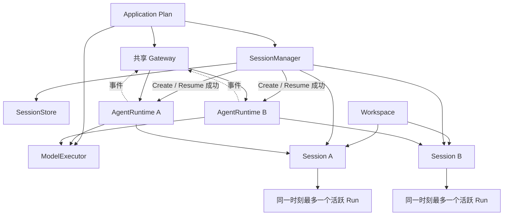

# Agent 设计的架构讨论

## 1. 文档定位

本文是 AgentSlot 中 Session、固定 `AgentRuntime` 和标准组件 Slot 的架构决策账本，
不是聊天记录，也不是已经完成的代码说明。确定的结论直接约束后续接口和实现；
标记为“待商榷”的事项必须在编码触及对应边界前再次评审。

本文不把候选 Go 接口写成已经实现的合同。`AgentRuntime` 是框架固定对象，不参与
Slot 成熟度计分；新增或改名的标准组件仍保持 `Mapped`，直到满足组件地图的证据要求。

相关实施步骤见
[AgentRuntime 与标准 Slot 实施计划](agent-runtime-standard-slots-implementation-plan.zh-CN.md)。

## 2. 总体对象关系

基本包含关系如下：一个 Application Plan 可以服务多个 Workspace；一个 Workspace
可以有多个 Session；一个 Session 可以先后产生多个 Run，但同一时刻最多有一个
活跃 Run；一个 Run 由若干 Step 组成；完整 Message 属于 Session，并记录其来源
Run/Step。sub-agent 是独立执行参与者，必须拥有独立 Session，并通过父子关系与
发起方关联。

## 3. 装配、身份与生命周期

### A-001 一个 Application Plan 服务多个 Workspace 和 Session

- **问题 / 背景：** Plan 是应用装配结果，不应与一次会话的短生命周期绑定。
- **最终决定：** 一个已构建并启动的 Application Plan 可以同时服务多个 Workspace 和 Session。
- **必须满足的不变量：** Plan 内组件选择和启动顺序固定；不同 Session 的运行状态相互隔离。
- **否决的方案及原因：** 每个 Session 创建独立 Plan，会重复启动应用级组件，并把会话隔离错误地变成重复装配。
- **对接口、存储、Gateway 和实现的影响：** Plan 持有 SessionManager、SessionStore、ModelExecutor、Gateway 和其他共享组件；Session 与 AgentRuntime 是 Plan 之下的运行时作用域。
- **状态：** 已确定。

### A-002 `AgentRuntime` 是框架固定对象，不是 Slot

- **问题 / 背景：** Slot 表示开发者能够独立实现和替换的边界；而标准循环的事务顺序和状态控制必须只有一个权威。
- **最终决定：** `AgentRuntime` 及其内部循环由框架固定，不定义标准 `agent.loop` Slot，也不定义公共 `AgentLoopFactory` 或独立 `AgentLoop` 对象。
- **必须满足的不变量：** 标准 Profile 只有一套循环不变量；Hook、Provider 或 Entrypoint 都不能替代 Runtime 控制状态。
- **否决的方案及原因：** 一边禁止替换循环、一边保留 `agent.loop` Slot 是自相矛盾的 API；共享全局 Loop 又会混合多个 Session 的状态。
- **对接口、存储、Gateway 和实现的影响：** 组件地图删除 `agent.loop`。需要完全不同循环的项目可用通用装配核心定义本地 Slot，但不属于标准 LLM Agent Profile。
- **状态：** 已确定。

### A-003 显式恢复的 Session 拥有独立 `AgentRuntime`

- **问题 / 背景：** 并行 Session 必须在内存状态、取消和等待关系上隔离。
- **最终决定：** 浏览或列出 Session 不创建 Runtime；`CreateSession` 或 `ResumeSession` 成功时立即初始化绑定该 Session 的 `AgentRuntime`，Runtime 在 idle 时继续驻留，直到显式 `Close` 或应用停止。
- **必须满足的不变量：** 同一进程、同一 SessionID 只有一个 Runtime；并发 resume 汇合到同一实例；初始化失败不缓存半成品；不同 Session 的 Runtime 可以并行。
- **否决的方案及原因：** 每个 Run 创建临时 Loop 会反复重建命令、取消和配置边界；对只读浏览也创建 Runtime 会把查询行为变成资源占用；隐藏 idle 回收会让对象有效期不可预测。
- **对接口、存储、Gateway 和实现的影响：** 框架维护 SessionID 到 Runtime 的单实例注册；`Close` 只释放内存 Runtime，不删除 Session，再次 resume 可按最新配置创建新 Runtime。
- **状态：** 已确定。

### A-004 SessionManager 与 SessionStore 分离，Runtime 负责命令和执行

- **问题 / 背景：** Session 创建、恢复、fork、持久化和 Agent 命令具有不同变化原因。
- **最终决定：** `session.manager` 负责 create/resume/fork/摘要启动；`session.store` 负责 History、Context、Queue、RunJournal 和 revision/CAS 原子事务；固定 Runtime 接收 `Send`、`Steer`、`RunPending`、Queue 操作、`Cancel`、`WhenIdle` 和 `Close`。
- **必须满足的不变量：** Manager 依赖 Store；Runtime 只接收已恢复完成的 Session；任何组件都不能绕过 SessionStore 的核心事务。
- **否决的方案及原因：** Manager 与 Store 合并会让生命周期服务和存储机制无法独立替换；把这些职责塞进循环会让 fork、恢复和存储迁移污染执行代码。
- **对接口、存储、Gateway 和实现的影响：** `session.manager` 与 `session.store` 都是标准 `One` Slot；`CreateSession`/`ResumeSession` 是生命周期入口，不是 Runtime 实例命令。
- **状态：** 已确定。

### A-005 身份和包含关系

- **问题 / 背景：** Agent、sub-agent、Session、Run、Step、Message 容易被混成同一层对象。
- **最终决定：** `AgentID` 标识配置和能力集合；`SessionID` 标识隔离会话；`RunID` 标识一次从运行到停止的执行；`StepID` 标识一次模型调用或工具批次边界；`MessageID` 标识持久化完整消息。sub-agent 另有身份，但执行时同样绑定独立 Session。
- **必须满足的不变量：** Message 可追溯到 Session，并在适用时追溯到 Run/Step；Run 不能跨 Session；Step 不能跨 Run。
- **否决的方案及原因：** 用内存对象地址或数组下标充当身份，无法跨进程重启、RPC 或持久化引用。
- **对接口、存储、Gateway 和实现的影响：** 所有持久化记录和事件使用稳定 ID；RPC 不传递内存对象句柄。
- **状态：** 已确定。

### A-006 Session 内串行、Session 间并行

- **问题 / 背景：** 同一上下文上的多个并行 Run 会争夺队列和 Context 尾部。
- **最终决定：** 同一 Session 同一时刻只允许一个活跃 Run；不同 Session 可以并行运行。
- **必须满足的不变量：** 活跃 Run 的认领必须原子化；重复启动返回冲突或同一结果，不能产生第二个活跃 Run。
- **否决的方案及原因：** 同一 Session 并行 Run 会破坏消息顺序、工具调用配对和 Context 版本。
- **对接口、存储、Gateway 和实现的影响：** SessionStore 需要活跃 Run 执行权 CAS；共享组件必须支持多个 Session Runtime 并发调用。
- **状态：** 已确定。

### A-007 sub-agent 使用独立 Session

- **问题 / 背景：** sub-agent 需要隔离上下文和失败边界，但仍要继承必要配置。
- **最终决定：** 每个 sub-agent 必须使用独立 Session；完整历史 fork 与摘要启动是两个显式操作。
- **必须满足的不变量：** 子 Session 有独立 ID、Queue、Context、History 和 Run；父子关系可追踪；两种创建方式不得悄悄互换。
- **否决的方案及原因：** 让 sub-agent 共用父 Session 会混淆权限、上下文和并发；把摘要伪装成 fork 会丢失审计语义。
- **对接口、存储、Gateway 和实现的影响：** SessionManager 分别提供 fork 和基于摘要创建；配置继承生成新的只读快照。
- **状态：** 已确定。

## 4. Gateway、RPC 与客户端交互

### A-008 Gateway 是应用级共享组件

- **问题 / 背景：** Gateway 负责接入和分发，不属于单个 Session 的推理状态。
- **最终决定：** 一个应用运行时共享 Gateway，不为每个 Session 创建 Gateway。
- **必须满足的不变量：** Gateway 不拥有 Session 真相；它只认证、路由、调用和投递事件。
- **否决的方案及原因：** 每 Session 一个 Gateway 会重复监听器和连接管理，并把传输生命周期绑定到会话。
- **对接口、存储、Gateway 和实现的影响：** Gateway 依赖 Session 生命周期入口和 Runtime 命令，不拥有 Runtime 注册表；Runtime 只依赖抽象事件发布能力。
- **状态：** 已确定。

### A-009 完整路由身份

- **问题 / 背景：** 只凭 SessionID 或 RunID 无法在多 Agent、多 Workspace 部署中稳定定位目标。
- **最终决定：** 已创建会话和运行的路由使用 `AgentID + WorkspaceID + SessionID + RunID`；创建 Session 的 RPC 在返回 SessionID 前使用 AgentID 与 WorkspaceID。
- **必须满足的不变量：** 服务端验证四者归属关系，不能只做字符串转发；RunID 只在其 Session 内有效。
- **否决的方案及原因：** 仅使用内存 Loop 引用或单个 ID 会让越权检查、重连和横向扩展失去依据。
- **对接口、存储、Gateway 和实现的影响：** RPC 请求、事件信封、日志和鉴权上下文携带稳定路由键。
- **状态：** 已确定。

### A-010 Gateway 两端采用 RPC 语义

- **问题 / 背景：** 前端、外部通道和 AgentRuntime 之间需要明确的请求、响应和事件边界。
- **最终决定：** Gateway 面向客户端和内部 Agent 服务都采用 RPC 语义；具体 wire protocol 另行决定。
- **必须满足的不变量：** 命令有明确结果或错误；流事件有稳定信封；传输细节不进入 Runtime 领域命令。
- **否决的方案及原因：** 让 UI 直接持有 Runtime 对象会穿透进程边界，并暴露并发实现细节。
- **对接口、存储、Gateway 和实现的影响：** 需要协议适配层和领域命令层；HTTP、WebSocket、gRPC 等只是候选承载。
- **状态：** 已确定 RPC 语义；wire protocol 待商榷。

### A-011 断开不取消 Run

- **问题 / 背景：** 客户端网络断开不代表用户要求停止长任务。
- **最终决定：** 连接断开不取消 Run；客户端可重新连接并恢复可观察状态。
- **必须满足的不变量：** Run 生命周期由领域命令和安全限制控制；连接生命周期不能隐式改变执行状态。
- **否决的方案及原因：** 把 socket 断开映射为 Cancel 会让移动网络和页面刷新造成意外任务终止。
- **对接口、存储、Gateway 和实现的影响：** Gateway 需要重连读取 Snapshot；Cancel 必须是显式 RPC。
- **状态：** 已确定。

### A-012 `Send/Steer` 返回持久化 `MessageID`

- **问题 / 背景：** 客户端需要引用已提交输入，但不能依赖内存 Run 对象。
- **最终决定：** `Send` 和 `Steer` 成功后返回持久化 `MessageID`；Run 使用稳定 `RunID` 表示。
- **必须满足的不变量：** 返回成功意味着消息已持久化；相同幂等键不能制造重复消息。
- **否决的方案及原因：** 暴露 `RunHandle` 或 Runtime 指针无法跨重启和 RPC，并泄漏内部同步模型。
- **对接口、存储、Gateway 和实现的影响：** Gateway 返回 ID 与 revision；后续编辑、删除、取消均使用稳定 ID。
- **状态：** 已确定。

### A-013 内部唯一执行模式是流式

- **问题 / 背景：** 同时维护流式和非流式两套执行路径会产生行为分叉。
- **最终决定：** AgentRuntime 和 ModelExecutor 内部只采用流式事件执行；非流式由 Gateway 聚合包装。
- **必须满足的不变量：** 两种客户端模式观察到相同的最终持久化事实和错误语义。
- **否决的方案及原因：** 两套执行路径容易在取消、工具调用、重试和消息边界上不一致。
- **对接口、存储、Gateway 和实现的影响：** Gateway 提供 stream 和 aggregate 两种呈现；Runtime 只发布一套事件。
- **状态：** 已确定。

### A-014 非流式返回全部 assistant 文本消息

- **问题 / 背景：** 一次 Run 可能在工具调用前后产生多条 assistant 文本。
- **最终决定：** 非流式结果按顺序返回本次 Run 产生的全部 assistant 文本消息，并保留消息边界。
- **必须满足的不变量：** 不能只取最后一条，也不能无损失地假定所有文本可拼成一条。
- **否决的方案及原因：** 只返回最终文本会丢失同一执行中已经提交的用户可见输出。
- **对接口、存储、Gateway 和实现的影响：** 聚合响应是消息数组，并包含 RunID 与最终状态。
- **状态：** 已确定。

### A-015 重连基于 Snapshot 和 revision

- **问题 / 背景：** 临时 chunk 不持久化，客户端仍需要在重连后恢复一致界面。
- **最终决定：** 重连时读取 Session Snapshot 和持久化 revision；AgentSlot 不保存临时 chunk 游标，也不保存框架级客户端 ACK 或消费游标。
- **必须满足的不变量：** Snapshot 只包含已提交事实和当前状态；客户端以 revision 去重和替换本地临时内容；传输回执不能改变 History、Context、Run 或业务完成状态。
- **否决的方案及原因：** 把每客户端 ACK 或游标放进 SessionStore，会把展示与传输状态变成核心业务状态，并带来客户端身份、租期和无界清理问题。
- **对接口、存储、Gateway 和实现的影响：** Gateway 提供 Snapshot RPC 和后续事件流；客户端发现 revision 缺口时重新拉 Snapshot。具体 Gateway 或外部消息系统可以自行实现可靠投递，但不新增标准 ACK Slot。
- **状态：** 已确定。

## 5. Session 的三个业务视图

### A-016 Session 明确分为 History、Context、Queue

- **问题 / 背景：** 已发生事实、模型当前输入和待处理消息有不同的修改规则。
- **最终决定：** Session 对外明确提供 History、Context、Queue 三个业务视图。
- **必须满足的不变量：** 同一条数据处于哪个视图必须可判断；跨视图迁移由原子提交完成。
- **否决的方案及原因：** 用一个可变 messages 数组承载三种语义，会让压缩、编辑和审计互相破坏。
- **对接口、存储、Gateway 和实现的影响：** Session API、Snapshot 和事件都区分三类视图。
- **状态：** 已确定。

### A-017 History 严格 append-only

- **问题 / 背景：** History 是模型交互和工具事实的审计来源。
- **最终决定：** History 是唯一的会话事实账本，按真实发生顺序保存全部已提交模型交互和工具事实，并严格只追加。
- **必须满足的不变量：** 已提交项不能修改、删除、换位或向前插入；批量追加原子且可幂等重试；History 不以“可直接发送给某个 Provider”为合法性标准。
- **否决的方案及原因：** 压缩时改写或删除旧 History 会失去恢复、审计和重新派生 Context 的依据。
- **对接口、存储、Gateway 和实现的影响：** Store 提供尾 revision/CAS 和批量 append；更正只能追加新事实；完整 tool call 一旦产生就立即成为 History 事实。
- **状态：** 已确定。

### A-018 Context 是版本化派生视图

- **问题 / 背景：** 模型输入需要压缩，但压缩不应篡改事实。
- **最终决定：** Context 是从 History、Queue 消费结果和配置派生、且满足所选模型协议的版本化视图；压缩生成新版本。
- **必须满足的不变量：** 每次模型调用绑定明确 ContextVersion；旧 History 保持不变；未配对 tool call 不进入下一次模型请求。
- **否决的方案及原因：** 直接裁剪 History 会把模型预算优化变成数据丢失。
- **对接口、存储、Gateway 和实现的影响：** Context 记录来源 revision、压缩元数据和必要协议尾部。
- **状态：** 已确定。

### A-019 Queue 保存未进入 Context 的消息

- **问题 / 背景：** 正在运行、暂停或离线时到达的输入不能直接篡改当前 Context。
- **最终决定：** Queue 持久化尚未进入 Context 的 `normal`、`steer` 和 `held` 消息。
- **必须满足的不变量：** 入队成功后可重启恢复；被认领前不出现在模型 Context 中。
- **否决的方案及原因：** 仅使用内存 inbox 会在崩溃时丢消息，并无法支持可靠编辑和重连。
- **对接口、存储、Gateway 和实现的影响：** Queue 是 Session 持久化状态，Gateway 展示其投递类型和 revision。
- **状态：** 已确定。

### A-020 Queue 消息认领前可修改

- **问题 / 背景：** 用户可能在消息尚未被模型读取前修正内容或投递方式。
- **最终决定：** Queue 消息进入 Context 前允许编辑、删除，以及在 `normal`、`steer`、`held` 间改变投递方式。
- **必须满足的不变量：** 一旦认领或进入 Context 就不可原地修改；修改行为必须产生新 revision。
- **否决的方案及原因：** 修改已经进入 Context 的消息会让实际模型输入与持久化事实不一致。
- **对接口、存储、Gateway 和实现的影响：** Queue API 提供 edit、delete、reclassify，并明确 conflict 错误。
- **状态：** 已确定。

### A-021 Queue 操作使用 expected revision/CAS

- **问题 / 背景：** Gateway、用户操作和 AgentRuntime 可能同时修改 Queue。
- **最终决定：** 所有 Queue 变更携带 expected revision 并通过 CAS 提交。
- **必须满足的不变量：** 认领后的修改返回 conflict；调用方不得静默覆盖更新。
- **否决的方案及原因：** 后写覆盖会误删已被 Runtime 认领的输入或篡改投递顺序。
- **对接口、存储、Gateway 和实现的影响：** RPC 返回最新 revision；客户端冲突后刷新 Snapshot。
- **状态：** 已确定。

### A-022 Steer 在下一安全 step 批量优先消费

- **问题 / 背景：** Steer 要尽快影响当前 Run，又不能插入半个模型响应或半个工具提交。
- **最终决定：** 运行中的 Steer 在下一个安全 step 边界按批次优先进入 Context；normal 等待下一 Run。
- **必须满足的不变量：** 不拆分原子工具批次；同一批 Steer 保持稳定顺序；一次认领原子完成。
- **否决的方案及原因：** 任意时刻注入会产生无效协议序列；把 Steer 当 normal 会失去及时纠偏能力。
- **对接口、存储、Gateway 和实现的影响：** AgentRuntime 在 step 边界检查 Queue；事件标明认领批次和目标 Run。
- **状态：** 已确定。

### A-023 正常完成可自动消费，异常停止自动消费

- **问题 / 背景：** Queue 自动推进需要清楚区分正常结束和不确定状态。
- **最终决定：** Run 正常完成后可以在同一原子边界按 FIFO 启动下一条 normal；取消、错误或进程重启后 Session 回到 `idle`，但不得自动消费旧 Queue。
- **必须满足的不变量：** 异常边界之后旧 Queue 保持不变；只有新的 `Send` 或显式 `RunPending` 才能重新启动执行。
- **否决的方案及原因：** 异常后自动继续可能在未知副作用或坏 Context 上扩大损失。
- **对接口、存储、Gateway 和实现的影响：** Session 执行状态只需要 `idle/running`；正常 drain 与异常停止都必须和 Run 终态提交绑定。
- **状态：** 已确定。

### A-024 Send 和 RunPending 是两种显式启动方式

- **问题 / 背景：** 异常停止后，用户可能通过新输入继续，也可能要求在没有新输入时恢复未完成工作。
- **最终决定：** Runtime 在 `idle` 时收到新 `Send` 会持久化消息并立即启动执行；`RunPending` 用于没有新消息时显式继续可恢复工作或旧 Queue。`ResumeSession` 只表示从存储恢复 Session 并创建 Runtime。
- **必须满足的不变量：** Send 和 RunPending 都可审计并使用 expected revision；不能因 Session 中存在旧 Queue 就自行唤醒；Steer 不能替代启动命令。
- **否决的方案及原因：** 保留独立 `paused` 状态会让“是否正在执行”和“是否允许自动 drain”混成一个持久状态；复用 Resume 同时表达会话恢复和执行继续会造成歧义。
- **对接口、存储、Gateway 和实现的影响：** Send、RunPending 属于 Runtime 命令；二者都通过 SessionStore 原子认领 Run 执行权，不创建第二个循环对象。
- **状态：** 已确定。

### A-025 重启后的未消费 Steer 进入 held

- **问题 / 背景：** Steer 原本针对旧 Run 的下一 step，重启后不能假定仍适用。
- **最终决定：** 恢复时未消费 Steer 转为 `held`，由 Gateway 展示并允许用户编辑、删除或重新投递。
- **必须满足的不变量：** held 不被自动消费；原 MessageID 和来源 Run 可追踪。
- **否决的方案及原因：** 自动把旧 Steer 注入新 Run 可能改变用户已经无法预期的上下文。
- **对接口、存储、Gateway 和实现的影响：** 恢复事务执行类型迁移；Snapshot 明确 held 原因。
- **状态：** 已确定。

### A-026 五类持久化职责分离

- **问题 / 背景：** SessionStore、History、Context、Queue 和 RunJournal 不是同义词。
- **最终决定：** SessionStore 负责 Session 聚合状态、revision 和原子提交；History 保存唯一、有序的会话事实；Context 保存合法的版本化模型输入；Queue 保存未消费输入；RunJournal 只保存执行恢复状态和证据。
- **必须满足的不变量：** 领域上分责，物理上可共用一个数据库事务；任何实现都必须提供相同原子边界；RunJournal 不能成为第二份对话事实账本。
- **否决的方案及原因：** 把全部数据都叫 History 会掩盖可变性、保留期限和恢复规则的差异。
- **对接口、存储、Gateway 和实现的影响：** `session.store` 是标准 `One` Slot；接口可分层，但跨视图提交协调必须由这个聚合存储合同完成。
- **状态：** 已确定。

### A-027 默认 Context 压缩结构

- **问题 / 背景：** 长 Session 必须在 Token 预算内保留目标和协议完整性。
- **最终决定：** `context.compactor` 是唯一可替换的压缩 Slot，不新增 `CompactionPolicy` Slot。框架只固定输入输出、来源 revision、版本和协议完整性；默认实现的压缩结果由历史执行摘要、最近三条 inbound 意图和必要协议尾部组成。
- **必须满足的不变量：** Compactor 输入当前完整 Context，输出压缩后的会话 Message 列表，不包含 SystemPrompt 和 Tool 定义；它不修改 History、不保存 ContextVersion、不提交 Session 事务。AgentRuntime 重新装配固定部分，并验证模型协议完整性与硬 Token 上限。
- **否决的方案及原因：** 只保留最近若干原始消息容易丢失长期目标；只保留摘要容易丢失近期精确意图。
- **对接口、存储、Gateway 和实现的影响：** 开发者可配置默认实现或整体替换 `context.compactor`；“摘要 + 三条 inbound + 协议尾部”不是其他实现的合规要求。
- **状态：** 高层契约已确定；默认算法属于可替换实现。

### A-028 “最近三条 inbound”范围

- **问题 / 背景：** inbound 不只来自当前人类的一种消息类型。
- **最终决定：** 默认 ContextCompactor 的最近三条包括 normal、steer，以及人类或其他被授权 Session 来源的输入意图。
- **必须满足的不变量：** 按被 Session 接受的稳定顺序选择；系统内部事件和 assistant 输出不计入三条。
- **否决的方案及原因：** 只数 human normal 会漏掉 sub-agent 协作和用户纠偏。
- **对接口、存储、Gateway 和实现的影响：** Message 元数据必须表达来源主体和投递类型；替换实现可以采用其他选择规则。
- **状态：** 默认实现行为已确定，不是框架强制算法。

### A-029 摘要模型与阈值

- **问题 / 背景：** 压缩模型和触发阈值若含糊，会导致各实现行为不可比较。
- **最终决定：** 默认 ContextCompactor 使用当前 Session 配置的模型生成摘要；外部配置的比例或预算最终解析成确定 Token 数。替换实现可以选择其他摘要算法或模型。
- **必须满足的不变量：** 一次压缩记录来源 Context revision；AgentRuntime 在调用模型前能够检查明确的硬 Token 上限。
- **否决的方案及原因：** 在核心中硬编码某个便宜模型会引入 Provider 偏好；运行中反复解释比例会产生漂移。
- **对接口、存储、Gateway 和实现的影响：** 默认实现的配置加载阶段解析阈值，并通过 ModelExecutor 调用当前模型；框架接口不硬编码摘要模型。
- **状态：** 框架校验边界已确定；摘要选择属于可替换实现。

### A-030 压缩后可查询完整 History

- **问题 / 背景：** 模型在摘要不足时仍可能需要精确历史事实。
- **最终决定：** 提供标准 Session History 工具，让模型分页查询被压缩掉的完整 History。
- **必须满足的不变量：** 工具只读、受权限和配额约束、结果可追溯到 History revision。
- **否决的方案及原因：** 把全部 History 永久塞回 Context 会抵消压缩；让模型直接访问数据库会绕过边界。
- **对接口、存储、Gateway 和实现的影响：** 需要一个标准只读工具能力；最终 Slot ID 待商榷。
- **状态：** 行为已确定；Slot ID 待商榷。

## 6. Provider、Model 与配置稳定性

### A-031 Provider 配置与 Model 配置分层

- **问题 / 背景：** 连接凭据与具体模型能力的变化频率和复用关系不同。
- **最终决定：** Provider 配置保存协议适配器、BaseURL、CredentialRef 等连接信息；Model 条目引用 Provider，并保存模型能力与限制。配置来源由最终产品决定。
- **必须满足的不变量：** 核心不读取特定配置文件或密钥；Model 不复制明文凭据。
- **否决的方案及原因：** 把每个模型做成完整 Provider 配置会重复连接信息；让核心决定配置来源会污染通用层。
- **对接口、存储、Gateway 和实现的影响：** Runtime 初始化接收已解析的 AgentConfig 快照；Provider 连接配置留在 Provider/Executor 组件内，而不是文件路径注入核心。
- **状态：** 已确定。

### A-032 Model 条目表达协议、模态、限制和 Reasoning

- **问题 / 背景：** 同一 Provider 可承载不同协议和能力，不能只保存一个模型字符串。
- **最终决定：** 每个 Model 条目选择协议、支持模态、Context/Input/Output 限制，以及该模型支持的 Reasoning 枚举和默认值。
- **必须满足的不变量：** 不向不支持的模型发送 Reasoning 值；限制在构建请求前可检查。
- **否决的方案及原因：** 任意字符串参数会把错误推迟到 Provider，并使跨模型配置不可验证。
- **对接口、存储、Gateway 和实现的影响：** ModelCatalog 提供有限稳定语义；Provider wire 参数留在适配器。
- **状态：** 已确定。

### A-033 AgentRuntime 生命周期内关键配置固定

- **问题 / 背景：** SystemPrompt、工具集合或模型在 Session 运行中变化会改变推理语义。
- **最终决定：** `SystemPrompt`、`ToolKeys`、模型选择、模型参数和 Context 配置组成 AgentConfig，在一个 AgentRuntime 生命周期内固定。
- **必须满足的不变量：** 每个 Run 可追溯到同一 AgentConfig/Model 配置版本；Runtime idle 或 running 时都不热替换。
- **否决的方案及原因：** 隐式热更新会让同一 Context 的前后请求使用不同协议和能力。
- **对接口、存储、Gateway 和实现的影响：** CreateSession/ResumeSession 初始化 Runtime 时注入不可变配置快照；关闭并重新 resume 后才使用新配置。
- **状态：** 已确定。

### A-034 配置更新只影响新 AgentRuntime

- **问题 / 背景：** 模型请求的稳定前缀有利于 KV cache，也便于复现。
- **最终决定：** 配置更新只影响之后创建的 AgentRuntime；现有 Runtime 即使处于 idle 也继续使用原快照。
- **必须满足的不变量：** 不在下一 step 偷换模型、SystemPrompt 或 Tool 定义；版本在事件中可见。
- **否决的方案及原因：** 自动热刷新会隐式破坏 KV cache，并让恢复无法重建原请求。
- **对接口、存储、Gateway 和实现的影响：** 配置服务提供版本化快照；Runtime 显式 Close 后，再次 ResumeSession 才取得新快照。
- **状态：** 已确定。

### A-035 ModelExecutor 统一模型调用和网络重试

- **问题 / 背景：** Provider 协议转换和瞬时网络故障不应散落在 Runtime 状态机中。
- **最终决定：** AgentRuntime 发起一次逻辑模型调用；`model.executor` 是公共 `One` Slot，负责背后一次或多次真实 Provider 请求、Provider 适配，以及重试、原生续传或终止决定。
- **必须满足的不变量：** Runtime 只消费临时输出、`reset`、完整结果和最终失败等标准事件，不理解 Provider 差异；每次真实请求有唯一 AttemptID；只有完整模型结果进入 Session History。
- **否决的方案及原因：** Runtime 自己适配 Provider 会复制协议逻辑并产生不同重试语义；把 `model.provider` 全局设为必需会排斥不通过本地 Provider 注册表实现的 Executor。
- **对接口、存储、Gateway 和实现的影响：** 标准 Profile 必需一个 ModelExecutor；`model.provider` 改为可选 `Many`，由具体 Executor 显式声明依赖；AttemptID 和用量进入运维事件而非 Session History。
- **状态：** 职责已确定；数值默认值待商榷。

### A-036 半流失败由 ModelExecutor 恢复

- **问题 / 背景：** Provider 可能已经发出部分 chunk 后断网，这些 chunk 不是完整事实。
- **最终决定：** Provider 半流失败后，由 ModelExecutor 根据协议能力决定重试、原生续传或终止；需要撤销临时展示时向 Runtime 发出 `reset`。不再强制所有 Provider 使用相同 Context 从头重试。
- **必须满足的不变量：** 临时 chunk 不进入 History；已提交完整消息不回滚；最终失败结束当前 Run，使 Session 回到 `idle`，且不自动消费旧 Queue。
- **否决的方案及原因：** Runtime 猜测 Provider 恢复方式会把供应商协议污染进状态机；把半截持久化为 assistant message 会制造伪事实。
- **对接口、存储、Gateway 和实现的影响：** 流事件带 AttemptID；Gateway 能撤销对应临时展示；物理尝试的计费和观测由模型调用组件记录。
- **状态：** 已确定。

## 7. 工具循环、并发与崩溃恢复

### A-037 工具结果后必须继续调用模型

- **问题 / 背景：** 工具结果本身不是面向用户的自然完成结论。
- **最终决定：** 工具结果进入 Context 后必须继续调用模型，直到自然完成、取消或安全限制触发。
- **必须满足的不变量：** Runtime 不能把“执行完工具”当作 Run 成功结束；每轮都检查取消和上限。
- **否决的方案及原因：** 让实现自由决定是否继续会产生不可预测的半成品响应。
- **对接口、存储、Gateway 和实现的影响：** 状态机固定 model -> tool -> model 循环；安全上限配置待定。
- **状态：** 行为已确定；安全上限默认值待商榷。

### A-038 工具 call/result 在 History 中按事实先后追加

- **问题 / 背景：** History 要保存真实发生顺序，而模型 Context 又必须满足 call/result 配对协议。
- **最终决定：** 完整 tool call 产生后立即追加到 History；tool result 在执行完成后单独追加，不要求 call/result 原子成对写入 History。
- **必须满足的不变量：** 每个 ToolCallID 最终只能有一个终态结果：成功、结构化错误或 `outcome_unknown`；未配对 call 不进入下一次模型请求。
- **否决的方案及原因：** 为了让 History 看起来像 Provider 消息数组而延迟记录 call，会混淆事实账本与模型协议投影。
- **对接口、存储、Gateway 和实现的影响：** History 支持逐事实 append；Context 投影负责筛除未配对 call，直到对应终态结果存在。
- **状态：** 已确定。

### A-039 pending 工具意图进入 RunJournal

- **问题 / 背景：** 工具有外部副作用，执行前不留证据会在崩溃后无法判断是否已发生。
- **最终决定：** 工具执行前，在同一 Session 事务中把完整 call 追加到 History，并在 RunJournal 建立 pending 执行记录；事务成功后才允许执行工具。
- **必须满足的不变量：** Journal 记录 ToolCallID、Run/Step、执行状态和必要恢复证据，但不重复承载完整对话事实；pending 记录写入成功后才允许执行。
- **否决的方案及原因：** 完全不记录会诱发盲目重跑；只写 Journal 而不写 History 会隐去已经真实产生的模型调用事实。
- **对接口、存储、Gateway 和实现的影响：** SessionStore 的事务同时覆盖 History append 和 Journal pending；敏感执行证据按安全策略存储。
- **状态：** 已确定。

### A-040 崩溃恢复使用 `outcome_unknown`

- **问题 / 背景：** 进程可能在工具产生副作用后、结果提交前崩溃。
- **最终决定：** 恢复时不自动重跑未知调用；为已经存在于 History 的 call 追加唯一的结构化 `outcome_unknown` 结果，再允许后续模型执行。
- **必须满足的不变量：** 已确认完成的调用使用真实结果；未知调用不得伪装成功或失败；恢复事务结束当前 Run 并把 Session 置为 `idle`，不得自动消费旧 Queue。
- **否决的方案及原因：** 自动重跑可能重复付款、写文件或执行命令；丢弃调用会隐瞒真实风险。
- **对接口、存储、Gateway 和实现的影响：** 恢复器扫描 RunJournal，原子追加 unknown 结果、结束旧 Run 并迁移状态；用户可用新 Send 或 RunPending 决定下一步。
- **状态：** 已确定。

### A-041 Tool 只声明两种调度模式

- **问题 / 背景：** 工具批次既要利用无依赖并发，也要保护有顺序要求的操作。
- **最终决定：** Tool 只声明 `ParallelSafe` 或 `Serial`；Runtime 不推测自然语言或工具名来决定并发。
- **必须满足的不变量：** Serial 工具按模型给出的稳定顺序执行；ParallelSafe 工具可同批并行；结果按原调用顺序归并。
- **否决的方案及原因：** 复杂锁域或关键字推断会增加不可验证策略，并把 Workspace 冲突错误归给 Runtime。
- **对接口、存储、Gateway 和实现的影响：** Tool 定义增加显式执行模式；ToolDispatcher 负责分组和结果归并。
- **状态：** 已确定。

### A-042 文件冲突使用乐观校验

- **问题 / 背景：** 不同 Session 可能同时修改同一 Workspace 文件。
- **最终决定：** 文件写入和精确编辑使用版本哈希或精确旧内容校验，不使用 Workspace 全局写锁。
- **必须满足的不变量：** 校验失败返回 conflict，不静默覆盖；调用参数包含模型已读取的版本证据。
- **否决的方案及原因：** Workspace 写锁会让无关文件操作互相阻塞，也无法处理进程外修改。
- **对接口、存储、Gateway 和实现的影响：** 官方文件工具定义 expectedHash/oldContent；冲突结果交给模型处理。
- **状态：** 已确定。

### A-043 工具错误作为安全结构化结果返回模型

- **问题 / 背景：** 参数错误通常需要模型修正，但内部错误可能包含凭据或基础设施细节。
- **最终决定：** 工具错误转换成安全、结构化、可行动的 ToolResult 交给模型；内部敏感错误只进入受控日志和追踪。
- **必须满足的不变量：** ToolCallID 保持配对；区分可修正错误、策略拒绝、冲突和内部失败；不得原样泄露秘密。
- **否决的方案及原因：** 遇到任意工具错误就终止 Run 会阻止模型自我修正；原样返回内部 error 会泄密。
- **对接口、存储、Gateway 和实现的影响：** 工具调度逻辑负责错误分类和净化，Runtime 随后继续调用模型。
- **状态：** 已确定。

## 8. Hook 与核心事务

### A-044 Hook 固定两个阶段

- **问题 / 背景：** 可扩展收尾行为需要 Hook，但任意阶段会让主循环不可推理。
- **最终决定：** 使用统一 `AgentHook` 注册模型，只开放 `BeforeRunComplete` 和 `AfterCommit` 两个固定阶段。`BeforeRunComplete` 在完整 assistant 消息已经保存、Run 尚未标记完成时运行；首版只能返回受控的“追加后续输入请求”。
- **必须满足的不变量：** Hook 不能直接修改 Queue、History、Context 或 Run 状态，也不能自行启动 step；AgentRuntime 校验并持久化请求，由它唯一决定继续下一 step 或完成 Run。Hook 报错只记录并忽略，其他 Hook 继续运行；`AfterCommit` 只观察已提交事实。
- **否决的方案及原因：** 为 Hook 提供暂停、取消或任意状态动作会制造第二个循环控制者；允许 AfterCommit 改事务会破坏一致性。
- **对接口、存储、Gateway 和实现的影响：** Hook 接收只读快照并返回受限 proposal；标准 `agent.hook` 是可选 `Chain` Slot；未来新增动作必须单独评审。
- **状态：** 已确定。

### A-045 Session 持久化属于核心事务

- **问题 / 背景：** 如果持久化依赖可选 Hook，关闭或失败 Hook 就会让 Agent 丢失真相。
- **最终决定：** History、Context、Queue、RunJournal 和 Session 状态提交由核心 Session 事务完成，不能委托给可选 Hook。
- **必须满足的不变量：** 先持久化再发布 AfterCommit；核心提交失败时不得宣称动作成功。
- **否决的方案及原因：** 用 Hook 保存 Session 会让正确性依赖安装顺序、Hook 可用性和外部副作用。
- **对接口、存储、Gateway 和实现的影响：** SessionStore 是 AgentRuntime 必需依赖；Hook 只做受控 proposal、通知、索引、遥测等派生工作。
- **状态：** 已确定。

## 9. 外部评审问题（已讨论）

本节保留外部评审意见及本项目的处理结果。R-001～R-006 均已完成讨论，结论已经
写入受影响的 A 系列决策；这里不再形成一套平行规范。

### R-001 Hook 是否会成为第二个循环控制者

- **评审意见：** 当前 A-044 允许 `BeforeRunComplete` 追加 Steer 并继续当前 Run。若 Hook 既能决定是否继续，又能修改输入，主 Loop 和 Hook 可能形成双重循环控制者。建议 Hook 只能提出后续命令，由唯一的 Loop/Session owner 在事实提交后决定是否继续。
- **讨论结论：** 接受风险判断，并收窄 Hook 权限。首版 `BeforeRunComplete` 只能在完整 assistant 消息提交后返回“追加后续输入请求”；固定 AgentRuntime 校验、持久化并拥有唯一继续权。Hook 失败只记录并忽略，其他 Hook 继续；`AfterCommit` 纯观察。
- **对既有决策的处理：** 已修订 A-044；A-022 的用户 Steer 语义不变，Hook 请求不再被描述为可直接追加 Steer。
- **状态：** 已讨论并接受修改。

### R-002 History 是 canonical facts 还是模型协议投影

- **评审意见：** A-038 要求工具 call/result 成对写入 History，但必须先明确 History 是“真实发生事实的时间序列”，还是“可以直接发送给模型的合法协议序列”。前者可能要求已被 Provider 接受的 tool call 及时成为事实；后者才天然要求成对提交。
- **讨论结论：** 接受概念分离。History 是唯一事实账本；Context 是满足模型协议的派生投影。完整 tool call 立即写入 History，并在同一事务建立 RunJournal pending；result 后续单独追加。未配对 call 不进入模型请求。
- **对既有决策的处理：** 已修订 A-017、A-018、A-026、A-038～A-040，删除“History 必须原子成对”的旧结论。
- **状态：** 已讨论并接受修改。

### R-003 是否保存持久事实的最小客户端 ACK

- **评审意见：** 赞成不持久化临时 chunk，也不保存逐 chunk 游标；但可以考虑保存客户端最后确认的持久化 Message、revision 或 retirement。是否保存应交给 Gateway 根据可靠投递需求决定。
- **讨论结论：** 不接受把 ACK 提升为 AgentSlot 标准。框架既不保存临时 chunk 游标，也不保存客户端对持久事实的 ACK；重连继续使用客户端 revision 与 Session Snapshot。可靠投递可由具体 Gateway 或外部消息系统私有实现。
- **对既有决策的处理：** 已补强 A-015；不新增 ACK Slot，不把 ACK 写入 SessionStore，传输回执不影响业务事实或完成状态。
- **状态：** 已讨论并否决标准化。

### R-004 默认压缩策略是否应成为固定架构语义

- **评审意见：** “历史摘要 + 最近三条 inbound + 协议尾部”适合作为默认策略，但不应成为 StandardAgentLoop 的固定语义。架构应只规定压缩输入、输出、来源 revision、协议完整性和版本要求；保留条数、摘要模型和选择规则应由可替换 Compaction Policy 配置。
- **讨论结论：** 接受默认算法不应成为核心语义，但不新增 `CompactionPolicy` Slot。继续使用唯一可替换的 `context.compactor`；框架固定输入输出、来源 revision、版本、协议完整性和硬 Token 上限，默认实现可配置或整体替换。
- **对既有决策的处理：** 已修订 A-027～A-029，把“摘要 + 最近三条 inbound + 协议尾部”和当前 Session 模型明确降为默认实现行为。
- **状态：** 已讨论并接受修改。

### R-005 半流失败是否必须使用相同 Context 重试

- **评审意见：** 不同 Provider 可能支持原请求重试、continuation，或只能终止，不能统一规定相同 Context 重新调用。建议 ModelExecutor 返回 typed recovery decision，并记录每次 physical attempt；Loop 只执行决定。
- **讨论结论：** 接受 Provider-specific recovery 不属于 Runtime。AgentRuntime 发起一次逻辑调用；ModelExecutor 自行管理物理尝试，并决定重试、原生续传或终止。每次真实请求有 AttemptID 和运维/用量记录，不进入 Session History。
- **对既有决策的处理：** 已修订 A-035、A-036，删除“所有 Provider 使用相同 Context 重试”的固定规则；重试次数和退避仍保留为待商榷数值。
- **状态：** 已讨论并接受修改。

### R-006 “每个打开的 Session 一个 Loop”的生命周期是否过重

- **评审意见：** 风险不一定是立即 Bug，主要是生命周期含糊：浏览或恢复 1,000 个 Session 是否会常驻 1,000 个 Loop、队列和取消对象；配置更新后旧 Loop 何时释放；并发打开同一 Session 是否会生成两个 Loop。建议改为“每个具有执行租约的活跃 Session 最多一个 Loop”，无活跃 Run 时 Session 的正确性不依赖 Loop 常驻。
- **讨论结论：** 接受“浏览不能创建执行对象”和“同 Session 必须单实例”的风险判断，但不采用每个 Run 创建临时 Loop。显式 CreateSession/ResumeSession 成功时创建轻量 AgentRuntime；Runtime idle 时常驻，昂贵的活跃 Run、取消和模型流资源只在 running 期间存在。
- **对既有决策的处理：** 已修订 A-002～A-004、A-006、A-023～A-024、A-033～A-034；删除独立 Loop 和持久 `paused`，Session 执行状态只保留 `idle/running`，`closed` 属于 Runtime 生命周期。并发 resume 汇合为同一 Runtime，显式 Close 后才可按新配置重建。
- **状态：** 已讨论，接受问题但修改原建议。

## 10. 实现前仍待商榷

以下事项没有足够证据形成最终结论。它们不得在组件地图、Profile 或公共 API 中被
提前写成既定事实：

| 事项 | 当前边界 | 需要的决定或证据 |
| --- | --- | --- |
| Gateway 是否替代 `interaction.entrypoint` | 当前 Profile 仍要求 Entrypoint；Gateway 保持可选 | 明确本地 TUI、嵌入式调用和远程接入是否能共用同一必需接口 |
| Agent RPC wire protocol | 只确定 RPC 语义 | 比较 HTTP/SSE、WebSocket、gRPC 或独立进程协议的错误、重连和版本化能力 |
| Queue 容量、背压和配额 | 只确定 Queue 必须持久化和 CAS | 给出按 Session、Workspace、Agent 的限制以及超限行为 |
| 模型重试和 Run 安全默认值 | 只确定必须重试可重试网络错误并有上限 | 确定次数、退避、最大 Step、最大工具调用和最大运行时间 |
| RunJournal、Session History Tool 的 Slot ID | 行为和职责已确定；RunJournal 当前属于 SessionStore 聚合 | 评审是否还需要独立 Slot、具体 cardinality 和生命周期依赖 |
| 第一批真实 Provider 适配器 | 需要至少两个独立协议验证接口 | 根据真实消费者选择范围，不能只包两层同一 SDK |

## 11. 文档约束

- 本文记录架构结论；组件地图记录标准生态位和成熟度；实施计划记录代码顺序与验收。
- 新证据推翻已确定结论时，必须同时修改本文、实施计划和受影响的中英文组件地图。
- “已写出一个 AgentRuntime”不等于任何可替换 Slot 已 Proven；框架对象不参与 Slot 成熟度计分，组件成熟度规则也不能因进度压力降低。
