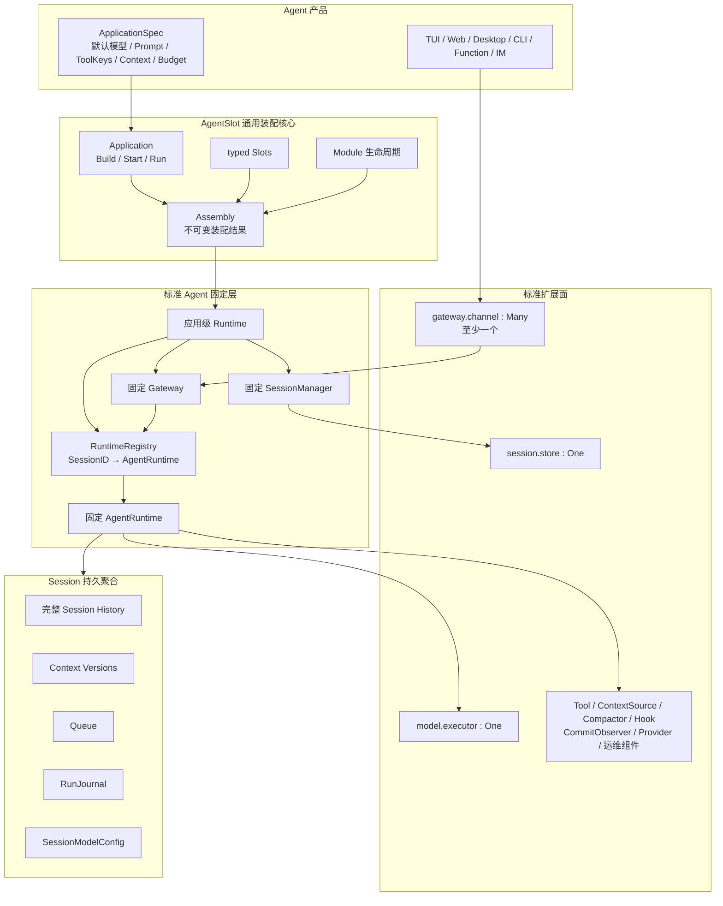

# AgentSlot 标准 Agent 框架全景架构

## 1. 文档定位

本文是标准 LLM Agent 框架的权威全景说明，回答系统最终由什么组成、谁拥有谁、请求怎样流动，以及开发者可以替换哪些部分。

- [标准组件地图](../COMPONENT_MAP.zh-CN.md)是公共 Slot、基数和成熟度的权威清单；
- [Agent 设计的架构讨论](agent-architecture-discussion.zh-CN.md)保存决策及理由；
- [AgentRuntime 与标准 Slot 实施计划](agent-runtime-standard-slots-implementation-plan.zh-CN.md)规定迁移轮次和验收边界。

本文描述长期架构，不是“第一版妥协”。代码分轮迁移不改变最终边界。迁移完成前，组件地图描述当前已实现合同；本文件描述迁移目标，两者的差距必须在实施计划中显式跟踪，不能把尚未实现的 Slot 提前标记为 Contracted。

## 2. 一句话架构

AgentSlot 用通用装配核心选择并启动三个标准扩展面；标准 Agent 层固定实现 SessionManager、AgentRuntime 和 Gateway。每个显式创建或恢复的 Session 对应一个进程内 AgentRuntime；所有用户操作只能经 Gateway 进入；持久化、模型调用和用户接入分别由 `session.store`、`model.executor` 和 `gateway.channel` 替换。

## 3. 全景与所有权



所有权规则：

- `Application.Build` 只验证和冻结装配结果，不创建 Session Runtime；
- `Application.Start` 创建并持有应用级 Runtime、Registry、固定 Manager 和固定 Gateway；
- 固定 Manager 只通过 SessionStore 创建、恢复或派生 Session，不保存第二份真相；
- `CreateSession` 或 `ResumeSession` 成功时，Registry 中已有唯一的 AgentRuntime；
- Gateway 通过 Registry 定位 Runtime，但不持有 Session 真相，也不直接写 Store；
- Channel 只获得 `GatewayAccess`，不能获得 Runtime、Store、Executor 或内部锁；
- 应用停止时先停止 Channel 接收新命令，再收束 Runtime，最后逆序停止共享组件。

## 4. 统一构建与启动

标准 Agent 显式使用 `standardagent.NewApplication`。它仍返回通用 `*agentslot.Application`，自动安装固定标准层和标准 Profile；产品不需要自己组装 Registry、Manager、Gateway 或 Agent loop。

```text
standardagent.NewApplication
    → Application.Build
    → Application.Start / Run
    → Runtime.Stop
```

目标标准 Profile 只要求：

| Slot | 基数 | 作用 |
| --- | --- | --- |
| `session.store` | `One` | 原子持久化完整 Session 聚合 |
| `model.executor` | `One` | 完成一次逻辑模型调用及其物理 Attempt |
| `gateway.channel` | `Many`，至少一个 | 把具体用户接入方式绑定到固定 Gateway |

固定 SessionManager、AgentRuntime 和 Gateway 都不是 Slot。框架不新增 AgentHost、RunningApplication、公开 RuntimeFactory 或第二套启动容器。

## 5. 对象生命周期

| 对象 | 所有者 | 生命周期 | 持久化 | Slot |
| --- | --- | --- | --- | --- |
| Application | Agent 产品 | 配置期到关闭 | 否 | 否 |
| Assembly | Application | Build 后到关闭 | 仅可导出安全描述 | 否 |
| 应用级 Runtime | `Application.Start` | Start 到 Stop | 否 | 否 |
| RuntimeRegistry | 应用级 Runtime | Start 到 Stop | 否 | 否 |
| 固定 Gateway | 应用级 Runtime | Start 到 Stop | 否 | 否 |
| 固定 SessionManager | 应用级 Runtime | Start 到 Stop | 否 | 否 |
| Session | SessionStore | 跨进程重启 | 是 | 否 |
| AgentRuntime | Registry | Create/Resume 到 Close/Stop | 否 | 否 |
| Run | AgentRuntime | 一次执行 | 事实和恢复证据持久化 | 否 |
| 可替换组件 | 对应 Module | Start 到 Stop | 由合同决定 | 是 |

一个启动后的应用级 Runtime 是明确的单进程边界：其中所有活跃 AgentRuntime 都在同一进程。同一 SessionID 最多对应一个 AgentRuntime；并发 Resume 汇合到同一实例。只读浏览不会创建 Runtime。跨进程 Session 租约、迁移或 active-active 不属于当前架构，未来需要独立设计。

## 6. 固定 Gateway 与 GatewayChannel

Gateway 是框架内的普通 Go 对象，不监听网络，也不是转发服务。它是 Agent 与用户操作之间唯一的后端边界。

```go
var ChannelSlot = agentslot.Many[GatewayChannel]("gateway.channel")

type GatewayChannel interface {
	Bind(GatewayAccess) error
}
```

Channel 的 Module 负责自身 Start/Stop。TUI、Web、飞书、Mattermost、RPC 和函数调用分别实现 Channel；需要网络时，监听、协议、远程认证授权、路由、输出和限流都属于该 Channel。Gateway 只提供与载体无关的结构化命令、查询、临时流和持久 revision 通知。

不存在标准 `interaction.entrypoint`、`gateway.transport`、`gateway.identity`、`gateway.route` 或 `gateway.delivery` Slot。这些职责不能被拆成能够绕过固定 Gateway 的第二套访问路径。

### 6.1 严格 Revision

每个 Session 只有一个 `SessionRevision`。所有外部写命令——Send、Steer、Queue 编辑、模型切换、Cancel 和 Close——都必须携带 `ExpectedRevision`。旧 revision 返回：

```text
RevisionConflictError {
    CurrentRevision
    SnapshotRequired = true
}
```

Gateway 不自动重试用户命令。调用方读取新的 SessionView，让用户或确定性 UI 流程基于新状态再次操作。

### 6.2 流、通知与恢复

- chunk/reset 是提交前的临时显示事件，允许丢失，永不持久化；
- 持久提交后只广播 `SessionID + Revision` 变化通知；
- UI 收到通知后读取权威 SessionView，不在客户端拼装第二份 Session 真相；
- 缓冲满时优先丢弃 chunk；持久 revision 通知无法投递时关闭订阅；
- 断线不取消 Run，恢复后重新读取 View；不保存 chunk 游标或框架级客户端 ACK。

SessionView 返回当前状态、Queue、模型配置和最近 100 个逻辑 Step。更老 History 使用 `BeforeHistorySequence` 游标向前分页，每页默认且最多 100 个完整逻辑 Step；不使用 offset，也不能拆断工具协议。

## 7. Session 与完整 Session History

SessionStore 原子持久化五类状态：

1. **完整 Session History**：唯一、append-only 的事实序列；
2. **Context**：下一次模型调用的合法输入投影；
3. **Queue**：尚未进入 Context 的 normal、steer 和 held 输入；
4. **RunJournal**：未完成执行的恢复证据，不是第二份事实账本；
5. **SessionModelConfig**：当前 Session 的模型选择和参数。

每个 HistoryFact 具有稳定 FactID、严格递增 HistorySequence、Session/Run/Step 身份、时间、ActorIdentity 和明确类型。标准事实至少包括 Message、ToolCall、ToolResult、Run、ModelAttempt、ModelConfigChanged、ContextContribution 和 RunBudgetExceeded。

`ActorIdentity` 记录事实来自 local_user、remote_user、service 或 agent；它是审计事实，不携带凭据，也不能被 Gateway 当成重新认证的依据。

History 记录真实发生顺序；Context 才负责生成合法模型协议。未配对 ToolCall 暂不进入下一模型请求，但不会从 History 消失。SystemPrompt、Tool definitions 和临时 chunk 不伪装成 Message；完整逻辑请求按 ContextRetentionMode 保存。

## 8. 固定 AgentRuntime

AgentRuntime 状态只有 `idle`、`running`、`closed`：

- 同一 Session 同时最多一个 Run，不同 Session 可并行；
- Send 在 idle 时启动新 Run；running 时持久化为下一 Run 的 normal 输入；
- Steer 只作用于活跃 Run，并在下一安全 Step 消费；
- 正常完成可以 FIFO 处理下一条 normal；取消、错误、重启或预算耗尽后不自动消费旧 Queue；
- Close 释放内存 Runtime，不删除 Session；再次 Resume 可恢复；
- 一个 Run 内冻结 SessionModelConfig，只允许在 Run 之间切换模型。

固定循环顺序是：认领输入、建立 Run、贡献新 Step Context、装配模型请求、执行逻辑模型调用、提交完整结果、执行工具、继续模型，直到自然完成、取消、错误或 Token Budget 终止。Hook、Tool、Executor 和 Channel 都不能成为第二个状态控制者。

## 9. Context 与 Token Budget

`ContextSource` 是可替换扩展面，但只能为**新 Step**提出追加内容。Runtime 必须先把提议持久化为 `ContextContributionFact`，再装配 Context。Source 不得替换、删除或插入旧 Step 内容。

Agent 启动配置提供：

- `LatestOnly`：默认，只保存最新完整 Context；
- `RetainAll`：调试模式，保存每个 Step 的完整逻辑模型请求。

完整 Context 包含当时的 SystemPrompt、模型输入、Tool definitions、ModelConfig 和附件投影，但不保存凭据或网络 Header。Compactor 可以替换；Runtime 固定验证协议完整性和硬 Token 上限。

只提供 `MaxTokensPerRun`，默认 `0` 表示无限。预算统计成功与失败 Attempt；达到预算且任务未完成时追加 `RunBudgetExceeded`，结束当前 Run 并回到 idle。用户显式发送“继续”会创建新 Run。框架不定义 MaxStep、MaxToolCall、MaxRunDuration 或 Queue 数量限制。

## 10. ModelExecutor 与物理 Attempt

AgentRuntime 发起一次逻辑模型调用；ModelExecutor 可以在内部执行多个物理 Provider Attempt，并自行决定重试、原生续传或终止。Runtime 不猜测 Provider 恢复方式。

Executor 获得受限 `AttemptRecorder`：

- `Started` 必须在真实 Provider 请求前完成持久提交；
- `Finished` 必须在下一次重试或返回终态前完成持久提交；
- 每个 Attempt 使用 started/terminal 两条 append-only `ModelAttempt` 事实；
- 崩溃恢复为未配对 started 追加 `outcome_unknown`；
- 失败 Attempt 不进入模型 Context，但必须保留用量与安全错误。

TokenUsage 分开记录 input、output、cached-input、cache-write、reasoning 和 total。cached-input 与 reasoning 是子集，不能再次累加到 total。Provider 未返回失败 Attempt usage 时，由适配器的本地 tokenizer 估算并标记估算来源。

## 11. Tool、Hook 与提交观察

ToolKeys 是严格白名单。nil、空列表和未配置都表示不暴露工具；未知、空字符串或重复 key 必须在 Build 阶段失败。Tool 只声明 `Serial` 或 `ParallelSafe`；工具结构化错误进入模型 Context，工具结果后 Runtime 必须继续调用模型。

`agent.hook` 只保留 `BeforeRunComplete`。Hook 只能提出后续输入 proposal；Runtime 校验、持久化并决定是否继续。Hook 不能改写 Store 或控制 Runtime 状态。

`session.commit.observer` 是有序异步观察链，只接收 SessionID、Revision 和本次提交的 FactSequence 范围。失败或 panic 被隔离，不能回滚提交。Trace、Metric、Audit、Usage 继续使用专用 Slot；不存在宽泛的 `runtime.observer`。

## 12. Fork

固定 Manager 支持完整历史 Fork 和从历史检查点 Fork。检查点必须是合法 HistorySequence/已完成 Step，不能位于未配对 ToolCall 中间。

- 子 Session 保存父 Session、截止 Sequence 和来源 Fact 身份；
- Queue、RunJournal 和活跃 Run 不继承；
- 默认继承来源 Session 当前 ModelConfig，创建命令可以显式覆盖；
- 历史事实保留来源关系，但子 Session 的 usage 不重复计费；
- 摘要启动是另一种显式操作，不能伪装成 Fork。

## 13. 框架固定边界与可定制边界

| 层级 | 开发者能否替换 | 内容 |
| --- | --- | --- |
| 通用装配核心 | 否 | Application、Module、Slot、Assembly、Build/Start/Run、生命周期回滚 |
| 标准固定层 | 否 | SessionManager、AgentRuntime、Gateway、Registry 和事务/状态不变量 |
| 标准 Profile 必需 Slot | 是 | SessionStore、ModelExecutor、GatewayChannel |
| 可选 Slot | 是 | Provider、Tool、ContextSource、Compactor、Hook、CommitObserver、策略与运维组件 |
| 产品配置 | 可配置 | Prompt、默认模型、ToolKeys、ContextRetentionMode、MaxTokensPerRun、Provider 地址引用 |
| 内部端口 | 否 | ID 生成、Clock、锁、协调器；测试注入不使其成为公共 Slot |

开发者若需要完全不同的循环，可以直接使用通用 AgentSlot 核心定义项目本地 Profile，但不能把它称为标准 AgentRuntime 的替换实现。

## 14. 当前代码与目标架构的差距

截至本轮文档基线，现有代码仍实现旧合同。后续迁移必须消除以下差距：

- `session.manager` 仍是公共 Slot，而不是固定 Manager；
- `interaction.entrypoint` 及若干 Gateway 子 Slot 尚未收敛为 `gateway.channel`；
- HistoryFact、Attempt、TokenUsage、Context retention 和历史分页字段尚不完整；
- 外部写命令尚未全部执行统一严格 ExpectedRevision；
- Hook/Observer 和 ToolKeys 仍是旧语义；
- FileStore 仍是旧格式；组件地图仍反映当前代码成熟度。

这些是迁移任务，不是未决架构。最终验收时目标组件地图为 37 个标准生态位，其中 16 个 Contracted；达到该数字前不得通过改文档虚报完成。

## 15. 明确不作为开发门禁的事项

下列上线或生态事项不阻塞本架构的代码开发：具体远程 wire protocol、生产认证系统、分布式 Session 租约、部署拓扑、运维告警阈值、Provider 凭据平台和版本发布流程。开发期仍必须完成本地确定性测试、race、vet、文件崩溃安全和合同一致性验证。
