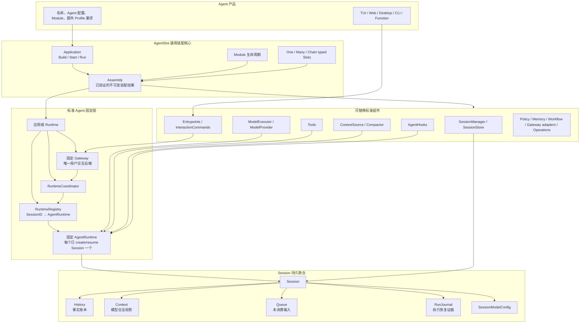
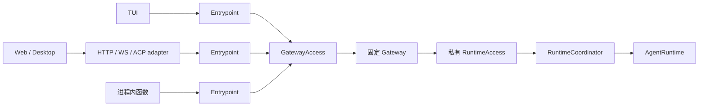
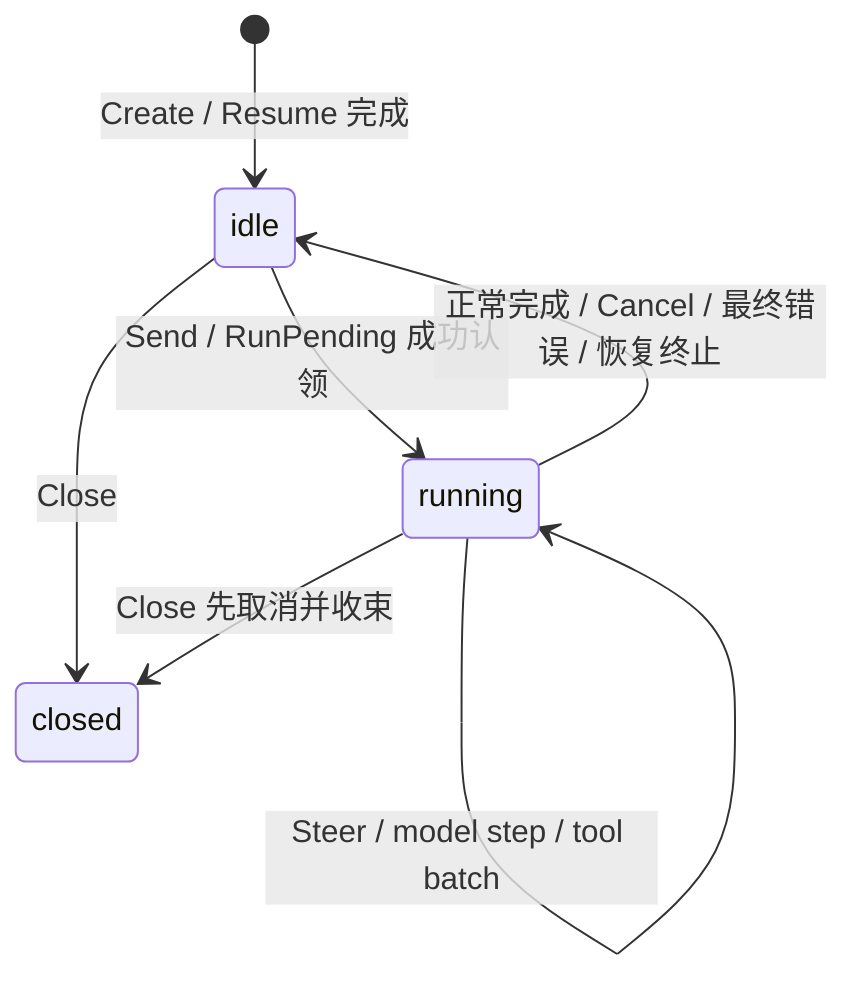
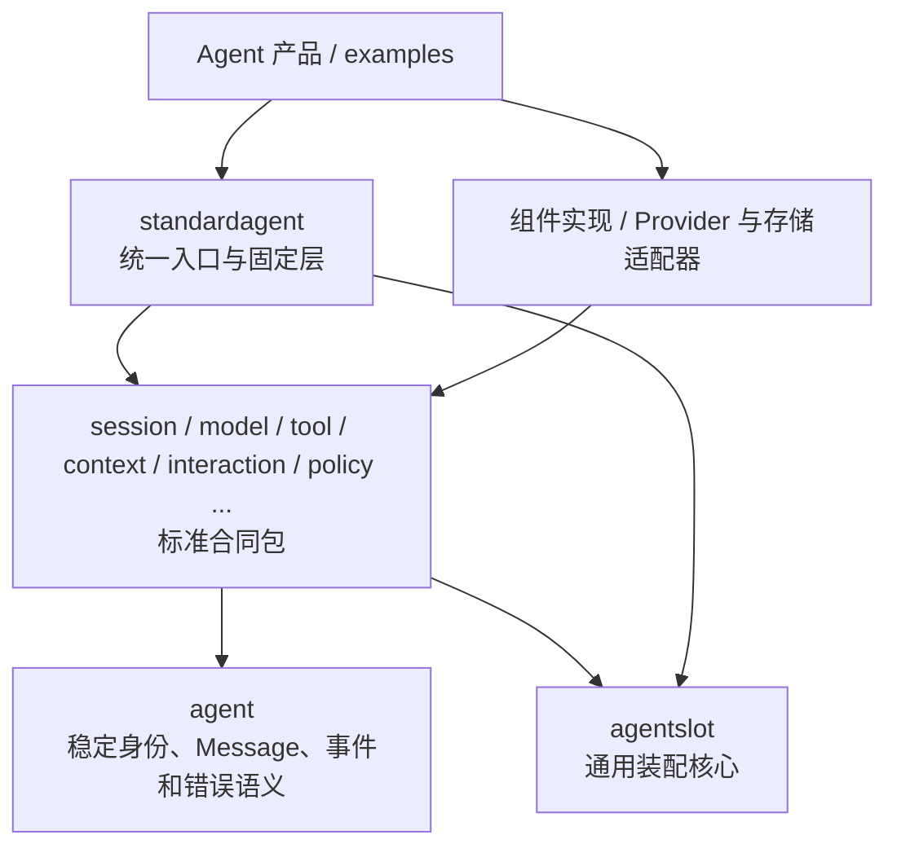

# AgentSlot 标准 Agent 框架全景架构

## 1. 文档定位

本文是标准 LLM Agent 框架的权威全景说明，回答“系统最终由什么组成、谁拥有谁、
请求怎样流动、哪里可以替换、哪里绝对不能替换”。阅读本文不需要先阅读实施阶段或
历史讨论。

- [标准组件地图](../COMPONENT_MAP.zh-CN.md) 是所有公共 Slot、基数和成熟度的权威清单。
- [Agent 设计的架构讨论](agent-architecture-discussion.zh-CN.md) 保存决策理由和被否决方案。
- [AgentRuntime 与标准 Slot 实施计划](agent-runtime-standard-slots-implementation-plan.zh-CN.md)
  只规定实现顺序和验收，不缩小本文的目标架构。

本文描述的是长期架构，不是“第一版临时方案”。代码可以分阶段完成，但任何阶段都
必须朝同一张完整架构图收敛，不能另造一套简化运行模型。

## 2. 一句话架构

AgentSlot 用通用装配核心选择并启动可替换组件；标准 Agent 层自动安装固定
`AgentRuntime` 和固定 Gateway；每个显式创建或恢复的 Session 对应一个进程内
`AgentRuntime`，所有用户操作只能经过应用级 Gateway，模型、工具、Session、Context
和运维能力通过小而明确的 Slot 替换。

## 3. 系统全景



这张图包含两个不同层次：

1. **通用装配核心**只知道 Module、Slot、Assembly 和生命周期，不知道 LLM、Session
   或 Gateway。
2. **标准 Agent 固定层**使用通用核心装配组件，但固定用户交互主链和执行循环，不允许
   Agent 项目替换整个 Runtime 或 Gateway。

## 4. 统一的 Agent 应用入口

### 4.1 显式启用标准 Agent

标准 Agent 不能靠“发现某几个 Slot 已安装”进行隐式猜测。目标公共入口固定为独立的
`standardagent` 包：

- 通用程序使用 `agentslot.NewApplication`，不会自动获得 AgentRuntime 或 Gateway；
- 标准 LLM Agent 使用 `standardagent.NewApplication`；
- `standardagent.NewApplication` 返回同一个通用 `*agentslot.Application`，自动加入
  框架内部 Runtime/Gateway Module 和标准 Agent Profile；
- 标准 Profile 强制要求一个 `session.manager`、一个 `session.store`、一个
  `model.executor` 和至少一个 `interaction.entrypoint`；
- 产品仍显式提供名称、Agent 配置、组件 Module 和额外 Profile 要求；导入包本身不会
  注册任何东西。

所有标准 Agent 项目因此使用同一条控制链：

```text
standardagent.NewApplication → Application.Build → Application.Start/Run → Runtime.Stop
```

不同项目只改变声明内容，不改变 Build、Start、Run、Stop 的语义，也不需要手写
Runtime 注册表、Gateway 或循环装配。框架不新增 `AgentHost`、`RunningApplication`、
公开 `RuntimeFactory` 或第二套启动容器。

### 4.2 Build 产物

`Build` 完成以下工作后产生不可变 `Assembly`：

1. 安装开发者声明的 Module 和标准 Agent 内部 Module；
2. 校验 Slot 基数、标准 Profile、Module 的 Slot 依赖和依赖环；
3. 按依赖顺序构造组件，并冻结 Runtime 所需的依赖集合；
4. 生成可检查、不可泄密的 `AssemblyDescription`。

当前代码使用 `Assembly`、`AssemblyDescription` 和 `agentslot.assembly/v0`，不保留
旧 `Plan` 名称的长期兼容别名。

### 4.3 Start 与 Stop

`Application.Start` 按以下顺序启动：

1. 启动共享组件；
2. 创建应用级 Runtime、`RuntimeRegistry` 和 `RuntimeCoordinator`；
3. 创建并绑定固定 Gateway；
4. 启动 Entrypoint，允许其通过同一个 `GatewayAccess` 接收用户操作。

停止顺序相反：先拒绝新的用户命令，再取消并收束全部 AgentRuntime，清空 Registry，
关闭 Gateway 和 Entrypoint，最后逆序停止共享组件。任一启动失败都只回滚已经成功
启动的部分。

## 5. 对象所有权与生命周期

| 对象 | 谁创建并持有 | 生命周期 | 是否持久化 | 是否是 Slot |
| --- | --- | --- | --- | --- |
| Application | Agent 产品 | 进程配置期到关闭 | 否 | 否 |
| Assembly | `Application.Build` | Application 生命周期 | 可导出安全描述 | 否 |
| 应用级 Runtime | `Application.Start` | 一次 Start 到 Stop | 否 | 否 |
| Gateway | 应用级 Runtime | 与应用级 Runtime 相同 | 否 | 否 |
| RuntimeRegistry | 应用级 Runtime | 与应用级 Runtime 相同 | 否 | 否 |
| RuntimeCoordinator | 应用级 Runtime | 与应用级 Runtime 相同 | 否 | 否 |
| Session | SessionManager/Store | 跨进程重启 | 是 | Session 实现可替换 |
| AgentRuntime | RuntimeCoordinator | Create/Resume 到 Close/Stop | 否 | 否 |
| Run | AgentRuntime | 一次执行 | Journal 与事实持久化 | 否 |
| 共享组件 | Assembly 中的 Module | Start 到 Stop | 由各实现决定 | 是 |

固定所有权规则：

- 一个启动后的应用级 Runtime 是一个**单进程执行边界**；Registry 中的所有
  AgentRuntime 都在该进程内运行。
- 浏览 Session 列表或只读查看不会创建 AgentRuntime。
- `CreateSession` 或 `ResumeSession` 成功时 Runtime 已完成初始化并登记。
- 同一进程、同一 SessionID 最多一个 AgentRuntime；并发 Resume 汇合到同一实例。
- AgentRuntime 在 idle 时保持轻量常驻，只在 `Close` 或应用停止时释放；Close 不删除
  Session，再次 Resume 会重建 Runtime。
- 同一 Session 同时最多一个活跃 Run；不同 Session 可以并行。
- 多个进程不能同时拥有同一 Session 的标准 AgentRuntime。跨进程 Session 租约、迁移
  或 active-active 不属于本架构的隐含能力，未来需要单独设计。

## 6. Gateway 是用户操作的唯一后端

Gateway 是一套框架内的静态 Go 代码和进程内对象，不等于 HTTP 转发服务，也不要求
独立部署。它把 Agent 本体与 TUI、Web、桌面端、CLI 和嵌入式函数调用解耦。



边界固定如下：

- Entrypoint 只能获得 `GatewayAccess`，不能获得 RuntimeAccess、AgentRuntime、Store、
  ModelExecutor 或内部锁。
- Gateway 负责主体校验、目标路由、幂等/revision 基础校验、命令目录、Snapshot、事件
  投影以及流式/聚合结果；它不直接写 SessionStore，也不执行模型或工具循环。
- Gateway 通过私有 RuntimeAccess 调用 RuntimeCoordinator。RuntimeAccess 不进入公共
  Slot、组件地图或产品 API。
- Gateway 核心与承载协议无关。进程内入口直接调用 Go 接口；远程 UI 通过 HTTP、
  WebSocket、gRPC、ACP 等适配器映射相同语义。
- 连接断开不会取消 Run；取消必须是显式命令。重连使用 Session Snapshot、revision 和
  后续持久事件，不持久化临时 chunk 游标或框架级客户端 ACK。

`interaction.command` 是可选 `Many` Slot，只向 Gateway 注册 UI-neutral 的结构化命令。
Gateway 输出命令名称、字段、选项、确认要求、结果和后续动作；不同 Entrypoint 可以把
同一个 `model` 命令渲染成 `/model`、菜单、按钮或表单。命令不能直接访问 Store 或
Runtime，也不能实现第二套循环。

## 7. Session、AgentRuntime 与固定循环

### 7.1 Session 的五类持久状态

| 状态 | 定义 | 修改规则 |
| --- | --- | --- |
| History | 真实发生事实的唯一时间序列 | 严格 append-only |
| Context | 下一次模型调用的合法协议投影 | 创建版本，不能改写 History |
| Queue | 尚未进入 Context 的 normal、steer、held 输入 | 认领前可用 expected revision/CAS 修改 |
| RunJournal | 活跃 Run、Step、工具 pending 和恢复证据 | 随执行事务推进，不复制对话事实 |
| SessionModelConfig | 当前 Provider、Model、Reasoning 和参数 | 仅 Runtime idle 时 CAS 更新 |

SystemPrompt、Tool 定义和 Runtime 的 Context 配置属于 `AgentRuntimeConfig`，不反复写入
History。临时模型 chunk、Provider Attempt 和客户端展示状态也不进入 History。

### 7.2 Runtime 状态

AgentRuntime 只有 `idle`、`running`、`closed`：



- `Send` 持久化 normal 输入；idle 时原子创建 Run，running 时排队。
- `Steer` 只针对当前 Run，在下一个安全 step 边界优先批量消费；idle 返回
  `no_active_run`。
- `RunPending` 在没有新消息时显式继续异常停止后遗留工作，不等同于 ResumeSession。
- 正常完成可以 FIFO 自动认领下一条 normal；取消、错误或重启后回到 idle，但不自动
  消费旧 Queue。
- `Cancel` 只取消当前 Run，`WhenIdle` 等待收束，`Close` 拒绝新命令并释放内存对象。

### 7.3 固定 Agent loop

一次 Run 的标准循环只有一个控制者：AgentRuntime。

1. 从 Queue 原子认领输入，冻结本 Run 的 SessionModelConfig，建立 RunJournal；
2. 从 History、已认领输入、固定 Prompt、Tool 定义和 Context 组件装配合法模型请求；
3. 调用 ModelExecutor 完成一次逻辑模型调用；
4. 临时 chunk 只发事件，完整 assistant 结果才提交 History；
5. 若结果包含 tool call，先把完整 call 事实与 RunJournal pending 原子提交，再按 Tool 的
   `Serial`/`ParallelSafe` 声明执行；
6. 把每个工具的成功、结构化错误或 `outcome_unknown` 结果提交 History，并继续调用模型；
7. 模型自然结束后运行 `BeforeRunComplete` Hook。Hook 只能提出后续输入 proposal，
   AgentRuntime 决定是否持久化和继续；
8. 原子完成 Run，执行只读 `AfterCommit` 观察，并按完成原因决定是否自动消费 normal。

工具返回错误时，安全的结构化错误结果交给模型判断；网络级模型恢复由 ModelExecutor
处理。AgentRuntime 不包含 Provider-specific 重试、续传或计费分支。

## 8. 模型切换

模型切换是 Session 后端能力，不依赖 Slash 或 Gateway UI：

- 新 Session 从 Agent 默认模型初始化 `SessionModelConfig`；Resume 恢复 Session 自己
  保存的配置，不被新默认值覆盖。
- SessionModelConfig 可以在 idle 时更新；running 时返回 `active_run`，不会隐式取消。
- 需要中途切换时，调用方先显式 Cancel，再等待 WhenIdle，然后提交带 expected revision
  的完整新配置。
- 每个 Run 在开始时冻结配置版本，Run 内所有 step 使用同一 Provider、Model、Reasoning
  和参数。
- 未知模型、非法参数直接拒绝；可能产生模态或 Context 损失时先返回警告，明确确认后
  才提交。
- 切换到文本模型不会删除图片或附件。Context 只投影稳定引用或省略说明；切回视觉模型
  时原始事实仍然存在。
- Context 超限先调用可替换 Compactor，压缩后仍超过硬限制则在 Provider 调用前失败，
  不能静默截断。

`/model` 只是默认 InteractionCommand 的一种前端渲染，最终仍调用同一个 Gateway
模型配置命令和同一笔 SessionStore 事务。

## 9. 可替换边界

| 类别 | 典型内容 | 谁决定 | 能否被 Agent 项目替换 |
| --- | --- | --- | --- |
| 通用装配规则 | Module、Slot、Assembly、依赖、生命周期回滚 | AgentSlot | 否 |
| 标准 Agent 主链 | Gateway、Registry、Coordinator、AgentRuntime、循环和状态机 | AgentSlot | 否 |
| 正确性不变量 | 单 Run、append-only、CAS、工具结果后继续、异常不自动 drain | AgentSlot | 否 |
| 必需 Slot | SessionManager、SessionStore、ModelExecutor、Entrypoint | 标准 Profile | 实现可替换，合同不可破坏 |
| 执行扩展 Slot | Provider、Tool、ContextSource、Compactor、Hook | Agent 项目 | 可以 |
| 交互适配 Slot | InteractionCommand、Gateway transport/identity/route/delivery | Agent 项目 | 可以，但不能替换 Gateway 核心 |
| 平台能力 Slot | Policy、Approval、Authorization、Memory、Checkpoint、Workspace、Environment、Artifact、Credential、Workflow、Mailbox | Agent 项目/Profile | 可以 |
| 运维与商业 Slot | Event/Observer、Usage、Price、Quota、Billing、Audit、Trace、Metric、Health | Agent 项目/Profile | 可以 |
| 默认实现 | 默认 Compactor、标准 Tool 包、内存 Store、Provider adapter | AgentSlot 或生态 | 可以替换或不安装 |
| 产品配置 | Prompt、ToolKeys、默认模型、Provider 地址、凭据引用、限额 | Agent 产品 | 可以配置 |
| Runtime 内部端口 | Clock、ID 生成器、锁、调度器、事件泵 | 固定层内部 | 仅测试注入，不是公共 Slot |

完整 Slot ID、基数和成熟度只以组件地图为准。Slot 的意义是“独立实现可替换的业务
责任”，不能因为某段内部代码方便测试就新增 Slot。

## 10. 包依赖方向

目标 Go 包依赖固定为单向 DAG：



规则如下：

- 根包 `agentslot` 只实现通用装配，不导入任何 Agent 领域包。
- `agent` 叶包保存跨组件共享的稳定值类型，不依赖 Provider、存储、UI 或固定 Runtime。
- `session`、`model`、`tool`、`context`、`interaction` 等合同包可以依赖 `agent` 和根包，
  但不能依赖 `standardagent` 或具体实现。
- `interaction` 定义 Entrypoint、InteractionCommand、GatewayAccess 及其结构化数据；固定
  Gateway 实现这些合同。
- `standardagent` 依赖根包和合同包，公开统一 Application 构造入口；循环、Registry、
  Coordinator 和 Gateway 实现放在它的 `internal` 包中，产品不能绕过公开边界调用。
- 适配器依赖合同包和外部 SDK；合同包和通用核心永远不反向依赖适配器。

这条依赖图必须在创建公共领域类型前固定，避免 Session、Gateway 和 Runtime 互相导入。

## 11. 一致性、恢复与失败语义

以下边界属于架构，不允许具体实现自行改写：

- Queue 入队、幂等结果、MessageID 和 revision 推进原子提交。
- idle→running 时，输入认领、RunID、配置快照和 RunJournal 原子提交。
- tool call 事实与同 ToolCallID 的 pending 原子提交；成功后才能执行工具。
- 每个 ToolCallID 只能有一个终态结果。崩溃后未知副作用写入
  `outcome_unknown`，不能自动重跑。
- ContextVersion 安装必须校验来源 History/Queue revision；Compactor 不能直接写 Store。
- ModelExecutor 的每次真实请求有 AttemptID，用量与运维事件可记录它，但 Session
  History 只保存完整业务事实。
- 半流失败可以由 Executor 重试、续传或终止；若已展示临时内容，发送 reset 撤销临时
  投影。临时 chunk 不持久化。
- Session 持久化是核心事务，不能交给可选 Hook。Hook 失败记录后继续其他 Hook，不得
  回滚已经提交的事实。

## 12. 部署与伸缩边界

标准部署单元是一个 Agent 应用进程：

- 应用级 Runtime、Gateway、Registry 和所有已打开 Session 的 AgentRuntime 在同一进程；
- SessionStore、Provider、对象存储和消息系统可以是进程外服务；
- 远程前端只通过 Gateway 的传输适配器进入；
- 同一进程可以并行运行多个 Session，不为每个 Session 创建进程或 Gateway；
- 多个独立 Agent 应用进程可以部署，但不能在没有新租约架构的情况下共同执行同一
  Session。

因此，横向扩容当前只能按 Agent、Workspace 或明确不重叠的 Session 所有权分片。跨进程
热迁移和 active-active 不是“以后加一个锁”就能得到的能力，不能在实现中偷偷假设。

## 13. 仍需选择的实施参数

以下事项不会改变本文的对象、所有权、调用方向、状态机或扩展边界，因此不是架构缺口：

| 事项 | 已固定架构 | 实施时选择 |
| --- | --- | --- |
| Gateway wire protocol | 核心 carrier-neutral，远程端经适配器 | HTTP/SSE、WebSocket、gRPC、ACP 的具体组合 |
| Queue 容量与背压数值 | 必须有限额、typed error、CAS 和不可丢事实 | 各 Profile 的默认容量与配额值 |
| 重试与 Run 上限数值 | ModelExecutor 管恢复，Run 必须有限终止边界 | 次数、退避、最大 Step/工具调用/时长 |
| Provider 范围 | Provider 是可选 Many，Executor 显式依赖 | 首批用哪两个独立协议证明合同 |
| 数据库与网络 Schema | Session 事务和 Gateway 语义固定 | 具体存储表、索引和 wire version |

RunJournal 已确定属于 SessionStore 聚合，不再建立独立 Slot。Session History 查询能力
作为受授权的标准 Tool 实现，通过 Session 只读查询端口读取事实，不建立专用 History
Tool Slot。

这些参数可以在实施和真实消费者验证中确定；它们不能成为推迟固定 Gateway、Runtime、
Session 聚合或包依赖方向的理由。

## 14. 架构完成判据

本架构已经固定：

- 标准 Agent 如何显式启用并自动挂载；
- Build、Start、Run、Stop 的唯一入口；
- Application、Assembly、应用级 Runtime、Gateway、Session 和 AgentRuntime 的所有权；
- 单进程多 Session 并发模型；
- 用户操作、模型调用、工具执行和持久化的完整主链；
- Session 五类状态及原子提交边界；
- 模型切换、断线重连、取消、失败和崩溃恢复语义；
- 框架固定能力、可替换 Slot、默认实现和产品配置的边界；
- Go 包依赖方向和禁止的反向依赖；
- 分布式能力不在当前标准中的明确边界。

后续 TDD 可以细化 Go 方法签名和错误封装，但不得重新发明上述架构。若真实实现证明
某项不成立，必须先修改本文和决策账本，再改变代码。
