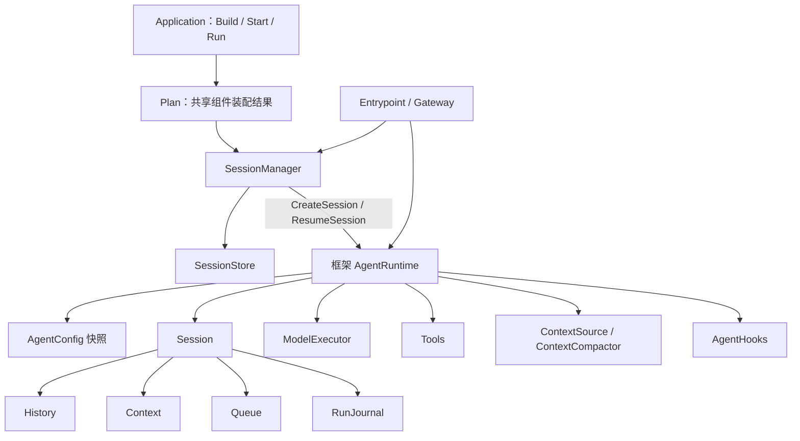
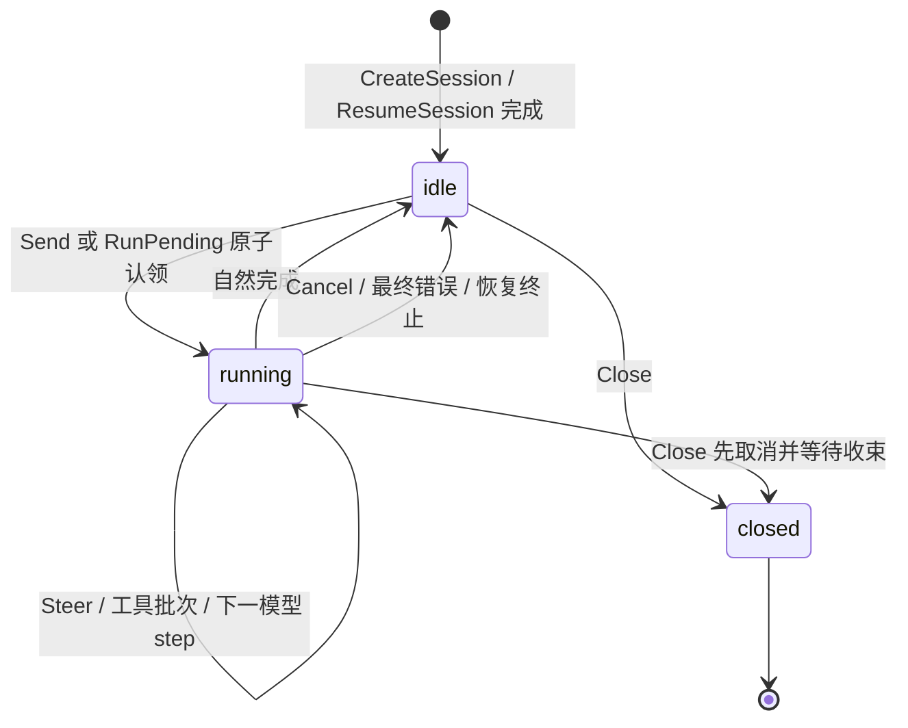
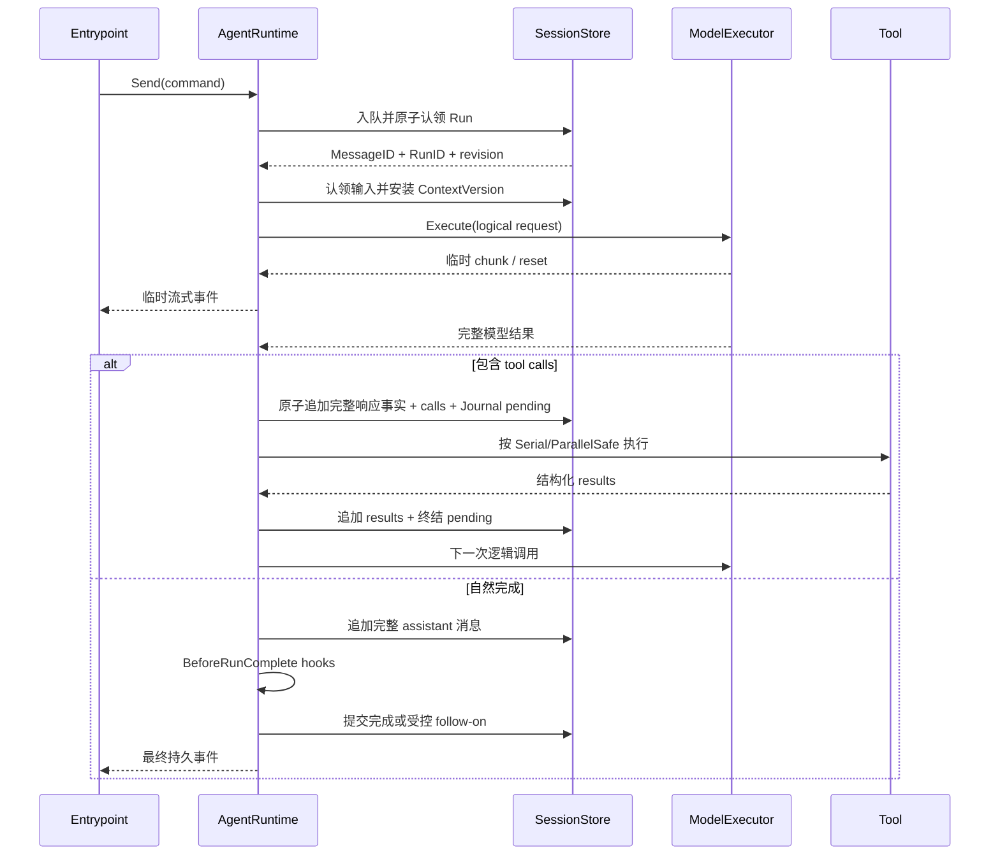

# AgentRuntime 与标准 Slot 实施计划

## 1. 文档状态

本文把 [Agent 设计的架构讨论](agent-architecture-discussion.zh-CN.md) 中已经确定的
结论转换成可执行的开发顺序。它描述目标合同，不代表这些 Go 接口已经发布；标准
组件的实际成熟度以中英文组件地图为准。

第一批编码只建立公共领域类型、typed Slot、合同测试和最小装配验证，不实现完整
`AgentRuntime`，不创建版本或发布。接口批次通过评审后，才单独开始 Runtime 实现。

## 2. 目标与非目标

### 目标

- 所有标准 LLM Agent 使用框架固定的 `AgentRuntime` 和同一套循环不变量。
- 一个 Application Plan 服务多个 Workspace 和 Session；不同 Session 可并行。
- Session 生命周期、持久化、模型执行、工具、Context 和 Hook 都有明确可替换边界。
- Agent 项目继续使用统一的 `Application.Build`、`Start`、`Run` 和 `Runtime.Stop`。
- 开发者能从组件地图判断哪些是框架规则、哪些是 Slot、哪些只是产品配置。

### 非目标

- 不把 `AgentRuntime`、循环状态机、事务不变量做成可替换 Slot。
- 不新增 AgentHost、RunningApplication、公开 RuntimeFactory 或第二套启动容器。
- 不规定 Gateway wire protocol、Provider 网络格式、数据库 Schema 或配置来源。
- 不把默认压缩算法、标准工具包或某个 Provider 适配器写成框架强制语义。
- 不通过反射扫描、`init()` 或隐藏服务定位器自动发现组件。

## 3. 术语与对象关系



| 对象 | 作用域 | 职责 |
| --- | --- | --- |
| Application | 进程内应用 | 装配模块，提供统一 Build、Start、Run 入口 |
| Plan | Application 生命周期 | 保存经过校验的共享组件选择和启动顺序 |
| AgentConfig | AgentRuntime 生命周期 | 固定 SystemPrompt、模型选择与参数、ToolKeys、Context 配置 |
| Session | 持久会话 | 拥有 History、Context、Queue、RunJournal 和 revision |
| AgentRuntime | 已恢复 Session 的内存生命周期 | 绑定一个 Session，接收命令并执行固定循环 |
| Run | Session 内一次执行 | 从开始持续到自然完成、取消或失败 |
| Step | Run 内执行边界 | 一次逻辑模型调用或一个工具批次 |
| ModelExecutor | Application 共享组件 | 完成逻辑模型调用并屏蔽 Provider 重试与续传差异 |

`CreateSession`、`ResumeSession` 是框架固定的 Session 生命周期入口，不是已经存在
的 `AgentRuntime` 实例方法，也不是 SessionManager 组件可以重写的循环入口。固定
入口先调用 SessionManager，再装配配置并初始化 Runtime；对调用方返回成功时，对应
Runtime 已经可用。Runtime 实例自身只提供 `Send`、`Steer`、`RunPending`、
`Cancel`、`WhenIdle`、Queue 操作、查询和 `Close`。

## 4. 框架固定边界与开发者扩展边界

| 层级 | 可否替换 | 内容 | 约束 |
| --- | --- | --- | --- |
| 装配框架 | 否 | Application、Module、typed Slot、Plan、Build/Start/Run、生命周期回滚 | 通用核心保持小且稳定 |
| AgentRuntime | 否 | Session 绑定、命令串行化、循环、状态机、事务顺序 | 不是 Slot，不允许实现另一套标准循环 |
| 正确性不变量 | 否 | 同 Session 唯一活跃 Run、History append-only、CAS、工具结果后继续模型、异常不自动消费旧 Queue | 不能被配置或 Hook 关闭 |
| 标准组件 Slot | 是 | SessionManager、SessionStore、ModelExecutor、Tool、ContextSource、ContextCompactor、AgentHook、Entrypoint 等 | 替换实现必须满足同一合同和兼容测试 |
| 默认实现 | 是 | 默认 Compactor、标准工具包、Provider 适配器、内存 Store | 默认算法不是所有实现的语义 |
| 产品配置 | 由项目决定 | SystemPrompt、ToolKeys、模型参数、压缩参数、Provider 地址和凭据引用 | Runtime 内使用不可变快照 |
| Runtime 内部端口 | 否，除非以后证明为生态位 | Clock、ID 生成器、执行协调器、锁和调度细节 | 可用于测试注入，不自动升级成公共 Slot |

开发者如果确实要实现完全不同的循环，可以使用 AgentSlot 通用装配核心定义项目本地
Slot 和 Profile；它不属于标准 LLM Agent Profile，也不能冒充标准 AgentRuntime。

## 5. 标准 Slot 与依赖关系

### 5.1 标准 Profile 必需项

| Slot ID | 候选合同 | 类型 | 基数 | 直接消费者 |
| --- | --- | --- | --- | --- |
| `session.manager` | `SessionManager` | `One` | 恰好 1 | Entrypoint 和框架 Runtime 创建逻辑 |
| `session.store` | `SessionStore` | `One` | 恰好 1 | SessionManager 和 AgentRuntime |
| `model.executor` | `ModelExecutor` | `One` | 恰好 1 | AgentRuntime |
| `interaction.entrypoint` | `Entrypoint` | `Many` | 至少 1 | 外部调用方 |

### 5.2 与 Runtime 直接相关的可选项

| Slot ID | 候选合同 | 类型 | 说明 |
| --- | --- | --- | --- |
| `agent.hook` | `AgentHook` | `Chain` | 有序执行受控 Hook；缺失时循环正常运行 |
| `model.provider` | `ModelProvider` | `Many` | 仅在所选 ModelExecutor 需要时成为该模块的依赖 |
| `tool` | `Tool` | `Many` | 零工具对话 Agent 合法；ToolKeys 只能选择已安装键 |
| `context.source` | `ContextSource` | `Chain` | 按顺序提供模型调用的派生上下文 |
| `context.compactor` | `ContextCompactor` | `One` | 多轮 Profile 可要求；算法可整体替换 |

其他策略、审批、观察、审计、用量和 Gateway Slot 继续按组件地图定义。某个
ModelExecutor 模块如果需要 Provider，必须通过 `RequiredSlots` 显式声明
`model.provider` 依赖；标准 Profile 不再全局强制 Provider 数量。

## 6. 候选 Go 合同

本节用来固定职责和数据流，编码前还要把命名、错误类型和最小方法集写成红测试。
这些代码块不是已发布 API。

### 6.1 SessionManager

```go
type SessionManager interface {
	Create(context.Context, CreateSessionCommand) (Session, error)
	Resume(context.Context, ResumeSessionCommand) (Session, error)
	Fork(context.Context, ForkSessionCommand) (Session, error)
	StartFromSummary(context.Context, SummarySessionCommand) (Session, error)
}
```

- 负责创建、恢复和派生 Session，不执行 Agent 循环。
- Manager 的 `Resume` 必须完成恢复检查；不能把损坏或半恢复 Session 交给 Runtime。
- 同一进程对同一 SessionID 的并发 resume 必须汇合为同一个 AgentRuntime；注册表和
  单航班逻辑属于框架实现，不扩成公共 Factory Slot。
- Manager 依赖 `session.store`，但不能要求具体存储实现。

### 6.2 SessionStore 与 Session

```go
type SessionStore interface {
	Create(context.Context, NewSession) (SessionSnapshot, error)
	Load(context.Context, SessionRef) (SessionSnapshot, error)
	Transact(context.Context, SessionRef, Revision, SessionMutation) (Commit, error)
}

type Session interface {
	ID() SessionID
	View(context.Context) (SessionView, error)
	Revision() Revision
}
```

`SessionStore.Transact` 是 Session 聚合的唯一持久化提交入口。它必须覆盖 History、
Context、Queue、RunJournal 和执行状态之间需要一致的更新，支持 expected revision、
CAS 和幂等键。`Session` 是已恢复会话的窄句柄，不暴露存储实现，也不允许调用方
绕过 AgentRuntime 随意改写聚合状态。

### 6.3 ModelExecutor

```go
type ModelExecutor interface {
	Execute(context.Context, ModelRequest) (ModelStream, error)
}

type ModelStream interface {
	Recv(context.Context) (ModelEvent, error)
	Close() error
}
```

- Runtime 发起一次逻辑调用；Executor 可在内部执行多次真实 Provider 请求。
- 每次真实请求有独立 `AttemptID`，进入用量、Trace 和运维事件，不进入 Session History。
- Executor 统一产生临时输出、`reset`、完整结果或最终失败。
- 重试、原生 continuation 或终止由 Executor 根据 Provider 能力决定；Runtime 不猜测
  Provider 差异，也不强制“相同 Context 从头重试”。
- 只有完整模型结果可以成为 History 事实；半流 chunk 不持久化。

### 6.4 Tool 与工具调度

`Tool` 是可替换标准组件。每个 Tool 只声明 `ParallelSafe` 或 `Serial`；固定 Runtime
根据声明形成批次并调用工具。工具参数必须先通过其 Schema 校验。

工具错误形成安全、结构化的 tool result 并返回模型。内部堆栈、凭据和敏感路径不得
原样暴露。一个工具批次结束后 Runtime 必须再次调用模型，直至自然完成、取消、
最终模型失败或安全上限触发。

### 6.5 ContextSource 与 ContextCompactor

```go
type ContextSource interface {
	Contribute(context.Context, ContextInput) ([]Message, error)
}

type ContextCompactor interface {
	Compact(context.Context, CompactionInput) (CompactionOutput, error)
}
```

- Compactor 输入当前完整 Context 及来源 revision，输出较小的会话 Message 投影。
- 输出不包含 SystemPrompt 和 Tool 定义；Runtime 验证协议完整性与硬 Token 上限后重新
  装配固定部分并提交 ContextVersion。
- Compactor 不改写 History、不直接写 Store、不分配 ContextVersion。
- 默认实现采用“历史摘要 + 最近三条 inbound + 必要协议尾部”，但替换实现可以改变
  保留条数、摘要模型和选择规则。

### 6.6 AgentHook

```go
type AgentHook interface {
	BeforeRunComplete(context.Context, RunCompleteView) (FollowOnProposal, error)
	AfterCommit(context.Context, CommitView) error
}
```

- `BeforeRunComplete` 在完整 assistant 消息已提交、Run 尚未结束时调用，只能提出追加
  后续输入；Runtime 校验并持久化 proposal，并且拥有是否继续的唯一决定权。
- Hook 不能直接修改 Queue、History、Context、RunJournal 或 Runtime 状态。
- Hook 报错只记录并继续执行其他 Hook；不能破坏核心事务。
- `AfterCommit` 只观察已提交事实，不能回滚或改变提交结果。
- 首版不提供暂停、取消或任意命令动作；未来扩展动作必须重新评审。

### 6.7 AgentRuntime 的固定命令面

AgentRuntime 由框架实现为普通 Go 结构体。候选命令面如下：

```go
type AgentRuntime struct { /* framework-owned fields */ }

func (r *AgentRuntime) Send(context.Context, SendCommand) (EnqueueResult, error)
func (r *AgentRuntime) Steer(context.Context, SteerCommand) (EnqueueResult, error)
func (r *AgentRuntime) RunPending(context.Context, RunPendingCommand) (RunID, error)
func (r *AgentRuntime) Cancel(context.Context, CancelCommand) error
func (r *AgentRuntime) WhenIdle(context.Context) error
func (r *AgentRuntime) EditQueued(context.Context, EditQueuedCommand) (Commit, error)
func (r *AgentRuntime) DeleteQueued(context.Context, DeleteQueuedCommand) (Commit, error)
func (r *AgentRuntime) ReclassifyQueued(context.Context, ReclassifyQueuedCommand) (Commit, error)
func (r *AgentRuntime) Snapshot(context.Context) (RuntimeSnapshot, error)
func (r *AgentRuntime) SessionView(context.Context) (SessionView, error)
func (r *AgentRuntime) Close(context.Context) error
```

这里不定义 `AgentRuntime` 接口或 Slot，以免制造“标准循环可以整体替换”的错误承诺。
为了测试而抽出的 Clock、ID 生成器或协调器保持包内小接口。

## 7. 初始化与注入

### 7.1 Application 级共享依赖

| 依赖 | 来源 | 是否为标准必需项 | Runtime 用法 |
| --- | --- | --- | --- |
| SessionManager | `session.manager` | 是 | 创建、恢复、fork Session |
| SessionStore | `session.store` | 是 | Session 聚合事务与 Snapshot |
| ModelExecutor | `model.executor` | 是 | 逻辑模型调用 |
| Entrypoint | `interaction.entrypoint` | 至少一个 | 接入生命周期命令和 Runtime 命令 |
| ModelProvider 集合 | `model.provider` | 否 | 由特定 Executor 选择性依赖 |
| Tool 集合 | `tool` | 否 | 按 AgentConfig.ToolKeys 冻结选择 |
| ContextSource 链 | `context.source` | 否 | 组装 Context |
| ContextCompactor | `context.compactor` | 否或由多轮 Profile 要求 | 压缩 Context |
| AgentHook 链 | `agent.hook` | 否 | 受控扩展与提交后观察 |

### 7.2 创建 Runtime 时的 Session 级输入

| 输入 | 来源 | 规则 |
| --- | --- | --- |
| AgentID、WorkspaceID、SessionID | Create/Resume 结果 | 稳定持久身份 |
| 已恢复 Session | SessionManager | 已完成恢复，不能是半成品 |
| AgentConfig | 产品配置解析结果 | Runtime 生命周期内不可变 |
| ModelExecutor 引用 | Plan | 共享，不复制客户端或连接池 |
| 选中的 Tools | Plan + ToolKeys | 键必须存在且无歧义 |
| Context 组件、Hooks | Plan | 保持 Plan 的稳定顺序 |

Runtime 初始化必须一次完成：任一必需依赖、ToolKey、模型选择或 Session 恢复校验
失败时，`CreateSession`/`ResumeSession` 返回错误，不能缓存半成品 Runtime。

## 8. 生命周期与状态机

Session 执行状态只有 `idle`、`running`；内存 Runtime 另有 `closed` 终态。



固定不变量：

- 浏览或列出 Session 不创建 Runtime；显式 create/resume 才创建。
- 一个进程内同一 SessionID 最多一个 Runtime；并发 resume 返回同一个实例。
- Runtime 在 idle 时仍驻留，不做隐藏空闲回收；仅 `Close` 或应用停止释放。
- 同一 Session 同一时刻最多一个活跃 Run；不同 Session 可并行。
- `Close` 不删除持久 Session；再次 resume 可以创建新 Runtime，并使用最新配置快照。
- Runtime 生命周期内 AgentConfig 固定；配置更新只影响后来创建的 Runtime。

## 9. 命令语义

### Send

1. 校验幂等键、权限、消息和 expected revision。
2. 以 `normal` 持久化到 Queue，并返回 `MessageID` 和新 revision。
3. 若 Runtime 为 idle，本次提交同时认领消息、创建 RunJournal 和 RunID，进入 running。
4. 若正在 running，消息保持 normal，等待当前 Run 自然完成后的 FIFO drain。

### Steer

1. 只允许针对当前活跃 Run；idle 返回 `no_active_run`，不偷偷降级为 normal。
2. 成功后持久化为 `steer` 并返回 `MessageID` 和 revision。
3. Runtime 在下一安全 step 边界按稳定顺序批量认领 Steer，优先于 normal。

### RunPending

用于没有新消息时显式处理异常停止后遗留的 Queue 或完成恢复动作。它不是 Session
恢复；Session 恢复只由 `ResumeSession` 表达。没有可处理工作时返回确定的
`nothing_pending`，不能创建空 Run。

### Queue 修改

Edit/Delete/Reclassify 必须携带 expected revision。仅未认领、尚未进入 Context 的
消息可修改；认领后返回 conflict。操作成功产生新 revision。

### Cancel、WhenIdle、Close

- `Cancel` 只取消当前 Run；重复 Cancel 幂等。Run 收束后回到 idle，不自动消费旧 Queue。
- `WhenIdle` 等待 Runtime 到达 idle 或 closed；调用方 context 取消只结束等待。
- `Close` 拒绝新命令，取消当前 Run，等待核心事务收束并释放内存资源；Session 数据保留。

## 10. Session 数据模型与提交边界

### History

History 是唯一、严格 append-only 的事实账本，按真实发生顺序保存完整用户消息、
assistant 消息、tool call/result 和 Run 事实。SystemPrompt、Tool 定义和临时 chunk
不是 History。已提交事实不能修改、删除、换位或向前插入。

### Context

Context 是下一次模型调用使用的版本化合法协议投影。每个版本记录父版本、来源
History/Queue revision、Compactor 实现与配置版本和 Token 计量。未配对 tool call
不能进入模型请求。

### Queue

Queue 保存未进入 Context 的 `normal`、`steer`、`held`。消息被认领前可以 CAS
编辑、删除或改投；重启时未消费 steer 转为 held，等待用户处理。

### RunJournal

RunJournal 保存活跃 Run、Step、待执行工具意图、Attempt 关联和恢复状态，不复制
History。它是执行恢复证据，不是第二份对话账本。

### 必须原子的事务

- Queue 入队、MessageID 分配、幂等结果和 revision 推进。
- idle 到 running：认领启动输入、创建 RunID、写 RunJournal 和状态转换。
- tool call 追加 History 与同一 ToolCallID 的 RunJournal pending 建立。
- 工具终态结果追加 History、Journal 终结和 Context 候选推进。
- Run 自然完成与下一 normal 的 FIFO 认领；异常终止不得顺带认领旧 Queue。
- ContextVersion 安装与来源 revision 校验。

每个 ToolCallID 最终只能有一个终态结果：成功、结构化错误或
`outcome_unknown`。崩溃恢复先追加 `outcome_unknown` 并终结 pending，不能自动
重跑可能已经产生外部副作用的工具。

## 11. 标准执行时序



临时 chunk 只用于当前连接和事件订阅，不持久化。半流失败时 Executor 可以发出
`reset`，Gateway/Entrypoint 丢弃对应临时展示；最终只有完整消息提交 History。

## 12. Gateway、断线与重连

- Gateway 是 Application 级共享组件，不为每个 Session 创建。
- 路由键为 `AgentID + WorkspaceID + SessionID + RunID`；创建 Session 前不含 SessionID。
- Gateway 两端使用 RPC 语义，具体 wire protocol 待定。
- 客户端断开不取消 Run；Cancel 必须是显式命令。
- 流式是内部唯一执行路径；非流式由 Gateway 聚合本 Run 全部 assistant 文本消息。
- 重连以客户端持有的 revision 请求 Session Snapshot，再订阅后续持久事件。
- AgentSlot 不保存 chunk 游标或框架级客户端 ACK；可靠投递由具体 Gateway 或外部消息
  系统私有实现，不能改变 History、Context、Run 或业务完成状态。

## 13. sub-agent 与 Session 派生

- 每个 sub-agent 使用独立 Session、Queue、Context、History、RunJournal 和 Runtime。
- 完整 fork 复制指定 revision 的完整可审计历史，并记录父子来源。
- 摘要启动创建新 Session，只把显式摘要作为新会话输入，不伪装成完整 fork。
- 两种方式都生成新的 AgentConfig 快照；继承项和覆盖项必须可检查。
- 派生完成时即初始化子 Session 的 Runtime；仅浏览父子关系不会创建 Runtime。

## 14. 分阶段 TDD

### 阶段 0：文档与目录基线

- 中英文组件地图的 Slot ID、基数、职责、数量和成熟度一致。
- README、架构讨论、路线图和本计划不存在旧 `agent.loop` 标准语义。
- 所有新生态位仍为 Mapped，不把候选代码写成 Contracted。

### 阶段 1：公共类型、typed Slot 和合同测试

- 先写失败测试，固定身份、Revision、History/Context/Queue/RunJournal 值类型。
- 声明 `session.manager`、`session.store`、`model.executor`、`agent.hook` 和关联 typed Slot。
- 完成 cardinality、依赖、错误分类、秘密不进入 `Plan.Describe` 的合同测试。
- 提供最小假实现，只用于证明装配；不实现 AgentRuntime 循环。
- 阶段完成后单独评审，不打 tag、不发布。

### 阶段 2：SessionStore 与 SessionManager

- 以内存实现驱动 append-only、CAS、幂等、原子提交和恢复测试。
- 测试 create/resume/fork/summary-start，以及并发 resume 单实例语义。
- 引入第二个独立存储实现前，不把生态位标记 Proven。

### 阶段 3：固定 AgentRuntime 与并发状态机

- 先覆盖 idle/running/closed、Send、Steer、RunPending、Cancel、WhenIdle、Close。
- 压测同 Session 并发命令只产生一个 Run；不同 Session 可并行。
- 测试 Runtime idle 常驻、显式 Close、应用停止和重新 resume 的配置快照。

### 阶段 4：ModelExecutor 与流式一致性

- 使用确定性 Executor 测试临时 chunk、reset、完整结果和最终失败。
- 两种不同 Provider 协议验证重试/continuation 差异不泄漏到 Runtime。
- 测试 AttemptID 进入运维/用量事件但不进入 History。

### 阶段 5：工具循环与崩溃恢复

- 测试 Serial/ParallelSafe 分组、Schema 校验、安全错误和结果后继续模型。
- 在每个事务断点注入崩溃，验证 call/pending 顺序、唯一终态和 outcome_unknown。
- 验证跨 Session 文件写入使用版本哈希和精确内容校验，不依赖 Workspace 全局写锁。

### 阶段 6：Context、Hook 与 History 查询

- 测试替换 Compactor 不受默认“最近三条”算法限制。
- 测试协议完整性、硬 Token 上限、来源 revision 和 History 不变。
- 测试 Hook 只能 proposal/observe，失败不能改变核心事务。

### 阶段 7：Gateway、多 Session 与真实适配器

- 测试流式/非流式事实一致、断线不停 Run、Snapshot/revision 重连。
- 测试多 Workspace、多 Session 路由、权限和无内存句柄泄漏。
- 用至少两个独立实现、真实消费者和兼容测试逐项推进成熟度。

## 15. 验证与发布门槛

每阶段运行：

```sh
gofmt -w .
go test -race ./...
go vet ./...
```

文档阶段额外运行 `git diff --check`、链接检查和关键术语扫描。不要为了文档链接
新增无业务价值的 `documentation_test.go`；可使用独立静态检查脚本或 CI 命令。

只有一个框架 Runtime 或一个组件实现，不能把任何 Slot 标记为 Proven。每个标准
生态位必须经过公开合同、兼容测试、两个语义独立实现和真实无分支消费者，才能按
组件地图规则晋级。

## 16. 仍待商榷

| 事项 | 已固定边界 | 后续要决定 |
| --- | --- | --- |
| Gateway wire protocol | RPC 语义、断线不取消、Snapshot/revision | HTTP/SSE、WebSocket、gRPC 等具体协议 |
| Queue 容量与配额 | 持久化、CAS、异常不自动 drain | Session/Workspace/Agent 限额和背压错误 |
| 重试与安全上限 | Executor 负责 Provider 恢复，Runtime 必须有终止边界 | 次数、退避、最大 Step、工具调用和运行时间默认值 |
| RunJournal 与 History 查询工具 Slot ID | 职责已经确定 | 是否为公共 Slot、ID、基数和依赖 |
| 第一批 Provider 适配器 | Provider 不是全局必需，Executor 可声明依赖 | 选择能证明协议差异的两个真实实现 |

`session.store`、`model.executor` 和 `agent.hook` 的 Slot ID、职责及基数已经确定，
不再列为待商榷事项。
