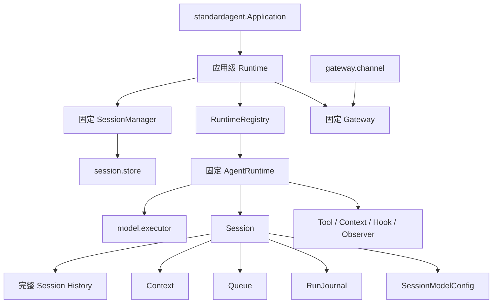
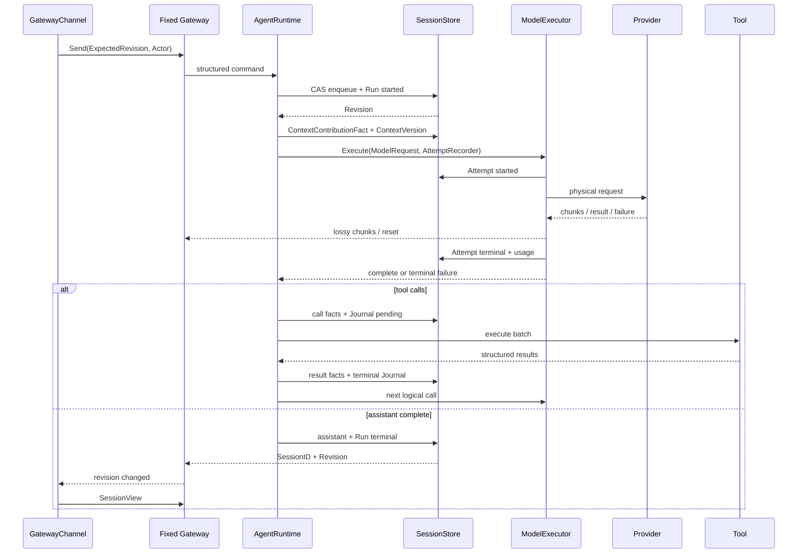

# AgentRuntime 与标准 Slot 实施计划

## 1. 文档状态

本文把[全景架构](agent-framework-architecture.zh-CN.md)转换成可执行迁移。它覆盖完整目标架构；分轮只是控制修改和验证边界，不是“先做残缺第一版”。每轮必须 TDD、Review、修复、完整验证并独立提交，上一轮未完成不得开始下一轮。

迁移期间：

- 全景架构和架构讨论记录最终目标；
- 组件地图记录当前已经落地的公共 Slot 和成熟度；
- 本文记录二者差距以及关闭差距的顺序；
- 不把上线部署、生产认证或 wire protocol 选择设为开发启动门禁。

当前迁移状态：第 0～6 轮已经全部完成。合同、实现、测试、参考 Agent 和组件地图已经
同步；本文继续保留轮次与验收边界，作为实现证据和后续回归依据。

## 2. 最终结构



最终标准 Profile 只要求三个扩展面：

| Slot ID | 合同 | 基数 |
| --- | --- | --- |
| `session.store` | `SessionStore` | `One` |
| `model.executor` | `ModelExecutor` | `One` |
| `gateway.channel` | `GatewayChannel` | `Many`，至少一个 |

固定 SessionManager、AgentRuntime 和 Gateway 不是 Slot。Agent 开发者可以替换 Store、Executor、Channel 以及可选的小组件，不能替换标准循环和事务不变量。

## 3. 核心公共数据

下列签名是迁移目标，用于约束职责；实现时可以按 Go 包依赖拆分，但不能改变语义。

### 3.1 身份与完整 History

```go
type HistorySequence uint64

type ActorKind string

const (
	ActorLocalUser  ActorKind = "local_user"
	ActorRemoteUser ActorKind = "remote_user"
	ActorService    ActorKind = "service"
	ActorAgent      ActorKind = "agent"
)

type ActorIdentity struct {
	Kind ActorKind
	ID   string
}

type HistoryFact struct {
	FactID    FactID
	Sequence  HistorySequence
	SessionID SessionID
	RunID     RunID
	StepID    StepID
	At        time.Time
	Actor     ActorIdentity
	Kind      HistoryFactKind
	Payload   HistoryFactPayload
}
```

`HistoryFactKind` 至少覆盖 Message、ToolCall、ToolResult、Run、ModelAttempt、ModelConfigChanged、ContextContribution 和 RunBudgetExceeded。具体 payload 使用封闭的类型化结构，不用 `map[string]any` 逃避合同。

每个物理 Attempt 使用 started/terminal 两条事实；同一 AttemptID 恰好一个 started 和一个 terminal。恢复时为孤立 started 追加 `outcome_unknown` terminal，永不修改原事实。

### 3.2 TokenUsage

```go
type TokenUsage struct {
	InputTokens       int64
	OutputTokens      int64
	CachedInputTokens int64
	CacheWriteTokens  int64
	ReasoningTokens   int64
	TotalTokens       int64
	Estimated         bool
	EstimateSource    string
}
```

`CachedInputTokens` 是 input 子集，`ReasoningTokens` 是 output/total 口径中的子集；统计预算使用 `TotalTokens`，不能重复相加。Provider 未返回失败 Attempt usage 时，由 Provider 适配器使用本地 tokenizer 估算并填写来源。

### 3.3 Context retention

```go
type ContextRetentionMode string

const (
	ContextLatestOnly ContextRetentionMode = "latest_only"
	ContextRetainAll  ContextRetentionMode = "retain_all"
)

type AgentRuntimeConfig struct {
	SystemPrompt         string
	ToolKeys             []string
	ContextRetentionMode ContextRetentionMode
	MaxTokensPerRun      int64
}
```

`MaxTokensPerRun == 0` 表示无限。负值非法。框架不增加 MaxStep、MaxToolCall、MaxRunDuration 或 Queue 标准上限。

## 4. SessionStore 合同

```go
type SessionStore interface {
	Create(context.Context, NewSession) (SessionSnapshot, error)
	Load(context.Context, SessionID) (SessionSnapshot, error)
	Commit(context.Context, SessionCommit) (SessionSnapshot, error)
	HistoryPage(context.Context, HistoryPageRequest) (HistoryPage, error)
	List(context.Context, ListSessionsRequest) (SessionList, error)
}
```

`SessionCommit` 在一个 CAS 事务里更新 History、Context、Queue、RunJournal 和 ModelConfig。每个外部写命令携带 `ExpectedRevision`；旧值返回统一的 `RevisionConflictError`。Commit 保留幂等键，重复请求不能追加重复事实。

```go
type RevisionConflictError struct {
	CurrentRevision  SessionRevision
	SnapshotRequired bool // 始终为 true
}
```

History 分页使用：

```go
type HistoryPageRequest struct {
	SessionID            SessionID
	BeforeHistorySequence HistorySequence // 0 表示从尾部开始
	StepLimit             int             // 0 使用 100；最大 100
}
```

Store 返回完整逻辑 Step，不能拆断 ToolCall/ToolResult 协议；基于不可变 sequence 分页，不能使用 offset。

FileStore 格式升级为 `agentslot.session-file/v1`。读取旧 `v0` 必须返回清晰的 unsupported-format 错误；当前没有外部用户，不实现迁移器或兼容垫片。写入继续采用私有临时文件、fsync 和原子 rename。

## 5. 固定 SessionManager 与 Fork

Manager 是标准框架内部结构，不导出可替换接口，也没有 `session.manager` Slot。它由 SessionStore、ApplicationSpec 默认 ModelConfig 和内部 ID 生成器构造。

固定能力：

- Create：使用 Application 默认模型创建全新 Session；
- Resume：恢复 Store 中的 SessionModelConfig，不用新默认值覆盖；
- Full Fork：复制到来源尾部的完整历史；
- Checkpoint Fork：复制到指定合法 HistorySequence/已完成 Step；
- Summary Start：以显式摘要创建新 Session，不伪装成 Fork。

Fork 必须保存 ParentSessionID、CutoffHistorySequence 和来源 Fact 身份；拒绝切在未配对 ToolCall 中间。Queue、RunJournal 和活跃 Run 不继承；默认继承父 Session 当前 ModelConfig；usage 事实保留来源关系但不计入子 Session 消费。

## 6. ModelExecutor 与 AttemptRecorder

```go
type ModelExecutor interface {
	Execute(context.Context, ModelRequest, AttemptRecorder) (ModelStream, error)
	Inspect(context.Context, Config) (ExecutionCapabilities, error)
	CountTokens(context.Context, ModelRequest) (int, error)
}

type AttemptRecorder interface {
	Started(context.Context, AttemptStart) error
	Finished(context.Context, AttemptFinish) error
	Budget() TokenBudget // MaxTokens == 0 表示无限
}
```

受限 Recorder 只能记录当前逻辑调用的 Attempt，不能提交任意 SessionMutation。Executor 必须在真实 Provider 请求前等待 `Started` 持久化成功，并在重试或返回终态前等待 `Finished` 持久化成功。Recorder 失败时不得继续发起 Provider 请求。

Executor 负责物理重试、续传和终止。它向 Runtime 输出临时 chunk/reset、唯一完整结果或最终失败；Attempt 事实不作为模型输入。OpenAI-compatible Executor 和 Fake 都必须经过同一合同测试。

## 7. Context 合同

```go
type ContextSource interface {
	Key() string
	Contribute(context.Context, ContextInput) ([]model.Input, error)
}

type ContextCompactor interface {
	Compact(context.Context, CompactionInput) (CompactionOutput, error)
}
```

Source 只看到当前新 Step 的受限请求，只能提出追加内容。Runtime 先持久化 `ContextContributionFact`，成功后才把贡献装配进本 Step。它不能替换、删除或插入旧 Step 内容。

完整逻辑 ModelRequest 包含当时的 SystemPrompt、消息、Tool definitions、ModelConfig 和附件投影，不含 Provider 凭据或网络 Header。`LatestOnly` 只保留最新完整请求；`RetainAll` 保存每个 Step 的完整请求。ContextVersion 记录来源 HistorySequence、配置版本和贡献 Fact。

Compactor 可替换，但 Runtime 固定验证工具协议完整性和模型硬 Token 上限。压缩后仍超限时，在 Provider 请求前结束 Run，不能偷偷删除事实。

## 8. 固定 Runtime 命令与状态

Runtime 状态为 idle/running/closed。同一 Session 最多一个活跃 Run。所有外部写命令通过 Gateway 到达，并统一携带 ActorIdentity 和 ExpectedRevision。提交幂等键由固定 Runtime 在内部生成，Channel 不能伪造 SessionStore 事务身份。

| 命令 | 固定行为 |
| --- | --- |
| Send | 持久化 normal；idle 时启动新 Run，running 时等待下一 Run |
| Steer | 只作用于活跃 Run，在下一安全 Step 优先消费；无活跃 Run 返回 `no_active_run` |
| RunPending | idle 时显式继续遗留 Queue；不制造伪 user Message |
| Queue 编辑/删除/改投 | 认领前可操作；基于旧 revision 或已认领均冲突 |
| UpdateModelConfig | 仅 idle；CAS 提交并追加 ModelConfigChanged；Run 中配置不变 |
| Cancel | strict CAS；取消当前 Run，收束到 idle，不自动消费旧 Queue |
| Close | strict CAS；拒绝新命令、收束 Run、释放 Runtime，不删除 Session |
| WhenIdle / View | 只读，不推进 revision |

达到 `MaxTokensPerRun` 且任务未完成时追加 RunBudgetExceeded、终止当前 Run并回到 idle。后续“继续”是新 Send，因此开始新 Run、获得新预算。

## 9. GatewayAccess 与 GatewayChannel

```go
var ChannelSlot = agentslot.Many[GatewayChannel]("gateway.channel")

type GatewayChannel interface {
	Bind(GatewayAccess) error
}
```

固定 Gateway 不监听网络。Channel 的 Module 持有自身协议、认证授权、限流、连接和 Start/Stop。Channel 只能获得 GatewayAccess；多个 Channel 共享同一 Gateway 和 RuntimeRegistry。

GatewayAccess 提供结构化 Create/Resume/Fork、写命令、SessionView、HistoryPage、临时流和 revision 通知。Create/Resume 的进程内结果也是 ID、revision 和 View，不向 Channel 暴露 Runtime 指针。

流语义：

1. Executor 的 chunk/reset 在提交前通过临时流发布；
2. 缓冲满时可以丢 chunk；
3. SessionStore 提交成功后仅发布 SessionID+Revision；
4. revision 通知不能投递时关闭订阅；
5. Channel 恢复后重新读取 SessionView；断线不得映射为 Cancel。

SessionView 只带状态、Queue、ModelConfig 和最近 100 个 Step。历史查询使用 Store 的 sequence 游标。

## 10. Hook、CommitObserver 与 Tool

```go
type AgentHook interface {
	BeforeRunComplete(context.Context, BeforeRunCompleteInput) (FollowOnProposal, error)
}

type SessionCommitObserver interface {
	ObserveSessionCommit(context.Context, SessionCommitNotice) error
}
```

Hook 只能提出 follow-on；Runtime 是唯一控制者。删除 AfterCommit Hook。`session.commit.observer` 是 Chain Slot：同一 Session 按 revision 顺序异步执行，不同 Session 可以并行；错误和 panic 隔离，绝不回滚已提交事务。

删除宽泛 `runtime.observer`。Trace、Metric、Audit、Usage 继续使用专用 Slot，并携带 Attempt、Actor 和细分 Token 字段。

ToolKeys 是严格白名单：nil、空列表和未配置都表示无工具；空 key、重复 key、未知 key 必须在 Build 阶段失败。安装 Tool Module 不等于授权 Runtime 使用其中所有工具。

## 11. 原子边界与执行时序

必须原子：

- 所有外部写命令的 revision 校验、事实/Queue/Journal/配置修改和 revision 推进；
- tool call HistoryFact 与 RunJournal pending 建立；
- tool result HistoryFact 与 pending 终结；
- ContextVersion 安装及其来源校验；
- Run 完成或预算终止事实与状态回到 idle。

物理 Provider 调用不能包含在 Store 事务中，但 Attempt started 必须先提交，terminal 必须在重试或返回前提交。



## 12. 分轮开发

### 第 0 轮：权威文档基线

- 把 D-001、D-002、P-001～P-009、历史 Fork 和 GatewayChannel 决策写入权威文档；
- 明确目标架构与当时代码差距；在迁移期间保留临时交接清单，并在最终轮删除；
- 不提前修改 Slot 成熟度。

### 第 1 轮：History 与 SessionStore v1

- 先写公共类型、Store 合同和格式拒绝测试；
- 实现 ActorIdentity、HistorySequence、类型化 Fact、Attempt、TokenUsage、ContextVersion、RunBudgetExceeded；
- 修改 MemoryStore、FileStore、Snapshot、Commit 和 History 分页；
- FileStore 使用 `agentslot.session-file/v1`，拒绝 v0；
- 验证原子、幂等、append-only、crash-safe。

### 第 2 轮：固定 SessionManager 与历史 Fork

- 先写无 ManagerSlot、默认模型和 Fork 合同测试；
- 固定 Manager，Store 模块只提供 SessionStore；
- 实现完整 Fork、检查点 Fork、非法协议边界拒绝、来源身份和 usage 非重复计费；
- 同步中英文组件地图删除 `session.manager`。

### 第 3 轮：Model Attempt、Context 与 Token Budget

- 先写 Attempt durability、Context contribution、retention 和预算测试；
- 修改 Executor/Fake/OpenAI-compatible；
- 实现本地 usage 估算、LatestOnly/RetainAll、完整 ModelRequest 快照和 RunBudgetExceeded；
- 验证失败 Attempt 不进 Context，工具失败仍进 Context。

### 第 4 轮：GatewayChannel、严格 CAS 与分页 View

- [x] 先写两个 Channel 并发、冲突、断线恢复和分页稳定性测试；
- [x] 将旧 Entrypoint 迁移为 GatewayChannel，更新 CLI 和进程内 Channel；
- [x] 所有外部写命令 strict CAS；实现冲突错误、revision 通知、View 和历史分页；
- [x] 删除重复 Gateway 子 Slot，同步中英文组件地图。

### 第 5 轮：Hook、Observer 与 Tool 白名单

- [x] 先写 Hook 权限、Observer 顺序/错误/panic 隔离、ToolKeys 构建失败测试；
- [x] AgentHook 只留 BeforeRunComplete；新增 session.commit.observer；
- [x] 删除 runtime.observer；更新 Trace/Metric/Audit/Usage；
- [x] 收紧 ToolKeys 默认语义。

### 第 6 轮：参考 Agent、全链路审查与文档收口

- [x] 参考 Agent 显式配置 ContextRetentionMode、MaxTokensPerRun、ToolKeys、Channel、ActorIdentity；
- [x] 跑通 FileStore、真实 Executor、Runtime、Channel、工具、Context、Attempt History 和分页 View；
- [x] 当轮收口时组件地图为 37 个生态位、16 个 Contracted；后续 Goal、Memory、Workflow、Billing 扩展已推进为 40 个生态位、27 个 Contracted，中英文一致；
- [x] 更新 README、ROADMAP 和实现状态；删除交接文档及链接；
- [x] 不创建 tag，不发布版本，不新增 `documentation_test.go`。

## 13. 每轮验收

每轮按同一顺序执行：

1. 先写失败测试或合同检查；
2. 实现最小完整边界；
3. Review 修改范围、并发、错误语义和文档漂移；
4. 修复 Review 问题；
5. 运行 `gofmt -w .`、`git diff --check`、`go test -race ./...`、`go vet ./...`；
6. 独立提交；提交成功才进入下一轮。

最终必须覆盖：HistorySequence 严格递增；Attempt 可查询和崩溃恢复；Context retention；Token Budget；两个 Channel strict CAS；Cancel/Close 冲突；并发追加下历史分页不漂移；Fork 合法边界；ToolKeys 默认无工具；慢 UI 丢 chunk 后通过 revision+View 恢复。

## 14. 已固定默认值

- Go 1.25；
- ContextRetentionMode 默认 LatestOnly；
- MaxTokensPerRun 默认无限；
- Queue 不设标准容量上限；
- History View 默认/最大每页 100 个逻辑 Step；
- Gateway 默认无网络监听，远程能力只能通过显式 Channel 安装；
- FileStore v0 直接不兼容，不承担数据迁移成本。
