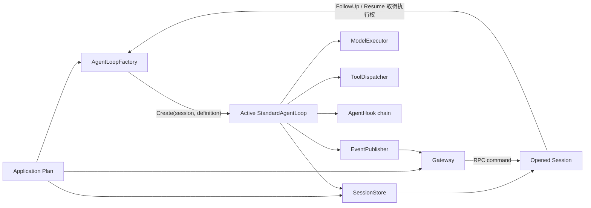
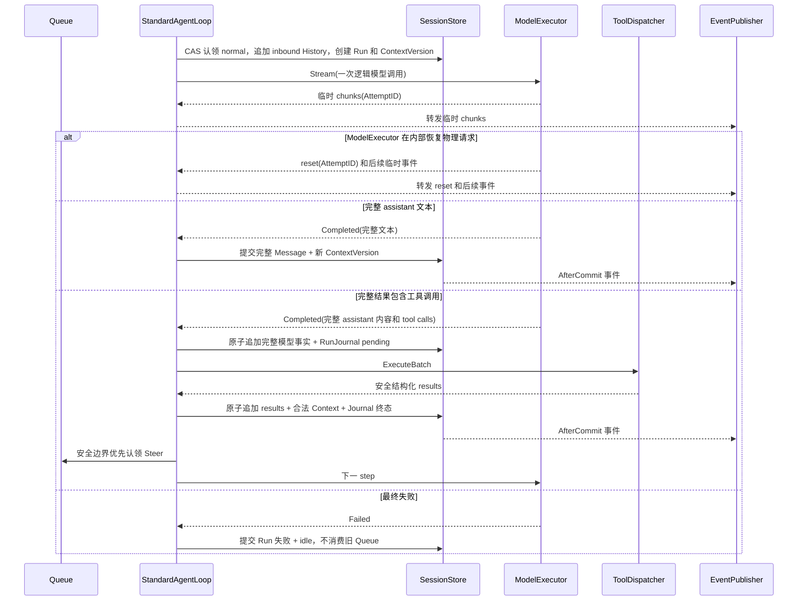

# StandardAgentLoop 实施计划

## 1. 文档状态

本文把 [Agent 设计的架构讨论](agent-architecture-discussion.zh-CN.md) 中已经确定的
结论转换成可执行的代码计划。本文中的 Go 接口是实现候选稿，不代表当前仓库已经
提供这些公共 API，也不提升 `agent.loop` 的成熟度。

本轮只持久化设计，不实现业务代码。开始实现前，仍须解决第 17 节中与首批代码
直接相关的待商榷事项。

## 2. 目标

1. 一个 Application Plan 启动一次应用级组件，并安全服务多个 Workspace 和 Session。
2. `agent.loop` Slot 提供一个 Factory，只为需要执行的 Session 按需创建独立 Loop。
3. 固定消息入队、模型流、工具循环、异常停止、恢复、压缩和重连的行为。
4. 把 Session 持久化从 Loop 算法和 Hook 中拆出，同时保留一个原子事务边界。
5. 用测试证明并发隔离、append-only、CAS、崩溃恢复和客户端重连。

## 3. 非目标

- 本计划不让 AgentSlot 核心读取产品配置、凭据或数据库连接。
- 本计划不决定最终 RPC wire protocol。
- 本计划不把 Gateway、Provider、UI、文件工具或存储实现放进通用装配内核。
- 本计划不支持同一 Session 多个并行 Run。
- 本计划不在运行中的 Loop 热更新模型、SystemPrompt 或 Tool 集合。
- 本计划不依靠 Hook 完成核心持久化。
- 本计划不因提供一个 Standard 实现就把 Slot 标记为 Proven。

## 4. 术语与对象关系

| 对象 | 生命周期 | 责任 |
| --- | --- | --- |
| Application Plan | 应用级 | 固定组件选择、依赖和启动顺序 |
| Gateway | 应用级 | 认证、RPC、路由、事件投递和非流式聚合 |
| AgentLoopFactory | 应用级 | 根据固定依赖和 Session 参数创建 Loop |
| AgentDefinition | Loop 生命周期 | 固定 SystemPrompt、ToolKeys、模型与参数 |
| Workspace | 产品定义 | 提供 Agent 可见资源和边界 |
| Session | 跨进程持久化 | 拥有 History、Context、Queue、RunJournal、revision 和命令入口 |
| StandardAgentLoop | 活跃执行期 | 按需创建，串行驱动该 Session 的 Run 和 Step，执行结束后可回收 |
| Run | 一次执行 | 从启动/恢复到自然完成、取消或错误 |
| Step | Run 内部 | 一次模型调用或一个工具执行批次 |
| Message | Session 级事实 | 完整持久化消息或尚在 Queue 的输入 |



## 5. 拟议 Go 接口

接口先放在实现计划中接受评审。正式进入领域包时，应先写编译失败的契约测试，
再确定包名和 Slot ID。

### 5.1 Factory 与 Loop

```go
type AgentLoopFactory interface {
	Create(
		ctx context.Context,
		session OpenedSession,
		binding SessionBinding,
	) (AgentLoop, error)
}

type SessionBinding struct {
	AgentID      AgentID
	WorkspaceID  WorkspaceID
	SessionID    SessionID
	Definition   AgentDefinitionSnapshot
}

type AgentLoop interface {
	Run(ctx context.Context) (RunCompletion, error)
	Close(ctx context.Context) error
}
```

约束：

- `Create` 只接受已经取得执行权的 Session 持久化视图，不创建、打开、fork 或删除 Session，也不调用 Session 命令。
- 打开或浏览 Session 不调用 `Create`；新 FollowUp 或显式 Resume 才可能触发创建。
- 每个返回的 Loop 只绑定一个 Session，同一 Session 同时最多一个活跃 Loop。
- `Run` 是 Session 内部执行协调器调用的端口，不向 Gateway 暴露；所有用户命令进入 Session。
- `Close` 只释放内存执行对象，不删除 Session 和未消费 Queue。执行结束后可以延迟释放资源，但旧 Loop 不得承接新 Run；下一次执行必须重新创建并取得最新配置快照。

### 5.2 Queue 与 Session

```go
type DeliveryMode string

const (
	DeliveryNormal DeliveryMode = "normal"
	DeliverySteer  DeliveryMode = "steer"
	DeliveryHeld   DeliveryMode = "held"
)

type OpenedSession interface {
	Identity() SessionIdentity
	Snapshot(ctx context.Context) (SessionSnapshot, error)
	Transact(ctx context.Context, expected Revision, fn SessionTransaction) (Commit, error)
	Watch(ctx context.Context, after Revision) (SessionEventStream, error)
}

type AgentSession interface {
	OpenedSession
	SessionCommands
}

type SessionCommands interface {
	FollowUp(ctx context.Context, command FollowUpCommand) (EnqueueResult, error)
	Steer(ctx context.Context, command SteerCommand) (EnqueueResult, error)
	EditQueued(ctx context.Context, command EditQueuedCommand) (QueueMutationResult, error)
	DeleteQueued(ctx context.Context, command DeleteQueuedCommand) (QueueMutationResult, error)
	ChangeDelivery(ctx context.Context, command ChangeDeliveryCommand) (QueueMutationResult, error)
	Cancel(ctx context.Context, command CancelCommand) (CancelResult, error)
	Resume(ctx context.Context, command ResumeCommand) (ResumeResult, error)
	WhenIdle(ctx context.Context) error
}

type SessionTransaction interface {
	History() HistoryWriter
	Context() ContextWriter
	Queue() QueueWriter
	RunJournal() RunJournalWriter
	SetRuntimeState(state DurableRuntimeState) error
}

type QueueWriter interface {
	Enqueue(message QueuedMessage) error
	Edit(messageID MessageID, patch QueuePatch) error
	Delete(messageID MessageID) error
	ChangeDelivery(messageID MessageID, mode DeliveryMode) error
	ClaimNormal(messageID MessageID, runID RunID) error
	ClaimSteerBatch(runID RunID) ([]QueuedMessage, error)
	HoldUnclaimedSteer(reason HoldReason) error
}
```

`SessionTransaction` 是逻辑事务，不要求五个视图使用不同数据库。实现可以共用一张
日志或一个数据库事务，但不能牺牲原子性和各视图的业务规则。

`SessionCommands` 是 Gateway 和产品代码的命令入口。所有修改命令包含
`ExpectedRevision` 和调用方幂等键；`FollowUp`、`Steer` 成功时返回持久化
`MessageID`，不返回 Loop 或 Run 的内存对象。

### 5.3 History、Context 与 RunJournal

```go
type HistoryWriter interface {
	Append(batch HistoryBatch) error
}

type ContextWriter interface {
	Install(version ContextVersion) error
	AppendCommitted(batch ContextBatch) error
}

type RunJournalWriter interface {
	BeginRun(record RunRecord) error
	BeginToolBatch(batch PendingToolBatch) error
	RecordToolOutcome(outcome JournalToolOutcome) error
	CompleteToolBatch(batchID ToolBatchID) error
	CompleteRun(result RunCompletion) error
}

type SessionSnapshot struct {
	Revision      Revision
	Runtime       DurableRuntimeState
	HistoryTail   []HistoryEntry
	Context       ContextVersion
	Queue         []QueuedMessage
	ActiveRun     *RunSnapshot
	HeldMessages  []QueuedMessage
}
```

History 是唯一事实账本。完整 tool call 产生后立即追加，并在同一事务中写入
RunJournal pending；该事务提交成功后才能执行工具。tool result 后续单独追加，每个
ToolCallID 最终只能有一个成功、结构化错误或 `outcome_unknown` 终态结果。
Context 只投影已经配对的 call/result，RunJournal 不复制对话事实。

### 5.4 ModelExecutor

```go
type ModelExecutor interface {
	Stream(ctx context.Context, request ModelRequest) (ModelEventStream, error)
}

type ModelRequest struct {
	RunID          RunID
	StepID         StepID
	ContextVersion ContextVersionID
	Messages       []ModelMessage
	Model           ModelSelection
	Tools           []ModelToolDefinition
}

type ModelEvent interface {
	modelEvent()
}

// 事件族至少包含 TextDelta、ReasoningDelta、ToolCallDelta、Usage、Reset、Completed 和 Failed。
// 临时事件、Reset 和 Usage 带 AttemptID；Completed/Failed 结束一次逻辑调用。
```

约束：StandardAgentLoop 每次只发起一个逻辑模型调用。ModelExecutor 在内部管理
一次或多次真实 Provider 请求，并按协议能力决定重试、原生续传或终止；Loop 不
解释这些差异。每次真实请求有唯一 AttemptID 并进入用量/运维事件，不进入 Session
History。临时 delta 不持久化，只有完整结果成为 History 事实；最终失败结束 Run。

### 5.5 ToolDispatcher

```go
type ToolExecutionMode string

const (
	ToolParallelSafe ToolExecutionMode = "parallel_safe"
	ToolSerial       ToolExecutionMode = "serial"
)

type ToolDispatcher interface {
	Definitions(keys []ToolKey) ([]ModelToolDefinition, error)
	ExecuteBatch(ctx context.Context, batch ToolBatch) ([]ToolResult, error)
}

type ToolDefinition interface {
	Key() ToolKey
	ExecutionMode() ToolExecutionMode
	InputSchema() json.RawMessage
}
```

约束：Dispatcher 按模型调用顺序把连续的 `ParallelSafe` 调用组成并行组；每个
`Serial` 调用是独占屏障，前一个组完成后才执行，完成后才开始后一个组。最终结果
仍按模型原始调用顺序归并。Dispatcher 把参数错误、策略拒绝、版本冲突和内部失败
转换为安全的结构化结果，敏感内部错误不返回模型。

### 5.6 AgentHook

```go
type AgentHook interface {
	BeforeRunComplete(ctx context.Context, event BeforeRunCompleteEvent) (HookProposal, error)
	AfterCommit(ctx context.Context, event AfterCommitEvent) error
}

type HookProposal struct {
	AppendFollowUp []InboundMessage
}
```

约束：

- `BeforeRunComplete` 在完整 assistant 消息已经保存、Run 尚未标记完成时调用。
- Hook 只能请求追加后续输入；不能直接修改 History、Context、Queue 或 Run，也不能自行启动 step。
- StandardAgentLoop 逐项校验并持久化请求，由它唯一决定继续下一 step 或完成 Run。
- 任一 Hook 报错只记录并忽略，其他 Hook 继续；`AfterCommit` 只能观察已提交事实，失败不能回滚核心事务。
- 首版不提供暂停、取消等万能 Hook 动作；未来扩展动作必须单独评审。
- Hook 的最终 Slot ID 和 cardinality 尚未确定。

### 5.7 ContextCompactor

```go
type ContextCompactor interface {
	Compact(ctx context.Context, input CompactionInput) (CompactionOutput, error)
}

type CompactionInput struct {
	SourceRevision Revision
	Context        ContextVersion
	TargetTokens   int
}

type CompactionOutput struct {
	Messages []ConversationMessage
	Metadata CompactionMetadata
}
```

输入是当前完整 Context；输出只包含压缩后的会话 Message 列表，不包含
SystemPrompt 和 Tool 定义。Compactor 不修改 History、不保存 ContextVersion，也不
提交 Session 事务。StandardAgentLoop 重新装配固定部分，并验证模型协议完整性和
硬 Token 上限。`context.compactor` 是唯一可替换 Slot，不新增 `CompactionPolicy`。

### 5.8 Session History Tool

```go
type SessionHistoryReader interface {
	Query(ctx context.Context, query HistoryQuery) (HistoryPage, error)
}
```

它是只读、可分页、受权限和配额限制的模型工具。查询结果带 History revision 和稳定
MessageID，不允许模型绕过 Session API 修改历史。最终 Slot ID 尚未确定。

## 6. 注入边界

### 6.1 Application 级依赖

| 依赖 | 必需 | 注入对象 | 原因 |
| --- | --- | --- | --- |
| `SessionManager/SessionStore` | 是 | Session 服务与 Gateway | 打开 Session、命令、事务、Snapshot 和恢复 |
| `ModelExecutor` | 标准 LLM Profile 是 | Factory | 统一流式 Provider 调用和网络重试 |
| `ToolDispatcher` | Tool Profile 是 | Factory | 解析 ToolKeys 并执行批次 |
| `AgentHook` 集合 | 否 | Factory | 固定两个扩展阶段 |
| `ContextCompactor` | 多轮 Profile 是 | Factory | 生成版本化压缩 Context |
| `EventPublisher` | 是 | Factory | 把标准事件交给共享 Gateway/观察者 |
| `Clock`、ID 生成器、执行协调器 | 是 | StandardLoop/Session 实现 | 使状态机、单实例执行和测试确定可控；默认保持内部端口 |
| 恢复协调器 | 是 | Session 服务 | 启动时处理 RunJournal、结束旧 Run 和迁移 held Steer |
| Gateway | Profile 待定 | Application Runtime | 共享 RPC、路由、聚合和重连；命令发给 Session，不直接拥有 Loop 状态 |

### 6.2 按需创建活跃 Loop 时的参数

| 参数 | 来源 | 是否可变 | 用途 |
| --- | --- | --- | --- |
| `AgentID` | 路由/Agent 目录 | 否 | 绑定配置与权限 |
| `WorkspaceID` | SessionManager | 否 | 资源和租户边界 |
| `SessionID` | 已打开 Session | 否 | 持久化和路由身份 |
| `OpenedSession` | SessionManager | 句柄固定 | 向 Loop 提供 Snapshot、事务和事件，不暴露 Session 命令控制权 |
| `AgentDefinitionSnapshot` | 配置服务 | 否 | SystemPrompt、ToolKeys、Model、参数 |
| 已解析 Token 限制 | 配置加载阶段 | 否 | 请求检查和压缩阈值 |

Gateway、配置文件路径、明文凭据和具体 Provider SDK 客户端不得作为 Session 级参数
泄漏到 Loop；它们由应用级适配器封装。

### 6.3 框架固定边界与开发者扩展点

这张表是“什么属于 AgentSlot，什么可由 Agent 开发者替换”的权威边界。新增公共
Slot 必须先证明它表达了独立、稳定、可替换的职责；StandardLoop 的包内端口不能
因为测试方便就自动升级为 Slot。

| 层次 | 固定或可变 | 典型内容 | 约束 |
| --- | --- | --- | --- |
| 装配框架 | 固定 | Application、Module、typed Slot、Plan、依赖图、启动/回滚/关闭 | AgentSlot 核心固定其接口和事务/生命周期不变量，不放产品策略 |
| 标准组件生态位 | 合同成熟后接口固定、实现可替换 | `AgentLoopFactory`、ModelProvider、Tool、`ContextCompactor`、Session 存储、Gateway 组件 | 当前拟议接口仍须按组件地图推进成熟度；开发者最终通过对应 Slot 提供实现 |
| StandardAgentLoop 宪法 | 固定行为 | 同一 Session 唯一活跃 Run、History append-only、工具结果后继续模型、异常后不自动消费旧 Queue | 替换 Loop 仍须通过合规测试；不能用配置关闭这些正确性规则 |
| 默认实现 | 可配置或整体替换 | 默认 ContextCompactor、标准工具包、Provider 适配器 | 默认行为不是所有实现的强制算法；替换实现仍遵守 Slot 高层契约 |
| 产品配置 | 每个 Agent 项目决定 | SystemPrompt、ToolKeys、模型参数、压缩参数、Provider 地址和凭据引用 | 配置来源不由 AgentSlot 核心决定；活跃 Loop 内使用不可变快照 |
| StandardLoop 内部端口 | 实现私有 | Clock、ID 生成器、执行协调器、故障注入点 | 可注入以便测试，但默认不是公共 Slot；只有跨实现稳定后才单独评审 |

Session 持久化已经确定为可替换组件边界，但它最终复用 `history.store` 还是改为
新的 Slot ID 仍由第 17 节保留评审；本表不提前决定命名和 cardinality。
Queue 继续作为 Session 的持久业务视图，本轮不新增独立消息队列 Slot。

## 7. 状态机

### 7.1 状态定义

Session 持久执行状态与内存 Loop 生命周期是两套状态，不能混成一个枚举。

| Session 状态 | 含义 | 是否接受消息持久化 | 是否自动执行 |
| --- | --- | --- | --- |
| `idle` | 没有活跃 Run 或 Loop | 是 | 新 FollowUp 触发；Resume 可显式继续旧工作 |
| `running` | 存在唯一活跃 Run 和最多一个活跃 Loop | 是 | Steer 在安全 step 优先；normal 等下一 Run |

| Loop 状态 | 含义 |
| --- | --- |
| `created` | 已按需创建，尚未进入 `Run` |
| `running` | 正在驱动当前 Session 执行 |
| `closed` | 内存资源已释放；不影响 Session 持久状态 |

```mermaid
stateDiagram-v2
    [*] --> idle: Open or recover Session
    idle --> running: FollowUp or Resume claims execution
    running --> running: model/tool/steer next step
    running --> idle: natural completion and Queue empty
    running --> running: natural completion and claim next normal
    running --> idle: Cancel/error/restart/safety limit; no old Queue drain
```



Loop 在 Session 进入 `running` 后创建，执行结束后不再活跃并进入 `closed`。资源可
以立即释放，也可以保留短暂回收期，但旧 Loop 不得承接新 Run；这项优化不能改变
Session 命令、恢复或配置快照语义。

### 7.2 转换不变量

- `idle -> running` 必须在一个事务中认领启动原因（FollowUp 的 FIFO 头或 Resume 的可恢复工作）、创建 RunID、写 RunJournal 并更新状态。
- Factory 创建或 Loop 启动失败必须结束已创建的 Run、释放执行权并回到 `idle`，不得自动认领其他旧 Queue。
- `running -> running` 的“下一 normal”实际结束旧 Run 并创建新 Run，两者 ID 不得复用。
- 取消、错误、重启或安全上限触发时，先停止产生新副作用，再提交已知结果、Run 终态和 `idle`；旧 Queue 不得自动认领。
- 正常完成只有在同一提交中认领下一条 normal 时才能保持 `running`，否则进入 `idle`。
- `closed` 只属于内存 Loop/句柄，不是 Session 执行状态，也不删除持久化 Session。

## 8. 命令的精确行为

### 8.1 FollowUp

1. 校验身份、权限、幂等键、内容和 expected revision。
2. 把消息以 `normal` 持久化并返回 `MessageID + Revision`。
3. `idle` 时尝试原子认领执行权和 FIFO 头，按需创建 Loop 并启动新 Run；即使上次因取消、错误或重启结束，新 FollowUp 也立即启动。
4. `running` 时只排队，等待当前 Run 正常完成后的 FIFO 自动消费。
5. 同一幂等键重试返回原 MessageID，不重复入队。

### 8.2 Steer

1. 只在 `running` 且目标 Run 是当前活跃 Run 时接受，以 `steer` 持久化并返回 `MessageID + Revision`。
2. `idle` 没有可被纠偏的当前 Run，返回 `no_active_run`，且不把消息保存为 normal 或 held；调用方应使用 FollowUp。
3. 已接受的 Steer 在下一安全 step 批量优先认领，不打断半个模型流或正在提交的工具批次。
4. 进程重启时，旧 Run 尚未消费的 Steer 由恢复事务转为 held。

### 8.3 Queue 编辑、删除和改投

1. 必须提供 MessageID 和 expected revision。
2. 只有仍处于 Queue 且未被认领的消息可修改。
3. 已认领、已进入 Context 或 revision 不匹配时返回 conflict，并附最新 revision。
4. held 只有经显式改投为 normal 后才可能在后续执行；改投为 steer 时仍须存在目标活跃 Run，否则返回 `no_active_run`。

### 8.4 Cancel

1. 请求包含 SessionID、目标 RunID 和幂等键；目标必须是该 Session 当前活跃 Run。
2. 标记取消请求，停止新的模型或工具启动，并取消当前可取消操作。
3. 临时 chunk 发送 reset，不写 History；已原子提交的完整事实保留。
4. 记录 Run 取消结果并把 Session 置为 `idle`；旧 Queue 不自动消费。
5. 对已经结束的同一 Run 重试 Cancel 返回其最终状态，不制造新状态转换。

### 8.5 Resume

1. 只接受 `idle`，并校验 expected revision；`running` 返回 conflict。
2. 先完成 RunJournal 恢复：真实结果正常配对，未知结果合成 `outcome_unknown`。
3. held 消息保持 held，不自动进入 Context。
4. 原子认领执行权并按需创建 Loop；若恢复 Context 需要模型判断则创建新 Run 继续，否则认领 FIFO normal。
5. 没有恢复工作也没有 normal 时保持 `idle` 并返回“无待执行内容”，不创建 Loop 或伪造 Run。

### 8.6 WhenIdle

- 这是 Session 命令：等待 Session 离开 `running`，`idle` 即满足，不依赖 Loop 是否仍在延迟回收期。
- 调用方 context 取消时立即返回；不改变 Session 状态。

### 8.7 Close

- Close 只用于内部 Loop/句柄生命周期，不是 Gateway 的 Session 命令。
- Loop `running` 时先等待执行结束；需要取消业务 Run 时必须通过 Session `Cancel`。
- Close 不清空 Queue、不删除 History、不把 Session 标记为业务完成。
- Close 后该 Loop 句柄不可再用；Session 仍可通过新 FollowUp 或 Resume 创建下一 Loop。

## 9. 数据模型与原子提交边界

### 9.1 Session Event

每个持久化事件至少包含：

```text
EventID, Revision, AgentID, WorkspaceID, SessionID,
RunID?, StepID?, MessageID?, EventType, OccurredAt, PayloadVersion
```

持久化事件按 Session revision 严格递增。临时 `TextDelta`、`ReasoningDelta` 和
ToolCallDelta 不占持久化 revision；它们使用 `RunID + StepID + AttemptID + Sequence`
在当前连接中排序。

### 9.2 History

- 是唯一事实账本，按真实发生顺序保存完整 inbound、assistant message、tool call、tool result、完成原因和必要逻辑用量事实。
- 只追加；批量原子；使用幂等键；支持从 revision/MessageID 分页读取。
- 完整 tool call 立即写入；result 后续追加。History 本身不要求任意时刻都能直接作为 Provider 消息数组。
- 不保存半流 chunk、物理 Attempt 明细或客户端显示/ACK 游标。

### 9.3 Context

- 每个版本保存 `ContextVersionID`、来源 History revision、生成方式、Token 估算和标准消息序列。
- 普通消费把 Queue 消息加入新 ContextVersion；压缩也创建新版本。
- 模型请求记录它使用的 ContextVersionID；Context 只投影满足所选模型协议的 call/result，未配对 call 不进入请求。

### 9.4 Queue

- 每条记录包含 MessageID、来源、内容、DeliveryMode、创建时间、目标 RunID（如有）、状态和 revision。
- 状态至少区分 `queued`、`claimed`、`consumed`、`deleted`；对外 Snapshot 默认只返回有效待处理项。
- 认领和 Context 更新属于同一事务，避免消息既从 Queue 消失又未进入 Context。

### 9.5 RunJournal

- 只保存 Run/Step 的进行中状态和工具副作用恢复证据，不直接作为模型上下文或第二份对话账本。
- 工具批次状态至少包含 `pending`、`known_result`、`outcome_unknown`、`committed`；对话内容以 History 为准。
- Journal 可以按保留策略归档，但只有在对应 History 和 Run 完成事实已提交后才能清理。

### 9.6 必须原子的提交

| 场景 | 同一提交内的变更 |
| --- | --- |
| 入队 | Queue 新消息 + revision + enqueue 事件 |
| 启动 Run | normal 认领 + inbound History append + Context 新版本 + RunJournal BeginRun + `running` 状态 |
| 消费 Steer | Steer 批次认领 + inbound History append + Context 新版本 + step 事件 |
| 接受 Hook 后续输入 | inbound History append + Context 新版本 + Hook 来源事件；Run 保持 `running` |
| 开始工具批次 | 完整模型结果及 tool calls 的 History append + RunJournal pending batch + step 状态；提交成功后才执行工具 |
| 完成工具批次 | tool result History append + 合法 Context 新版本 + Journal 终态 + 完整事件 |
| 完整 assistant 消息 | History append + Context 新版本 + assistant committed 事件 |
| 自然完成 | Run completion History fact + RunJournal CompleteRun + 状态迁移；有 normal 时同时完成下一 Run 的启动提交，否则 `idle` |
| 异常/取消 | 已知结果 + Run completion History fact + RunJournal CompleteRun + `idle`；不认领旧 Queue |
| 崩溃恢复 | `outcome_unknown` result append + held Steer + Journal/Run 终态 + `idle` |

## 10. 标准执行时序

### 10.1 模型、工具和下一 step



### 10.2 自然完成

1. ModelExecutor 给出自然停止且没有未决工具调用。
2. Loop 提交本 step 的完整 assistant message。
3. 调用全部 `BeforeRunComplete` Hook；单个 Hook 失败只记录并继续。返回的追加后续输入请求由 Loop 校验，并通过 Session 事务追加到 History 和新 ContextVersion。
4. 若 Loop 接受并提交了后续输入，由 Loop 决定继续同一 Run 的下一 step；Hook 本身不能启动 step 或修改状态，安全上限也可以使 Loop 拒绝 proposal。
5. 否则原子提交 Run 完成；若有 normal，FIFO 认领并创建新 Run；否则进入 idle。
6. 提交后异步调用 `AfterCommit`，其失败不改变完成结果。

### 10.3 工具崩溃恢复

1. 启动恢复器读取未完成 RunJournal。
2. 有可靠完成证据的调用使用真实 ToolResult。
3. 无法判断是否产生副作用的调用生成 `outcome_unknown` ToolResult，禁止自动重跑。
4. 原 call 已经在 History；恢复事务只追加每个唯一终态结果，并生成满足协议的新 ContextVersion。
5. 未消费 Steer 转 held，旧 Run 标记 interrupted，Session 进入 `idle`，旧 Queue 不自动消费。
6. Gateway Snapshot 展示恢复原因；用户用新 FollowUp 或显式 Resume 决定检查、补偿或继续。

## 11. Context 压缩

### 11.1 框架固定契约

1. StandardAgentLoop 只在安全 step 边界调用 `context.compactor`，并冻结当前完整 Context 和来源 revision。
2. Compactor 输入当前完整 Context、来源 revision 和目标预算，输出压缩后的会话 Message 列表及元数据。
3. 输出不包含 SystemPrompt 和 Tool 定义；StandardAgentLoop 使用当前 Loop 的固定配置重新装配它们。
4. Compactor 不修改 History、不持久化 ContextVersion，也不提交 Session 事务。
5. StandardAgentLoop 验证输出满足所选模型的协议完整性和硬 Token 上限；失败时保持旧 Context，并让当前 Run 失败回到 `idle`，不消费旧 Queue。
6. 验证通过后，StandardAgentLoop 原子安装新 ContextVersion，记录父版本、来源 revision、Compactor 实现/配置版本和 Token 数。
7. 压缩期间新进入 Queue 的消息不属于冻结输入，在后续事务处理。

框架不固定保留条数、摘要模型或消息选择算法；这些由 `context.compactor` 的具体实现
决定。Session History Tool 始终查询完整 History，而不是摘要文本，分页结果带
revision。

### 11.2 默认 ContextCompactor

AgentSlot 可提供一个默认实现，其算法是：

1. 使用当前 Session 模型生成历史执行摘要。
2. 保留最近三条已接受 inbound 意图，包括 normal、steer，以及人类和授权 Session 来源。
3. 保留满足模型协议所需的尾部，特别是完整 tool call/result 配对。
4. 输出“历史摘要 + 最近三条 inbound + 必要协议尾部”的会话 Message 列表。

默认实现的保留条数、摘要模型、触发阈值和预算可以配置；开发者也可以整体替换
`context.compactor`。这些默认算法不属于其他 Compactor 或 Loop 实现的合规条件。

## 12. Gateway 数据流

### 12.1 流式调用

1. 客户端通过 `AgentID + WorkspaceID + SessionID` 打开订阅，通过 RunID 过滤具体执行。
2. Gateway 鉴权并读取 Snapshot，返回其 revision。
3. 命令 RPC 调用 Session；持久化成功后返回 MessageID、可用的 RunID 和 revision，Session 在需要执行时按需创建 Loop。
4. Gateway 转发临时流事件和持久化 Session Event。
5. 客户端以 attempt/sequence 展示临时 chunk，以 revision 合并持久化事实。
6. 收到 reset 时移除对应 attempt 的临时内容。

### 12.2 非流式调用

Gateway 使用同一命令和事件流，等待目标 Run 达到终态，然后返回：

```text
RunID, FinalStatus, AssistantMessages[], LastRevision, Error?
```

`AssistantMessages` 是本 Run 产生的全部完整 assistant 文本消息，保持顺序和边界。

### 12.3 断线与重连

- 断线只释放连接资源，不发送 Cancel。
- 重连先读取最新 Snapshot；如果本地 revision 与服务端不连续，客户端丢弃临时投影并以 Snapshot 为准。
- AgentSlot 不保存每个客户端游标或 ACK；客户端自行保存最后观察 revision。
- 临时 chunk 丢失是允许的，因为完整 assistant message 才是持久化事实。
- 具体 Gateway 或外部消息系统可以在自身边界实现可靠投递，但不得把传输回执写进 SessionStore，也不得用它改变 History、Context、Run 或业务完成状态。

## 13. sub-agent 与 Session 派生

### 13.1 配置继承

sub-agent 创建时从父 AgentDefinition 生成新的不可变快照。允许产品显式收窄工具、
模型参数、权限和 Workspace 范围；不得隐式扩大权限。父子 Session 使用独立取消、
Queue、Run 和 Context；只有各自处于活跃执行时才按需拥有独立 Loop。

### 13.2 完整 fork

1. SessionManager 在指定 History revision 创建子 Session。
2. 子 Session 继承可审计的完整 History/Context 基线，并记录 parent SessionID 和 fork revision。
3. 创建后父子 revision 独立增长；后续内容不自动合并。
4. 子 Session 首次 FollowUp 或 Resume 时，Factory 才为其按需创建独立 Loop。

### 13.3 摘要启动

1. 父 Session 在固定 revision 生成一份受控摘要和必要任务输入。
2. SessionManager 创建空白子 Session，把摘要作为明确的初始化来源，而不是复制完整 History。
3. 子 Session 记录 parent SessionID、summary artifact/version 和授权范围。
4. UI/Gateway 必须把它标识为摘要启动，不能显示成完整 fork。

## 14. 分阶段 TDD 清单

每一阶段都先写行为测试，再写最小实现；测试名使用业务结果，不使用内部函数名。

### 阶段 0：合同和文档防漂移

- 检查 README 中两份设计文档链接存在。
- 检查中英文地图都把 `agent.loop` 描述为 Factory，并保持 Mapped/已映射。
- 冻结身份、状态、DeliveryMode、错误码和事件信封的候选值。
- 评审并关闭会阻塞首批 API 的待商榷事项。

### 阶段 1：内存 SessionStore 合同

- History 批量 append-only、尾 revision 冲突和幂等重试测试。
- Queue 入队、编辑、删除、改投、认领后 conflict 和 CAS 测试。
- Context 新版本、来源 revision 和压缩不改 History 测试。
- RunJournal pending、known、unknown、committed 状态测试。
- 一个事务跨 History/Context/Queue/RunJournal 失败时全部回滚测试。

### 阶段 2：Factory 和 Loop 状态机

- 打开或浏览 Session 不创建 Loop；FollowUp/Resume 才按需创建。
- 同一 Factory 为两个活跃 Session 创建两个隔离 Loop；不同 Session 真并行。
- 同一 Session 第二个活跃 Loop/Run 被 CAS 拒绝；执行结束回收 Loop 不影响 Session。
- FollowUp 在 `idle/running` 两态的持久化、启动和排队行为测试。
- Steer 的安全边界、批量优先、`idle` 返回 `no_active_run` 和重启转 held 测试。
- Cancel、Resume、WhenIdle 和内部 Loop Close 的状态与幂等测试。
- 正常完成 FIFO 自动 drain；错误、取消、重启不自动 drain。
- 配置更新只影响下一次按需创建的 Loop，当前活跃 Loop 快照不变。

### 阶段 3：ModelExecutor 和流式一致性

- 完整文本只在完成后写入 History。
- 验证 ModelExecutor 可分别选择物理重试、原生续传或终止，Loop 只处理统一事件。
- 半流失败需要撤销时发 reset，临时 chunk 不持久化；每个真实请求有唯一 AttemptID 和用量事件。
- 最终失败结束当前 Run 并回到 `idle`，旧 Queue 不自动消费。
- 物理 Attempt 的用量/运维事件不进入 Session History。
- 流式与非流式得到相同最终消息集合和终态。
- 固定 AgentDefinition 在 Loop 生命周期内不被配置更新改变。

### 阶段 4：工具循环和崩溃恢复

- ToolResult 后一定再次调用模型，直到自然完成或安全终止。
- `ParallelSafe` 真并行，`Serial` 稳定串行，混合批次结果保持调用顺序。
- 参数错误、策略拒绝、文件冲突和内部错误净化为模型可见结构化结果。
- 完整 tool call 立即进入 History，并与 RunJournal pending 同事务；提交成功前不执行工具。
- tool result 后续单独追加；Context 在配对前不得投影该 call。
- pending 后崩溃不自动重跑；恢复只追加唯一 `outcome_unknown` 结果并回到 `idle`。
- 文件工具 expectedHash/oldContent 冲突不覆盖并发修改。

### 阶段 5：Context 压缩和 History 工具

- `context.compactor` 输入完整 Context，输出不含 SystemPrompt/Tool 定义的会话 Message。
- StandardLoop 重新装配固定部分，并拒绝协议不完整或超过硬 Token 上限的输出。
- 默认 Compactor 的摘要、最近三条 inbound、必要协议尾部和当前模型行为单独测试。
- 替换 Compactor 不要求最近三条算法，但同样不得修改 History 或提交 Session 事务。
- 压缩失败不修改 Context；History 工具仍能读完整原文。

### 阶段 6：Gateway 和多 Session 端到端

- 四元路由归属校验和越权拒绝。
- 断线不取消，重连 Snapshot+revision 收敛。
- 不保存框架级客户端游标或 ACK，revision 缺口触发刷新。
- Gateway 私有可靠投递状态不影响 Session 事实和完成状态。
- 多客户端并发 Queue 编辑只有一个 CAS 成功。
- 非流式返回本 Run 全部 assistant 文本消息。
- Session A 取消、失败或压缩不影响 Session B。

### 阶段 7：sub-agent 与真实适配器

- sub-agent 使用独立 Session、Queue 和取消信号，执行期间才按需创建独立 Loop。
- 完整 fork 与摘要启动的持久化来源和 UI 标识不同。
- 权限继承只能保持或收窄。
- 至少两个真正独立 Provider 协议通过相同 ModelExecutor 合同。
- 至少两个独立 Loop 实现和一个无具体类型分支消费者通过后，才评估 Proven。

## 15. 统一验证命令

每个实现阶段交付前运行：

```sh
gofmt -w .
go test -race ./...
go vet ./...
```

涉及持久化实现时，额外运行故障注入套件；涉及 Gateway 时，额外运行断线重连和
慢消费者压力测试。测试必须使用可控 Clock、ID 和故障点，不能依赖 sleep 猜时序。

## 16. 组件地图成熟度与发布门槛

- 本计划完成后，`agent.loop` 仍保持 `Mapped`。
- 写出拟议 Go 接口和一个 StandardLoop 后，最多说明候选合同存在，不能标记 Proven。
- 至少两个独立 Loop 实现、一个真实消费者无具体类型分支、以及覆盖取消、并发、
  错误和生命周期的兼容测试全部存在后，才允许进入 Proven 评审。
- `AgentLoopFactory`、SessionStore、RunJournal、Hook 和 History Tool 的 Slot 变更必须
  同步中英文组件地图；未定 Slot 不提前计入地图数量。

## 17. 编码前必须关闭的待商榷事项

| 决定 | 阻塞的实施阶段 |
| --- | --- |
| `history.store` 是否改名为 `session.store` | 阶段 1 的正式 Slot/API |
| Gateway 是否替代 `interaction.entrypoint` | 阶段 6 的标准 Profile |
| Agent RPC wire protocol | 阶段 6 的协议适配器 |
| Queue 容量、背压和配额 | 阶段 1 的存储限制、阶段 6 的错误语义 |
| 模型重试、退避和 Run 安全默认值 | 阶段 3、4 的默认策略测试 |
| Hook、RunJournal、Session History Tool 的 Slot ID | 阶段 1、4、5 的公共装配接口 |
| 第一批真实 Provider 适配器 | 阶段 7 的可移植性证据 |

未决事项只阻塞触及它的正式公共边界，不阻塞用包内类型和测试替身验证已经确定的
状态机与事务不变量。

## 18. 外部评审问题处理结果

架构讨论文档第 9 节保留了 R-001～R-006 的原始评审意见和处理记录。六项均已完成
讨论，并已经进入本计划的接口、状态机和时序：

1. Hook 只能提出追加后续输入请求，StandardAgentLoop 是唯一状态控制者。
2. History 是唯一事实账本，Context 是合法模型协议投影；tool call/result 分时追加。
3. 不新增 ACK Slot，不把客户端 ACK 或游标写入 SessionStore。
4. 保留唯一可替换 `context.compactor`，默认算法不属于框架强制语义。
5. ModelExecutor 管理 Provider-specific 物理恢复和 AttemptID，Loop 只处理统一事件。
6. Session 长期持有状态与命令，Loop 仅在执行期间按需创建；Session 无 `paused` 状态。

这些事项不再列为待商榷。第 17 节保留的重试数值、Gateway wire protocol 和 Slot ID
等问题仍未决定，不能由本节推断出默认值。
