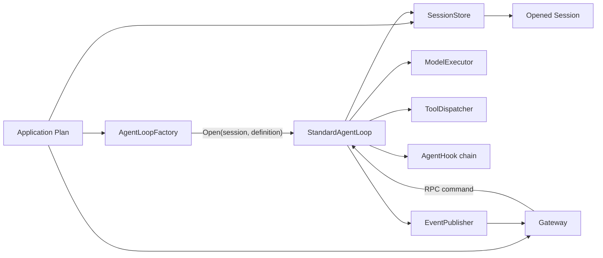
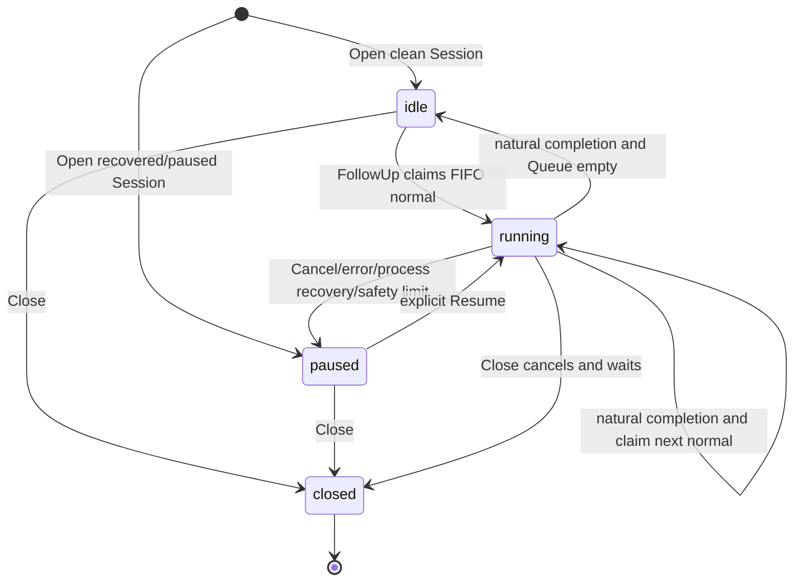
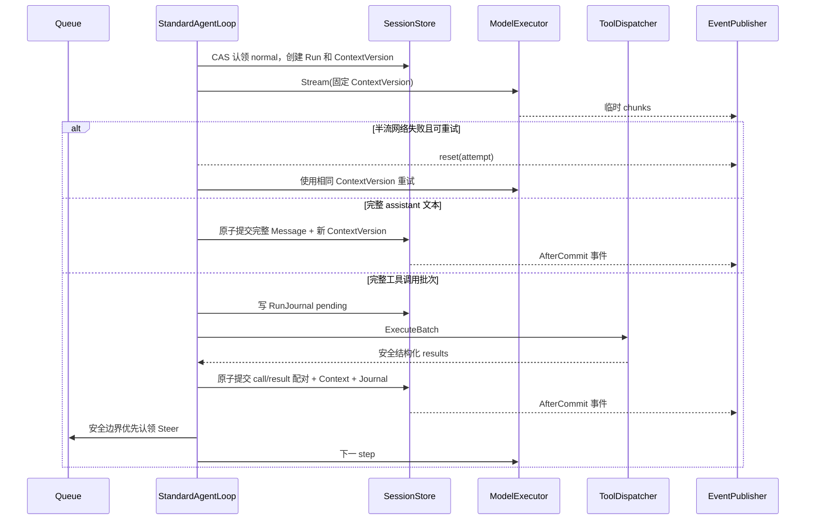

# StandardAgentLoop 实施计划

## 1. 文档状态

本文把 [Agent 设计的架构讨论](agent-architecture-discussion.zh-CN.md) 中已经确定的
结论转换成可执行的代码计划。本文中的 Go 接口是实现候选稿，不代表当前仓库已经
提供这些公共 API，也不提升 `agent.loop` 的成熟度。

本轮只持久化设计，不实现业务代码。开始实现前，仍须解决第 14 节中与首批代码
直接相关的待商榷事项。

## 2. 目标

1. 一个 Application Plan 启动一次应用级组件，并安全服务多个 Workspace 和 Session。
2. `agent.loop` Slot 提供一个 Factory，为每个已打开 Session 创建独立 Loop。
3. 固定消息入队、模型流、工具循环、暂停、恢复、压缩和重连的行为。
4. 把 Session 持久化从 Loop 算法和 Hook 中拆出，同时保留一个原子事务边界。
5. 用测试证明并发隔离、append-only、CAS、崩溃恢复和客户端重连。

## 3. 非目标

- 本计划不让 AgentSlot 核心读取产品配置、凭据或数据库连接。
- 本计划不决定最终 RPC wire protocol。
- 本计划不把 Gateway、Provider、UI、文件工具或存储实现放进通用装配内核。
- 本计划不支持同一 Session 多个并行 Run。
- 本计划不在运行中的 Loop 热更新模型、SystemPrompt 或 Tool 集合。
- 本计划不依靠 Hook 完成核心持久化。
- 本计划不因提供一个 Standard 实现就把 Slot 标记为 Proven。

## 4. 术语与对象关系

| 对象 | 生命周期 | 责任 |
| --- | --- | --- |
| Application Plan | 应用级 | 固定组件选择、依赖和启动顺序 |
| Gateway | 应用级 | 认证、RPC、路由、事件投递和非流式聚合 |
| AgentLoopFactory | 应用级 | 根据固定依赖和 Session 参数创建 Loop |
| AgentDefinition | Loop 生命周期 | 固定 SystemPrompt、ToolKeys、模型与参数 |
| Workspace | 产品定义 | 提供 Agent 可见资源和边界 |
| Session | 跨进程持久化 | 拥有 History、Context、Queue、RunJournal 和 revision |
| StandardAgentLoop | 已打开 Session 级 | 串行驱动该 Session 的 Run 和 Step |
| Run | 一次执行 | 从启动/恢复到自然完成、取消或错误 |
| Step | Run 内部 | 一次模型调用或一个工具执行批次 |
| Message | Session 级事实 | 完整持久化消息或尚在 Queue 的输入 |



## 5. 拟议 Go 接口

接口先放在实现计划中接受评审。正式进入领域包时，应先写编译失败的契约测试，
再确定包名和 Slot ID。

### 5.1 Factory 与 Loop

```go
type AgentLoopFactory interface {
	Open(
		ctx context.Context,
		session OpenedSession,
		binding SessionBinding,
	) (AgentLoop, error)
}

type SessionBinding struct {
	AgentID      AgentID
	WorkspaceID  WorkspaceID
	SessionID    SessionID
	Definition   AgentDefinitionSnapshot
}

type AgentLoop interface {
	Identity() LoopIdentity
	Status() LoopStatusSnapshot

	FollowUp(ctx context.Context, command FollowUpCommand) (EnqueueResult, error)
	Steer(ctx context.Context, command SteerCommand) (EnqueueResult, error)
	EditQueued(ctx context.Context, command EditQueuedCommand) (QueueMutationResult, error)
	DeleteQueued(ctx context.Context, command DeleteQueuedCommand) (QueueMutationResult, error)
	ChangeDelivery(ctx context.Context, command ChangeDeliveryCommand) (QueueMutationResult, error)

	Cancel(ctx context.Context, command CancelCommand) (CancelResult, error)
	Resume(ctx context.Context, command ResumeCommand) (ResumeResult, error)
	WhenIdle(ctx context.Context) error
	Close(ctx context.Context) error
}
```

约束：

- `Open` 只接受已打开的 Session，不创建、fork 或删除 Session。
- 每个返回的 Loop 只绑定一个 Session。
- 所有修改命令包含 `ExpectedRevision` 和调用方幂等键。
- `FollowUp`、`Steer` 成功时首先返回持久化 `MessageID`，不返回内存句柄。
- `Close` 释放内存执行对象，但不删除 Session 和未消费 Queue。

### 5.2 Queue 与 Session

```go
type DeliveryMode string

const (
	DeliveryNormal DeliveryMode = "normal"
	DeliverySteer  DeliveryMode = "steer"
	DeliveryHeld   DeliveryMode = "held"
)

type OpenedSession interface {
	Identity() SessionIdentity
	Snapshot(ctx context.Context) (SessionSnapshot, error)
	Transact(ctx context.Context, expected Revision, fn SessionTransaction) (Commit, error)
	Watch(ctx context.Context, after Revision) (SessionEventStream, error)
}

type SessionTransaction interface {
	History() HistoryWriter
	Context() ContextWriter
	Queue() QueueWriter
	RunJournal() RunJournalWriter
	SetRuntimeState(state DurableRuntimeState) error
}

type QueueWriter interface {
	Enqueue(message QueuedMessage) error
	Edit(messageID MessageID, patch QueuePatch) error
	Delete(messageID MessageID) error
	ChangeDelivery(messageID MessageID, mode DeliveryMode) error
	ClaimNormal(messageID MessageID, runID RunID) error
	ClaimSteerBatch(runID RunID) ([]QueuedMessage, error)
	HoldUnclaimedSteer(reason HoldReason) error
}
```

`SessionTransaction` 是逻辑事务，不要求五个视图使用不同数据库。实现可以共用一张
日志或一个数据库事务，但不能牺牲原子性和各视图的业务规则。

### 5.3 History、Context 与 RunJournal

```go
type HistoryWriter interface {
	Append(batch HistoryBatch) error
}

type ContextWriter interface {
	Install(version ContextVersion) error
	AppendCommitted(batch ContextBatch) error
}

type RunJournalWriter interface {
	BeginRun(record RunRecord) error
	BeginToolBatch(batch PendingToolBatch) error
	RecordToolOutcome(outcome JournalToolOutcome) error
	CompleteToolBatch(batchID ToolBatchID) error
	CompleteRun(result RunCompletion) error
}

type SessionSnapshot struct {
	Revision      Revision
	Runtime       DurableRuntimeState
	HistoryTail   []HistoryEntry
	Context       ContextVersion
	Queue         []QueuedMessage
	ActiveRun     *RunSnapshot
	HeldMessages  []QueuedMessage
}
```

`HistoryBatch` 中工具调用和工具结果必须成对。pending 工具调用只进入
RunJournal；恢复器决定真实结果或 `outcome_unknown` 后才把完整配对提交到 History。

### 5.4 ModelExecutor

```go
type ModelExecutor interface {
	Stream(ctx context.Context, request ModelRequest) (ModelEventStream, error)
}

type ModelRequest struct {
	RunID          RunID
	StepID         StepID
	Attempt        uint32
	ContextVersion ContextVersionID
	Messages       []ModelMessage
	Model           ModelSelection
	Tools           []ModelToolDefinition
}

type ModelEvent interface {
	modelEvent()
}

// 事件族至少包含 TextDelta、ReasoningDelta、ToolCallDelta、Usage、Completed 和 Reset。
```

约束：ModelExecutor 负责 Provider 协议适配和可重试网络错误；重试必须复用同一
ContextVersion 和配置快照。临时 delta 不由 SessionStore 持久化。

### 5.5 ToolDispatcher

```go
type ToolExecutionMode string

const (
	ToolParallelSafe ToolExecutionMode = "parallel_safe"
	ToolSerial       ToolExecutionMode = "serial"
)

type ToolDispatcher interface {
	Definitions(keys []ToolKey) ([]ModelToolDefinition, error)
	ExecuteBatch(ctx context.Context, batch ToolBatch) ([]ToolResult, error)
}

type ToolDefinition interface {
	Key() ToolKey
	ExecutionMode() ToolExecutionMode
	InputSchema() json.RawMessage
}
```

约束：Dispatcher 按模型调用顺序把连续的 `ParallelSafe` 调用组成并行组；每个
`Serial` 调用是独占屏障，前一个组完成后才执行，完成后才开始后一个组。最终结果
仍按模型原始调用顺序归并。Dispatcher 把参数错误、策略拒绝、版本冲突和内部失败
转换为安全的结构化结果，敏感内部错误不返回模型。

### 5.6 AgentHook

```go
type AgentHook interface {
	BeforeRunComplete(ctx context.Context, event BeforeRunCompleteEvent) (HookDecision, error)
	AfterCommit(ctx context.Context, event AfterCommitEvent) error
}

type HookDecision struct {
	Steer []InboundMessage
}
```

约束：

- `BeforeRunComplete` 只在模型自然完成且事务尚未标记 Run 完成时调用。
- 它只能追加受验证的 Steer；不能改写 History、Context 或 Queue。
- `AfterCommit` 只能观察已提交事实；失败记录遥测或进入重投机制，不能回滚核心事务。
- Hook 的最终 Slot ID 和 cardinality 尚未确定。

### 5.7 Session History Tool

```go
type SessionHistoryReader interface {
	Query(ctx context.Context, query HistoryQuery) (HistoryPage, error)
}
```

它是只读、可分页、受权限和配额限制的模型工具。查询结果带 History revision 和稳定
MessageID，不允许模型绕过 Session API 修改历史。最终 Slot ID 尚未确定。

## 6. 注入边界

### 6.1 Application 级依赖

| 依赖 | 必需 | 注入对象 | 原因 |
| --- | --- | --- | --- |
| `SessionManager/SessionStore` | 是 | Factory 与 Gateway 的应用服务 | 打开 Session、事务、Snapshot 和恢复 |
| `ModelExecutor` | 标准 LLM Profile 是 | Factory | 统一流式 Provider 调用和网络重试 |
| `ToolDispatcher` | Tool Profile 是 | Factory | 解析 ToolKeys 并执行批次 |
| `AgentHook` 集合 | 否 | Factory | 固定两个扩展阶段 |
| `ContextCompactor` | 多轮 Profile 是 | Factory | 生成版本化压缩 Context |
| `EventPublisher` | 是 | Factory | 把标准事件交给共享 Gateway/观察者 |
| `Clock`、ID 生成器 | 是 | Factory | 使状态机和测试确定可控 |
| 恢复协调器 | 是 | Session 服务 | 启动时处理 RunJournal 和 held Steer |
| Gateway | Profile 待定 | Application Runtime | 共享 RPC、路由、聚合和重连；不直接拥有 Loop 状态 |

### 6.2 创建 Session Loop 时的参数

| 参数 | 来源 | 是否可变 | 用途 |
| --- | --- | --- | --- |
| `AgentID` | 路由/Agent 目录 | 否 | 绑定配置与权限 |
| `WorkspaceID` | SessionManager | 否 | 资源和租户边界 |
| `SessionID` | 已打开 Session | 否 | 持久化和路由身份 |
| `OpenedSession` | SessionManager | 句柄固定 | Snapshot、事务和事件 |
| `AgentDefinitionSnapshot` | 配置服务 | 否 | SystemPrompt、ToolKeys、Model、参数 |
| 已解析 Token 限制 | 配置加载阶段 | 否 | 请求检查和压缩阈值 |

Gateway、配置文件路径、明文凭据和具体 Provider SDK 客户端不得作为 Session 级参数
泄漏到 Loop；它们由应用级适配器封装。

## 7. 状态机

### 7.1 状态定义

| 状态 | 含义 | 是否接受消息持久化 | 是否自动执行 |
| --- | --- | --- | --- |
| `idle` | 没有活跃 Run，可接受下一条 normal | 是 | 新 normal 触发 Run；正常完成后继续 FIFO |
| `running` | 存在唯一活跃 Run | 是 | Steer 在安全 step 优先；normal 等下一 Run |
| `paused` | 因取消、错误、恢复或人工暂停停止自动推进 | 是 | 否，只能显式 Resume |
| `closed` | 当前内存 Loop 已关闭 | 否 | 否；Session 数据仍保留 |



### 7.2 转换不变量

- `idle -> running` 必须在一个事务中认领 Queue 头、创建 RunID、写 RunJournal 并更新状态。
- `running -> running` 的“下一 normal”实际结束旧 Run 并创建新 Run，两者 ID 不得复用。
- `running -> paused` 先停止产生新副作用，再提交已知结果和暂停原因。
- 任何异常都不能直接从 `running` 跳回自动 `idle`。
- `closed` 只表示内存对象不可再调用，不删除持久化 Session。

## 8. 命令的精确行为

### 8.1 FollowUp

1. 校验身份、权限、幂等键、内容和 expected revision。
2. 把消息以 `normal` 持久化并返回 `MessageID + Revision`。
3. `idle` 时尝试原子认领 FIFO 头并启动新 Run；`running` 时只排队。
4. `paused` 时只排队，不恢复；`closed` 返回 closed 错误。
5. 同一幂等键重试返回原 MessageID，不重复入队。

### 8.2 Steer

1. `running` 时以 `steer` 持久化，返回 `MessageID + Revision`，在下一安全 step 批量优先认领。
2. `paused` 时以 `held` 持久化，等待用户编辑、删除或重新投递。
3. `idle` 没有可被纠偏的当前 Run，返回 `no_active_run`；调用方应使用 FollowUp。
4. `closed` 返回 closed 错误。
5. Steer 不打断半个模型流或正在提交的工具批次，只在下一个安全 step 边界生效。

### 8.3 Queue 编辑、删除和改投

1. 必须提供 MessageID 和 expected revision。
2. 只有仍处于 Queue 且未被认领的消息可修改。
3. 已认领、已进入 Context 或 revision 不匹配时返回 conflict，并附最新 revision。
4. held 只有经显式改投为 normal/steer 后才可能执行；不得被 Resume 自动消费。

### 8.4 Cancel

1. 请求包含 SessionID、目标 RunID 和幂等键；目标必须是该 Session 当前活跃 Run。
2. 标记取消请求，停止新的模型或工具启动，并取消当前可取消操作。
3. 临时 chunk 发送 reset，不写 History；已原子提交的完整事实保留。
4. 记录 Run 取消结果并把 Session 置为 `paused`；Queue 不自动消费。
5. 对已经结束的同一 Run 重试 Cancel 返回其最终状态，不制造新状态转换。

### 8.5 Resume

1. 只接受 `paused`，并校验 expected revision；`running` 返回 conflict。
2. 先完成 RunJournal 恢复：真实结果正常配对，未知结果合成 `outcome_unknown`。
3. held 消息保持 held，不自动进入 Context。
4. 创建新 Run：若恢复 Context 需要模型判断则直接继续；否则认领 FIFO normal。
5. 没有恢复工作也没有 normal 时，转换为 `idle` 并返回“无待执行内容”，不伪造 Run。

### 8.6 WhenIdle

- 等待 Loop 离开 `running`，因此 `idle`、`paused`、`closed` 都满足。
- 调用方 context 取消时立即返回；不改变 Session 状态。

### 8.7 Close

- `running` 时请求取消并等待当前提交边界完成，然后关闭内存资源。
- `idle/paused` 直接关闭。
- Close 不清空 Queue、不删除 History、不把 Session 标记为业务完成。
- Close 后所有修改命令返回 closed；产品可再次打开同一 Session 创建新 Loop。

## 9. 数据模型与原子提交边界

### 9.1 Session Event

每个持久化事件至少包含：

```text
EventID, Revision, AgentID, WorkspaceID, SessionID,
RunID?, StepID?, MessageID?, EventType, OccurredAt, PayloadVersion
```

持久化事件按 Session revision 严格递增。临时 `TextDelta`、`ReasoningDelta` 和
ToolCallDelta 不占持久化 revision；它们使用 `RunID + StepID + Attempt + Sequence`
在当前连接中排序。

### 9.2 History

- 保存完整 inbound、assistant message、成对 tool call/result、完成原因和必要用量事实。
- 只追加；批量原子；使用幂等键；支持从 revision/MessageID 分页读取。
- 不保存半流 chunk、未决工具调用或客户端显示游标。

### 9.3 Context

- 每个版本保存 `ContextVersionID`、来源 History revision、生成方式、Token 估算和标准消息序列。
- 普通消费把 Queue 消息加入新 ContextVersion；压缩也创建新版本。
- 模型请求记录它使用的 ContextVersionID，重试不得换版本。

### 9.4 Queue

- 每条记录包含 MessageID、来源、内容、DeliveryMode、创建时间、目标 RunID（如有）、状态和 revision。
- 状态至少区分 `queued`、`claimed`、`consumed`、`deleted`；对外 Snapshot 默认只返回有效待处理项。
- 认领和 Context 更新属于同一事务，避免消息既从 Queue 消失又未进入 Context。

### 9.5 RunJournal

- 保存 Run/Step 的进行中状态和工具副作用恢复证据，不直接作为模型上下文。
- 工具批次状态至少包含 `pending`、`known_result`、`outcome_unknown`、`committed`。
- Journal 可以按保留策略归档，但只有在对应 History 和 Run 完成事实已提交后才能清理。

### 9.6 必须原子的提交

| 场景 | 同一提交内的变更 |
| --- | --- |
| 入队 | Queue 新消息 + revision + enqueue 事件 |
| 启动 Run | normal 认领 + Context 新版本 + RunJournal BeginRun + `running` 状态 |
| 消费 Steer | Steer 批次认领 + Context 新版本 + step 事件 |
| 开始工具批次 | RunJournal pending batch + step 状态 |
| 完成工具批次 | call/result History 批次 + Context 新版本 + Journal committed + 完整事件 |
| 完整 assistant 消息 | History append + Context 新版本 + assistant committed 事件 |
| 自然完成 | Run completion + 状态迁移；有 normal 时同时认领下一 Run，否则 `idle` |
| 异常/取消 | 已知结果提交 + Run completion + `paused` |
| 崩溃恢复 | unknown 合成配对 + held Steer + Journal 状态 + `paused` |

## 10. 标准执行时序

### 10.1 模型、工具和下一 step



### 10.2 自然完成

1. ModelExecutor 给出自然停止且没有未决工具调用。
2. Loop 提交本 step 的完整 assistant message。
3. 调用全部 `BeforeRunComplete` Hook；Hook 产生的 Steer 经验证后进入 Queue。
4. 若存在 Steer，认领后继续同一 Run 的下一 step。
5. 否则原子提交 Run 完成；若有 normal，FIFO 认领并创建新 Run；否则进入 idle。
6. 提交后异步调用 `AfterCommit`，其失败不改变完成结果。

### 10.3 工具崩溃恢复

1. 启动恢复器读取未完成 RunJournal。
2. 有可靠完成证据的调用使用真实 ToolResult。
3. 无法判断是否产生副作用的调用生成 `outcome_unknown` ToolResult，禁止自动重跑。
4. 把模型原 call 和每个结果成对原子追加到 History，并生成新 ContextVersion。
5. 未消费 Steer 转 held，Run 标记 interrupted，Session 进入 paused。
6. Gateway Snapshot 展示恢复原因；用户显式 Resume 后由模型决定检查、补偿或继续。

## 11. Context 压缩

### 11.1 输入

- 当前完整 History 截止 revision；
- 当前 ContextVersion 和 Token 估算；
- 当前 AgentDefinition/Model 配置快照；
- 最近三条已接受 inbound 意图，包含 normal、steer、人类和授权 Session 来源；
- 保证模型协议有效所需的最近消息尾部，特别是工具 call/result 配对；
- 已解析成 Token 数的触发阈值和输出预算。

### 11.2 算法

1. 在 step 边界检查下一次请求是否超过阈值。
2. 冻结输入 History revision，避免摘要期间读取移动尾部。
3. 使用当前 Session 模型，通过 ModelExecutor 生成“历史执行摘要”。
4. 验证摘要结果完整且不含未配对工具协议。
5. 组装新 Context：SystemPrompt/固定协议 + 历史摘要 + 最近三条 inbound 意图 + 必要协议尾部。
6. 计算 Token，若仍超限则按安全策略失败并暂停；不能静默丢掉必要尾部。
7. 原子安装新 ContextVersion，记录父版本、来源 revision、模型配置版本和 Token 数。

### 11.3 输出与版本规则

- 输出是结构化 `ContextVersion`，不是覆盖 History 的字符串。
- 压缩失败不修改当前 Context。
- 压缩期间新入 Queue 的消息不进入本次快照，在后续事务处理。
- Session History Tool 始终查询 History，不查询摘要文本；分页结果带 revision。

## 12. Gateway 数据流

### 12.1 流式调用

1. 客户端通过 `AgentID + WorkspaceID + SessionID` 打开订阅，通过 RunID 过滤具体执行。
2. Gateway 鉴权并读取 Snapshot，返回其 revision。
3. 命令 RPC 调用 Loop；持久化成功后返回 MessageID/RunID/revision。
4. Gateway 转发临时流事件和持久化 Session Event。
5. 客户端以 attempt/sequence 展示临时 chunk，以 revision 合并持久化事实。
6. 收到 reset 时移除对应 attempt 的临时内容。

### 12.2 非流式调用

Gateway 使用同一命令和事件流，等待目标 Run 达到终态，然后返回：

```text
RunID, FinalStatus, AssistantMessages[], LastRevision, Error?
```

`AssistantMessages` 是本 Run 产生的全部完整 assistant 文本消息，保持顺序和边界。

### 12.3 断线与重连

- 断线只释放连接资源，不发送 Cancel。
- 重连先读取最新 Snapshot；如果本地 revision 与服务端不连续，客户端丢弃临时投影并以 Snapshot 为准。
- 服务端不保存每个客户端游标；客户端自行保存最后观察 revision。
- 临时 chunk 丢失是允许的，因为完整 assistant message 才是持久化事实。

## 13. sub-agent 与 Session 派生

### 13.1 配置继承

sub-agent 创建时从父 AgentDefinition 生成新的不可变快照。允许产品显式收窄工具、
模型参数、权限和 Workspace 范围；不得隐式扩大权限。父 Loop 与子 Loop 使用独立
取消、Queue、Run 和 Context。

### 13.2 完整 fork

1. SessionManager 在指定 History revision 创建子 Session。
2. 子 Session 继承可审计的完整 History/Context 基线，并记录 parent SessionID 和 fork revision。
3. 创建后父子 revision 独立增长；后续内容不自动合并。
4. Factory 为子 Session 创建独立 Loop。

### 13.3 摘要启动

1. 父 Session 在固定 revision 生成一份受控摘要和必要任务输入。
2. SessionManager 创建空白子 Session，把摘要作为明确的初始化来源，而不是复制完整 History。
3. 子 Session 记录 parent SessionID、summary artifact/version 和授权范围。
4. UI/Gateway 必须把它标识为摘要启动，不能显示成完整 fork。

## 14. 分阶段 TDD 清单

每一阶段都先写行为测试，再写最小实现；测试名使用业务结果，不使用内部函数名。

### 阶段 0：合同和文档防漂移

- 检查 README 中两份设计文档链接存在。
- 检查中英文地图都把 `agent.loop` 描述为 Factory，并保持 Mapped/已映射。
- 冻结身份、状态、DeliveryMode、错误码和事件信封的候选值。
- 评审并关闭会阻塞首批 API 的待商榷事项。

### 阶段 1：内存 SessionStore 合同

- History 批量 append-only、尾 revision 冲突和幂等重试测试。
- Queue 入队、编辑、删除、改投、认领后 conflict 和 CAS 测试。
- Context 新版本、来源 revision 和压缩不改 History 测试。
- RunJournal pending、known、unknown、committed 状态测试。
- 一个事务跨 Queue/Context/Journal 失败时全部回滚测试。

### 阶段 2：Factory 和 Loop 状态机

- 同一 Factory 为两个 Session 创建两个隔离 Loop。
- 同一 Session 第二个活跃 Run 被拒绝；不同 Session 真并行。
- FollowUp 在 idle/running/paused/closed 四态的行为测试。
- Steer 的安全边界、批量优先、idle 拒绝和 paused held 测试。
- Cancel、Resume、WhenIdle、Close 的状态与幂等测试。
- 正常完成 FIFO 自动 drain；错误、取消、重启不自动 drain。

### 阶段 3：ModelExecutor 和流式一致性

- 完整文本只在完成后写入 History。
- 半流网络失败发 reset、丢临时 chunk、复用相同 ContextVersion 重试。
- 不可重试错误和重试耗尽进入 paused。
- 流式与非流式得到相同最终消息集合和终态。
- 固定 AgentDefinition 在 Loop 生命周期内不被配置更新改变。

### 阶段 4：工具循环和崩溃恢复

- ToolResult 后一定再次调用模型，直到自然完成或安全终止。
- `ParallelSafe` 真并行，`Serial` 稳定串行，混合批次结果保持调用顺序。
- 参数错误、策略拒绝、文件冲突和内部错误净化为模型可见结构化结果。
- 工具 call/result 只能成对进入 History。
- pending 后崩溃不自动重跑；恢复生成 `outcome_unknown` 并 paused。
- 文件工具 expectedHash/oldContent 冲突不覆盖并发修改。

### 阶段 5：Context 压缩和 History 工具

- 摘要包含历史、最近三条 inbound 和必要协议尾部。
- normal、steer、人类和授权 Session 来源都参与最近三条选择。
- 工具配对在任何预算下都不被拆开。
- 使用当前模型和固定配置版本；阈值按解析后的 Token 数触发。
- 压缩失败不修改 Context；History 工具仍能读完整原文。

### 阶段 6：Gateway 和多 Session 端到端

- 四元路由归属校验和越权拒绝。
- 断线不取消，重连 Snapshot+revision 收敛。
- 不保存服务端客户端游标，revision 缺口触发刷新。
- 多客户端并发 Queue 编辑只有一个 CAS 成功。
- 非流式返回本 Run 全部 assistant 文本消息。
- Session A 取消、暂停或压缩不影响 Session B。

### 阶段 7：sub-agent 与真实适配器

- sub-agent 使用独立 Session、Loop、Queue 和取消信号。
- 完整 fork 与摘要启动的持久化来源和 UI 标识不同。
- 权限继承只能保持或收窄。
- 至少两个真正独立 Provider 协议通过相同 ModelExecutor 合同。
- 至少两个独立 Loop 实现和一个无具体类型分支消费者通过后，才评估 Proven。

## 15. 统一验证命令

每个实现阶段交付前运行：

```sh
gofmt -w .
go test -race ./...
go vet ./...
```

涉及持久化实现时，额外运行故障注入套件；涉及 Gateway 时，额外运行断线重连和
慢消费者压力测试。测试必须使用可控 Clock、ID 和故障点，不能依赖 sleep 猜时序。

## 16. 组件地图成熟度与发布门槛

- 本计划完成后，`agent.loop` 仍保持 `Mapped`。
- 写出拟议 Go 接口和一个 StandardLoop 后，最多说明候选合同存在，不能标记 Proven。
- 至少两个独立 Loop 实现、一个真实消费者无具体类型分支、以及覆盖取消、并发、
  错误和生命周期的兼容测试全部存在后，才允许进入 Proven 评审。
- `AgentLoopFactory`、SessionStore、RunJournal、Hook 和 History Tool 的 Slot 变更必须
  同步中英文组件地图；未定 Slot 不提前计入地图数量。

## 17. 编码前必须关闭的待商榷事项

| 决定 | 阻塞的实施阶段 |
| --- | --- |
| `history.store` 是否改名为 `session.store` | 阶段 1 的正式 Slot/API |
| Gateway 是否替代 `interaction.entrypoint` | 阶段 6 的标准 Profile |
| Agent RPC wire protocol | 阶段 6 的协议适配器 |
| Queue 容量、背压和配额 | 阶段 1 的存储限制、阶段 6 的错误语义 |
| 模型重试、退避和 Run 安全默认值 | 阶段 3、4 的默认策略测试 |
| Hook、RunJournal、Session History Tool 的 Slot ID | 阶段 1、4、5 的公共装配接口 |
| 第一批真实 Provider 适配器 | 阶段 7 的可移植性证据 |

未决事项只阻塞触及它的正式公共边界，不阻塞用包内类型和测试替身验证已经确定的
状态机与事务不变量。
